``` r
library(tidyverse)
```

```
## ── Attaching core tidyverse packages ──────────────────────── tidyverse 2.0.0 ──
## ✔ dplyr     1.1.4     ✔ readr     2.1.5
## ✔ forcats   1.0.0     ✔ stringr   1.5.1
## ✔ ggplot2   3.5.1     ✔ tibble    3.2.1
## ✔ lubridate 1.9.3     ✔ tidyr     1.3.1
## ✔ purrr     1.0.2     
## ── Conflicts ────────────────────────────────────────── tidyverse_conflicts() ──
## ✖ dplyr::filter() masks stats::filter()
## ✖ dplyr::lag()    masks stats::lag()
## ℹ Use the conflicted package (<http://conflicted.r-lib.org/>) to force all conflicts to become errors
```

``` r
library(patchwork)
library(ggbeeswarm)
library(magrittr)
```

```
## 
## Attaching package: 'magrittr'
## 
## The following object is masked from 'package:purrr':
## 
##     set_names
## 
## The following object is masked from 'package:tidyr':
## 
##     extract
```

``` r
library(nlme)
```

```
## 
## Attaching package: 'nlme'
## 
## The following object is masked from 'package:dplyr':
## 
##     collapse
```

``` r
library(IPMpack)
```

```
## Loading required package: Matrix
## 
## Attaching package: 'Matrix'
## 
## The following objects are masked from 'package:tidyr':
## 
##     expand, pack, unpack
## 
## Loading required package: MASS
## 
## Attaching package: 'MASS'
## 
## The following object is masked from 'package:patchwork':
## 
##     area
## 
## The following object is masked from 'package:dplyr':
## 
##     select
```


Get the data


``` r
d <- read.csv("../input/Intro_to_IPMs_Exercises_Data.csv")
head(d)
```

```
##   size sizeNext surv fec.seed fec.flower
## 1 3.09       NA    0       NA         NA
## 2 2.81       NA    0       NA         NA
## 3 4.46     6.07    1       15          1
## 4 1.68       NA    0       NA         NA
## 5 3.99       NA    0       NA         NA
## 6 4.07       NA    0       NA         NA
```

``` r
tail(d)
```

```
##     size sizeNext surv fec.seed fec.flower
## 495   NA     1.78   NA       NA         NA
## 496   NA     1.01   NA       NA         NA
## 497   NA     1.68   NA       NA         NA
## 498   NA     1.44   NA       NA         NA
## 499   NA     1.08   NA       NA         NA
## 500   NA     1.62   NA       NA         NA
```

Make some plots


``` r
p1 <- d %>%  filter(!is.na(surv)) %>%
  ggplot(aes(x=size, y = surv)) +
  geom_point(position=position_jitter(width=0, height = .05), size = .5) +
  labs(y = "Survival to t+1", x = "Size (t)")

p1.alt <- d %>% 
  filter(!is.na(surv)) %>%
  ggplot(aes(as.logical(surv), size)) +
  geom_violin() +
  geom_quasirandom(bandwidth = 1, width = .35, alpha=.5) +
  labs(x = "Survival to t+1", y = "Size (t)")

p2 <- d %>%
  ggplot(aes(x=size, y=sizeNext)) +
  geom_point() +
  labs(x = "Size (t)", y = "Size (t + 1)")

p3 <- d %>%
  ggplot(aes(x=size, y = fec.seed)) +
  geom_point() +
  labs(x = "Size (t)", y = "Seed Number")

p4 <- d %>%
  filter(is.na(size)) %>%
  ggplot(aes(x=sizeNext)) +
  geom_histogram(aes(y=after_stat(density)), bins=15, fill = "lightblue", color="grey20", lwd=.25) + 
  xlab("Recruit Size")

(p1 + p2) / (p3 + p4)
```

```
## Warning: Removed 220 rows containing missing values or values outside the scale range
## (`geom_point()`).
## Removed 220 rows containing missing values or values outside the scale range
## (`geom_point()`).
```

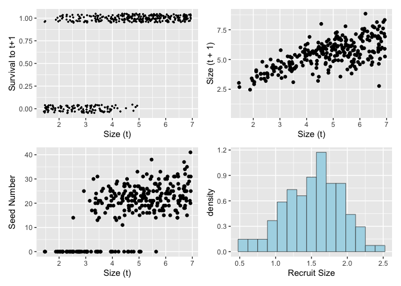<!-- -->

``` r
(p1.alt + p2) / (p3 + p4)
```

```
## Warning: Removed 220 rows containing missing values or values outside the scale range
## (`geom_point()`).
## Removed 220 rows containing missing values or values outside the scale range
## (`geom_point()`).
```

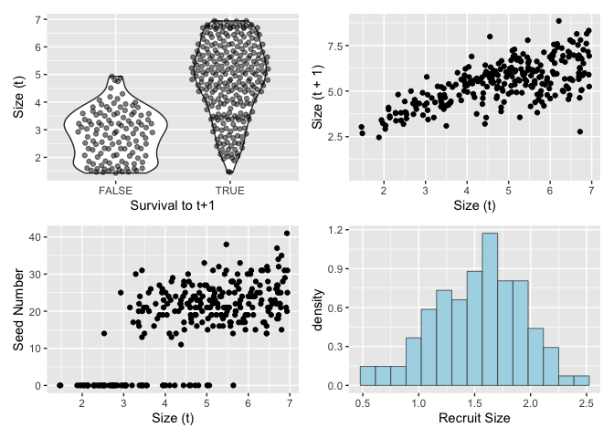<!-- -->

## Build Regressions for Vital Rate functions

Start with an empty data frame

``` r
params=data.frame(
  surv.int=NA, # Intercept from logistic regression of survival
  surv.slope=NA, # Slope from logistic regression of survival
  growth.int=NA, # Intercept from linear regression of growth
  growth.slope=NA, # Slope from linear regression of growth
  growth.sd=NA, # Residual sd from the linear regression of growth
  seed.int=NA, # Intercept from Poisson regression of seed number
  seed.slope=NA, # Slope from Poisson regression of seed number
  recruit.size.mean=NA, # Mean recruit size
  recruit.size.sd=NA, # Standard deviation of recruit size
  establishment.prob=NA # Probability of establishment
)
```

### Survival


``` r
surv.reg=glm(surv~size,data=d,family=binomial())
summary(surv.reg)
```

```
## 
## Call:
## glm(formula = surv ~ size, family = binomial(), data = d)
## 
## Coefficients:
##             Estimate Std. Error z value Pr(>|z|)    
## (Intercept)  -3.9646     0.4760  -8.329   <2e-16 ***
## size          1.2897     0.1338   9.642   <2e-16 ***
## ---
## Signif. codes:  0 '***' 0.001 '**' 0.01 '*' 0.05 '.' 0.1 ' ' 1
## 
## (Dispersion parameter for binomial family taken to be 1)
## 
##     Null deviance: 488.69  on 399  degrees of freedom
## Residual deviance: 315.82  on 398  degrees of freedom
##   (100 observations deleted due to missingness)
## AIC: 319.82
## 
## Number of Fisher Scoring iterations: 5
```

``` r
params$surv.int=coefficients(surv.reg)[1]
params$surv.slope=coefficients(surv.reg)[2]
```

### Growth


``` r
growth.reg=lm(sizeNext~size,data=d)
summary(growth.reg)
```

```
## 
## Call:
## lm(formula = sizeNext ~ size, data = d)
## 
## Residuals:
##     Min      1Q  Median      3Q     Max 
## -3.8037 -0.5434  0.0932  0.5741  2.6732 
## 
## Coefficients:
##             Estimate Std. Error t value Pr(>|t|)    
## (Intercept)  2.68135    0.19580   13.69   <2e-16 ***
## size         0.57922    0.03902   14.84   <2e-16 ***
## ---
## Signif. codes:  0 '***' 0.001 '**' 0.01 '*' 0.05 '.' 0.1 ' ' 1
## 
## Residual standard error: 0.8866 on 278 degrees of freedom
##   (220 observations deleted due to missingness)
## Multiple R-squared:  0.4421,	Adjusted R-squared:  0.4401 
## F-statistic: 220.3 on 1 and 278 DF,  p-value: < 2.2e-16
```

``` r
params$growth.int=coefficients(growth.reg)[1]
params$growth.slope=coefficients(growth.reg)[2]
params$growth.sd=sd(resid(growth.reg))
```

### Seed production


``` r
seed.reg=glm(fec.seed~size,data=d,family=poisson())
summary(seed.reg)
```

```
## 
## Call:
## glm(formula = fec.seed ~ size, family = poisson(), data = d)
## 
## Coefficients:
##             Estimate Std. Error z value Pr(>|z|)    
## (Intercept)  1.33234    0.06370   20.92   <2e-16 ***
## size         0.30647    0.01164   26.34   <2e-16 ***
## ---
## Signif. codes:  0 '***' 0.001 '**' 0.01 '*' 0.05 '.' 0.1 ' ' 1
## 
## (Dispersion parameter for poisson family taken to be 1)
## 
##     Null deviance: 2598.3  on 279  degrees of freedom
## Residual deviance: 1840.1  on 278  degrees of freedom
##   (220 observations deleted due to missingness)
## AIC: 2942.2
## 
## Number of Fisher Scoring iterations: 5
```

``` r
params$seed.int=coefficients(seed.reg)[1]
params$seed.slope=coefficients(seed.reg)[2]
```

### Size of recruits


``` r
params$recruit.size.mean=mean(d$sizeNext[is.na(d$size)])
params$recruit.size.sd=sd(d$sizeNext[is.na(d$size)])
```

### Establishment


``` r
params$establishment.prob=sum(is.na(d$size))/sum(d$fec.seed,na.rm=TRUE)
```

## Now check models to original data

THIS IS CRITICAL!


``` r
p1.fit <- p1 + geom_function(fun = ~ predict(surv.reg,
                                             data.frame(size=.x), 
                                             type = "response"),
                             color = "red", lwd=1)

p2.fit <- p2  + geom_function(fun = ~ predict(growth.reg,
                                              data.frame(size=.x)),
                              color = "red", lwd = 1)

p3.fit <- p3 + geom_function(fun = ~ predict(seed.reg,
                                             data.frame(size=.x),
                                             type="response"),
                             color = "red",lwd=1)

p4.fit <- p4 + geom_function(fun = ~ dnorm(.x,params$recruit.size.mean,params$recruit.size.sd),
                             color = "red", lwd=1)

(p1.fit + p2.fit) / (p3.fit + p4.fit)
```

```
## Warning: Removed 220 rows containing missing values or values outside the scale range
## (`geom_point()`).
## Removed 220 rows containing missing values or values outside the scale range
## (`geom_point()`).
```

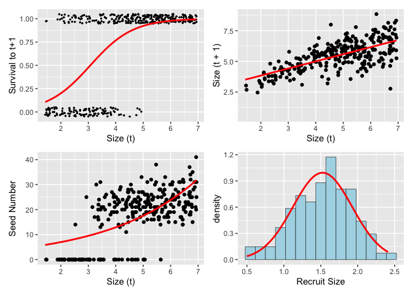<!-- -->

## Define functions to describe life history


``` r
# 1. survival probability function
## JM.  I think this is the inverse logit function
s.x=function(x,params) {
  u=exp(params$surv.int+params$surv.slope*x)
  return(u/(1+u))
}

# 2. growth function
## JM.  return a probablity distribution of new sizes at t+1 (xp) at a given size x.  
g.yx=function(xp,x,params) {
  dnorm(xp,mean=params$growth.int+params$growth.slope*x,sd=params$growth.sd)
}

# 3. reproduction function
f.yx=function(xp,x,params) {
  params$establishment.prob*
    dnorm(xp,mean=params$recruit.size.mean,sd=params$recruit.size.sd)*
    exp(params$seed.int+params$seed.slope*x) # why exp()?
}
```

## Make a kernel

Define the parameters for integration

``` r
# the sizes we are integrating over
min.size=.9*min(c(d$size,d$sizeNext),na.rm=T)
max.size=1.1*max(c(d$size,d$sizeNext),na.rm=T)

n=100 # number of cells in the matrix

b=min.size+c(0:n)*(max.size-min.size)/n # boundary points
y=0.5*(b[1:n]+b[2:(n+1)]) # mesh points
h=y[2]-y[1] # step size
```

Illustration of `outer`

``` r
x.test <- 1:5 %>% set_names(1:5)
y.test <- 11:15 %>% set_names(11:15)
outer(x.test, y.test, FUN = `+`)
```

```
##   11 12 13 14 15
## 1 12 13 14 15 16
## 2 13 14 15 16 17
## 3 14 15 16 17 18
## 4 15 16 17 18 19
## 5 16 17 18 19 20
```


Make the matrix

``` r
G=h*outer(y,y,g.yx,params=params) # growth matrix
# OK for each value of y,y evaluate the growth function g.yx using params
# If I understand this correctly, the rows are x(t) and the columns are x(t+1)

S=s.x(y,params=params) # survival
F=h*outer(y,y,f.yx,params=params) # reproduction matrix
P=G # placeholder; redefine P on the next line
for(i in 1:n) P[,i]=G[,i]*S[i] # growth/survival matrix
K=P+F # full matrix
```

### Basic Analyses


``` r
(lam <- Re(eigen(K)$values[1])) #dominant eigen value, lam = asympototic growth rate
```

```
## [1] 1.013391
```

``` r
w.eigen <- Re(eigen(K)$vectors[,1]) # right eigen vector, stable stage (e.g. size) distribution
stable.dist <- w.eigen/sum(w.eigen) # normalized it

v.eigen <- Re(eigen(t(K))$vectors[,1]) # left eigen vector, stable reproductive value
repro.val <- v.eigen/v.eigen[1] #I don't understand this normalization

# The eigen-things can be combined to obtain the sensitivity and elasticity matrices.
v.dot.w=sum(stable.dist*repro.val)*h
sens=outer(repro.val,stable.dist)/v.dot.w
elas=matrix(as.vector(sens)*as.vector(K)/lam,nrow=n)
```

Plot it

``` r
pl11 <- K %>% as_tibble() %>%
  set_colnames(y) %>% 
  mutate(size.t1=y) %>%
  pivot_longer(-size.t1, names_to = "size.t", names_transform = as.numeric) %>%
  ggplot(aes(x=size.t, y = size.t1)) +
  geom_raster(aes(fill = value)) +
  geom_contour(aes(z = value),lwd=.25) +
  scale_fill_viridis_c(option = "plasma") +
  labs(x = "Size (t)", y = "Size (t + 1)", title = "IPM Matrix") +
  coord_equal() +
  theme_bw()
```

```
## Warning: The `x` argument of `as_tibble.matrix()` must have unique column names if
## `.name_repair` is omitted as of tibble 2.0.0.
## ℹ Using compatibility `.name_repair`.
## This warning is displayed once every 8 hours.
## Call `lifecycle::last_lifecycle_warnings()` to see where this warning was
## generated.
```

``` r
pl12 <- tibble(Size = y, Density = stable.dist) %>% 
  ggplot(aes(x=Size, y = Density)) +
  geom_line() +
  labs(x = "Size", y = "Density", title = "Stable size distribution")

pl13 <- tibble(Size = y, repro.val) %>%
  ggplot(aes(x=Size, y = repro.val)) +
  geom_line() +
  labs(y = "Reproductive Values", title = "Reproductive Values")

pl14 <- elas %>% as_tibble() %>%
  set_colnames(y) %>% 
  mutate(size.t1=y) %>%
  pivot_longer(-size.t1, names_to = "size.t", names_transform = as.numeric) %>%
  ggplot(aes(x=size.t, y = size.t1)) +
  geom_raster(aes(fill = value)) +
  scale_fill_viridis_c(option = "plasma") +
  labs(x = "Size (t)", y = "Size (t + 1)", title = "Elasticity") +
  coord_equal() +
  theme_bw()

pl15 <- sens %>% as_tibble() %>%
  set_colnames(y) %>% 
  mutate(size.t1=y) %>%
  pivot_longer(-size.t1, names_to = "size.t", names_transform = as.numeric) %>%
  ggplot(aes(x=size.t, y = size.t1)) +
  geom_raster(aes(fill = value)) +
  scale_fill_viridis_c(option = "plasma") +
  labs(x = "Size (t)", y = "Size (t + 1)", title = "Sensitivity") +
  coord_equal() +
  theme_bw()

(pl11 + pl14 + pl15)  / (pl12 + pl13 + plot_spacer()) 
```

<!-- -->


## Improving the model

### Model variance in size as a function of size

Because variance isn't constant.

This is illustrated by plotting residuals vs size.


``` r
plot(growth.reg$model$size,abs(resid(growth.reg)),
     xlab="size",ylab="residual")
```

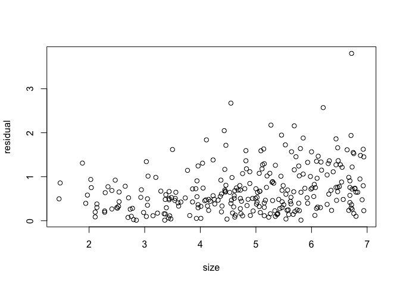<!-- -->

Use `nlme::gls()` to model variance as a function of size


``` r
growth.reg=gls(sizeNext ~ size, weights = varExp(), na.action = na.omit, data = d)
summary(growth.reg)
```

```
## Generalized least squares fit by REML
##   Model: sizeNext ~ size 
##   Data: d 
##       AIC      BIC   logLik
##   711.298 725.8085 -351.649
## 
## Variance function:
##  Structure: Exponential of variance covariate
##  Formula: ~fitted(.) 
##  Parameter estimates:
##     expon 
## 0.2935605 
## 
## Coefficients:
##                 Value Std.Error  t-value p-value
## (Intercept) 2.3280273 0.1422726 16.36315       0
## size        0.6585913 0.0330160 19.94764       0
## 
##  Correlation: 
##      (Intr)
## size -0.945
## 
## Standardized residuals:
##         Min          Q1         Med          Q3         Max 
## -3.29676378 -0.68003653  0.07382678  0.69180795  3.35550577 
## 
## Residual standard error: 0.1664014 
## Degrees of freedom: 280 total; 278 residual
```
plot the model

``` r
p2  + geom_function(fun = ~ predict(growth.reg,
                                    data.frame(size=.x)),
                    color = "red", lwd = 1)
```

```
## Warning: Removed 220 rows containing missing values or values outside the scale range
## (`geom_point()`).
```

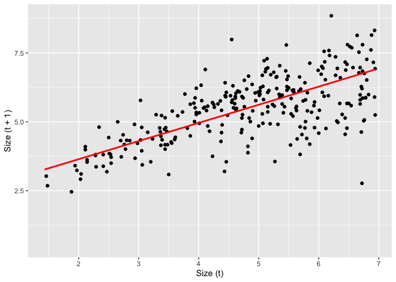<!-- -->

Now update the parameters, growth function, and then recreate the IPM


``` r
params$growth.int=coefficients(growth.reg)[1]
params$growth.slope=coefficients(growth.reg)[2]
params$growth.sigma2=summary(growth.reg)$sigma^2
params$growth.sigma2.exp=as.numeric(growth.reg$modelStruct$varStruct)

g.yx=function(xp,x,params) {
  dnorm(xp,mean=params$growth.int+params$growth.slope*x,
        sd=sqrt(params$growth.sigma2*exp(2*params$growth.sigma2.exp*x)))
}
```

Make the matrix

``` r
G=h*outer(y,y,g.yx,params=params) # growth matrix
# OK for each value of y,y evaluate the growth function g.yx using params
# If I understand this correctly, the rows are x(t) and the columns are x(t+1)

S=s.x(y,params=params) # survival
F=h*outer(y,y,f.yx,params=params) # reproduction matrix
P=G # placeholder; redefine P on the next line
for(i in 1:n) P[,i]=G[,i]*S[i] # growth/survival matrix
K=P+F # full matrix
```

### Basic Analyses


``` r
(lam <- Re(eigen(K)$values[1])) #dominant eigen value, lam = asympototic growth rate
```

```
## [1] 0.9802468
```

``` r
w.eigen <- Re(eigen(K)$vectors[,1]) # right eigen vector, stable stage (e.g. size) distribution
stable.dist <- w.eigen/sum(w.eigen) # normalized it

v.eigen <- Re(eigen(t(K))$vectors[,1]) # left eigen vector, stable reproductive value
repro.val <- v.eigen/v.eigen[1] #I don't understand this normalization

# The eigen-things can be combined to obtain the sensitivity and elasticity matrices.
v.dot.w=sum(stable.dist*repro.val)*h
sens=outer(repro.val,stable.dist)/v.dot.w
elas=matrix(as.vector(sens)*as.vector(K)/lam,nrow=n)
```

Plot it

``` r
pl11 <- K %>% as_tibble() %>%
  set_colnames(y) %>% 
  mutate(size.t1=y) %>%
  pivot_longer(-size.t1, names_to = "size.t", names_transform = as.numeric) %>%
  ggplot(aes(x=size.t, y = size.t1)) +
  geom_raster(aes(fill = value)) +
  geom_contour(aes(z = value),lwd=.25) +
  scale_fill_viridis_c(option = "plasma") +
  labs(x = "Size (t)", y = "Size (t + 1)", title = "IPM Matrix") +
  coord_equal() +
  theme_bw()

pl12 <- tibble(Size = y, Density = stable.dist) %>% 
  ggplot(aes(x=Size, y = Density)) +
  geom_line() +
  labs(x = "Size", y = "Density", title = "Stable size distribution")

pl13 <- tibble(Size = y, repro.val) %>%
  ggplot(aes(x=Size, y = repro.val)) +
  geom_line() +
  labs(y = "Reproductive Values", title = "Reproductive Values")

pl14 <- elas %>% as_tibble() %>%
  set_colnames(y) %>% 
  mutate(size.t1=y) %>%
  pivot_longer(-size.t1, names_to = "size.t", names_transform = as.numeric) %>%
  ggplot(aes(x=size.t, y = size.t1)) +
  geom_raster(aes(fill = value)) +
  scale_fill_viridis_c(option = "plasma") +
  labs(x = "Size (t)", y = "Size (t + 1)", title = "Elasticity") +
  coord_equal() +
  theme_bw()

pl15 <- sens %>% as_tibble() %>%
  set_colnames(y) %>% 
  mutate(size.t1=y) %>%
  pivot_longer(-size.t1, names_to = "size.t", names_transform = as.numeric) %>%
  ggplot(aes(x=size.t, y = size.t1)) +
  geom_raster(aes(fill = value)) +
  scale_fill_viridis_c(option = "plasma") +
  labs(x = "Size (t)", y = "Size (t + 1)", title = "Sensitivity") +
  coord_equal() +
  theme_bw()

(pl11 + pl14 + pl15)  / (pl12 + pl13 + plot_spacer()) 
```

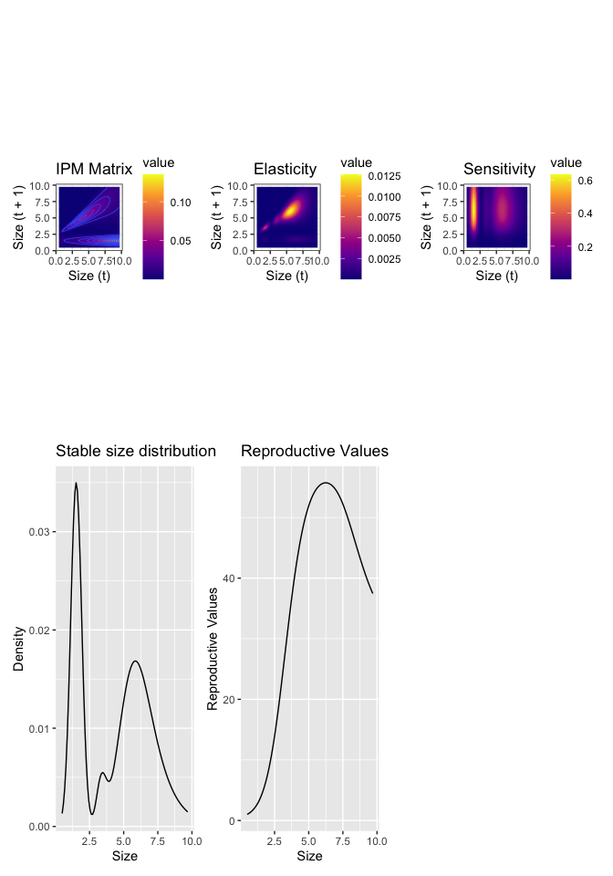<!-- -->

## Eviction

Evicition occurs when some individuals grow larger than the model's parameter space allows.

Check for eviction:


``` r
plot(y,s.x(y,params),xlab="Size",type="l", ylab="Survival Probability",lwd=2)
points(y,apply(P,2,sum),col="red",lwd=3,cex=.1,pch=19)
```

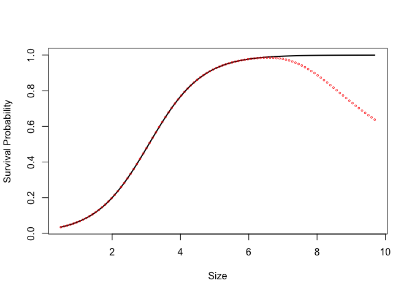<!-- -->

### Recreate the matrices while capturing evicted individuals


``` r
G=h*outer(y,y,g.yx,params=params) # growth matrix
S=s.x(y,params=params)
P=G
# fix eviction of offspring
for(i in 1:(n/2)) {
  G[1,i]<-G[1,i]+1-sum(G[,i])
  P[,i]<-G[,i]*S[i]
}
# fix eviction of large adults
for(i in (n/2+1):n) {
  G[n,i]<-G[n,i]+1-sum(G[,i])
  P[,i]<-G[,i]*S[i]
}
F=h*outer(y,y,f.yx,params=params) # reproduction matrix
K=P+F # full matrix
(lam=Re(eigen(K)$values[1])) # new population growth rate
```

```
## [1] 1.013069
```

And now plot again

``` r
plot(y,s.x(y,params),xlab="Size",type="l", ylab="Survival Probability",lwd=2)
points(y,apply(P,2,sum),col="red",lwd=3,cex=.1,pch=19)
```

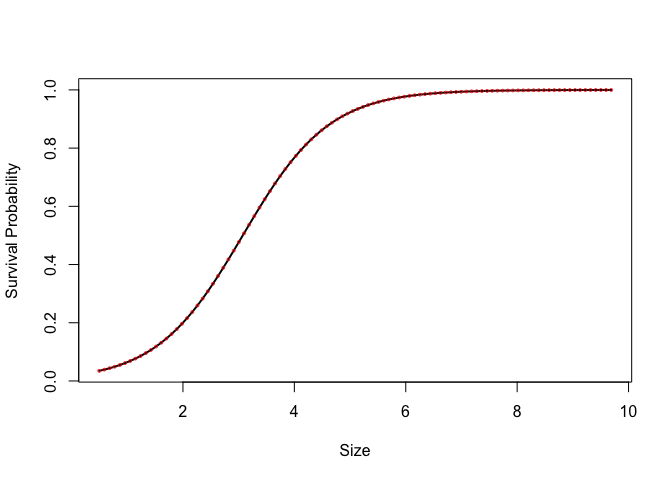<!-- -->

### Quadratic growth term


``` r
growth.reg=gls(sizeNext~size+I(size^2),weights=varExp(), na.action=na.omit, data=d)
summary(growth.reg) 
```

```
## Generalized least squares fit by REML
##   Model: sizeNext ~ size + I(size^2) 
##   Data: d 
##        AIC      BIC    logLik
##   698.7273 716.8474 -344.3636
## 
## Variance function:
##  Structure: Exponential of variance covariate
##  Formula: ~fitted(.) 
##  Parameter estimates:
##     expon 
## 0.3526461 
## 
## Coefficients:
##                  Value Std.Error   t-value p-value
## (Intercept)  0.7802238 0.3208072  2.432065  0.0156
## size         1.4981985 0.1704046  8.792009  0.0000
## I(size^2)   -0.1007464 0.0204990 -4.914706  0.0000
## 
##  Correlation: 
##           (Intr) size  
## size      -0.972       
## I(size^2)  0.925 -0.985
## 
## Standardized residuals:
##         Min          Q1         Med          Q3         Max 
## -3.26750304 -0.63630064  0.06390183  0.62856672  3.02974171 
## 
## Residual standard error: 0.11715 
## Degrees of freedom: 280 total; 277 residual
```


``` r
params$growth.int=coefficients(growth.reg)[1]
params$growth.slope=coefficients(growth.reg)[2]
params$growth.sqrd=coefficients(growth.reg)[3]
params$growth.sigma2=summary(growth.reg)$sigma^2
params$growth.sigma2.exp=as.numeric(growth.reg$modelStruct$varStruct)
g.yx=function(xp,x,params) {
  dnorm(xp,
        mean=params$growth.int+params$growth.slope*x+params$growth.sqrd*x^2,
        sd=sqrt(params$growth.sigma2*exp(2*params$growth.sigma2.exp*x)))
}

G=h*outer(y,y,g.yx,params=params) # growth matrix
S=s.x(y,params=params) # survival
P=G # placeholder; redefine P on the next line
# fix eviction of offspring
for(i in 1:(n/2)) {
  G[1,i]<-G[1,i]+1-sum(G[,i])
  P[,i]<-G[,i]*S[i]
}
# fix eviction of large adults
for(i in (n/2+1):n) {
  G[n,i]<-G[n,i]+1-sum(G[,i])
  P[,i]<-G[,i]*S[i]
}
F=h*outer(y,y,f.yx,params=params) # reproduction matrix
K=P+F # full matrix
(lam=Re(eigen(K)$values[1])) # new population growth rate
```

```
## [1] 0.9835344
```

``` r
w.eigen=Re(eigen(K)$vectors[,1])
stable.dist=w.eigen/sum(w.eigen)
v.eigen=Re(eigen(t(K))$vectors[,1])
repro.val=v.eigen/v.eigen[1]
v.dot.w=sum(stable.dist*repro.val)*h
sens=outer(repro.val,stable.dist)/v.dot.w
elas=matrix(as.vector(sens)*as.vector(K)/lam,nrow=n)
```


``` r
pl11 <- K %>% as_tibble() %>%
  set_colnames(y) %>% 
  mutate(size.t1=y) %>%
  pivot_longer(-size.t1, names_to = "size.t", names_transform = as.numeric) %>%
  ggplot(aes(x=size.t, y = size.t1)) +
  geom_raster(aes(fill = value)) +
  geom_contour(aes(z = value),lwd=.25) +
  scale_fill_viridis_c(option = "plasma") +
  labs(x = "Size (t)", y = "Size (t + 1)", title = "IPM Matrix") +
  coord_equal() +
  theme_bw()

pl12 <- tibble(Size = y, Density = stable.dist) %>% 
  ggplot(aes(x=Size, y = Density)) +
  geom_line() +
  labs(x = "Size", y = "Density", title = "Stable size distribution")

pl13 <- tibble(Size = y, repro.val) %>%
  ggplot(aes(x=Size, y = repro.val)) +
  geom_line() +
  labs(y = "Reproductive Values", title = "Reproductive Values")

pl14 <- elas %>% as_tibble() %>%
  set_colnames(y) %>% 
  mutate(size.t1=y) %>%
  pivot_longer(-size.t1, names_to = "size.t", names_transform = as.numeric) %>%
  ggplot(aes(x=size.t, y = size.t1)) +
  geom_raster(aes(fill = value)) +
  scale_fill_viridis_c(option = "plasma") +
  labs(x = "Size (t)", y = "Size (t + 1)", title = "Elasticity") +
  coord_equal() +
  theme_bw()

pl15 <- sens %>% as_tibble() %>%
  set_colnames(y) %>% 
  mutate(size.t1=y) %>%
  pivot_longer(-size.t1, names_to = "size.t", names_transform = as.numeric) %>%
  ggplot(aes(x=size.t, y = size.t1)) +
  geom_raster(aes(fill = value)) +
  scale_fill_viridis_c(option = "plasma") +
  labs(x = "Size (t)", y = "Size (t + 1)", title = "Sensitivity") +
  coord_equal() +
  theme_bw()

(pl11 + pl14 + pl15)  / (pl12 + pl13 + plot_spacer()) 
```

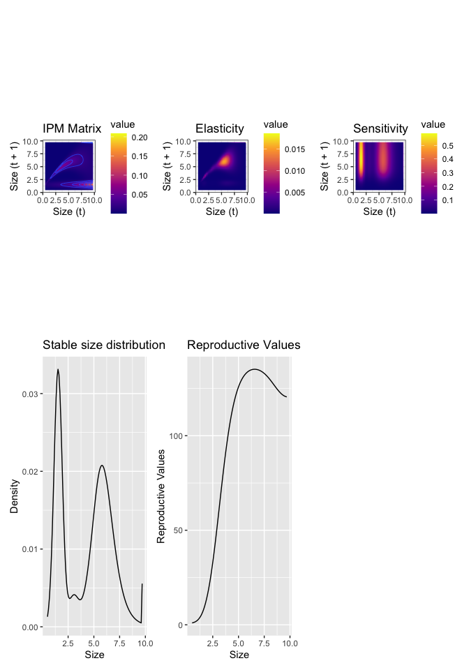<!-- -->

## Flowering probability

Update to include a probability of flowering based on size, instead of assuming that all plants flower.


``` r
# flowering probability function

p.flower.x=function(x,params) {
  u=exp(params$flower.int+params$flower.slope*x)
  return(u/(1+u))
}

# Modified reproduction function
f.yx=function(xp,x,params) {
  p.flower.x(x,params) * 
    params$establishment.prob * 
    dnorm(xp,mean=params$recruit.size.mean,sd=params$recruit.size.sd) * 
    exp(params$seed.int+params$seed.slope*x)
}

# Fit the flowering regression model
flower.reg=glm(fec.flower~size,data=d,family=binomial())
summary(flower.reg)
```

```
## 
## Call:
## glm(formula = fec.flower ~ size, family = binomial(), data = d)
## 
## Coefficients:
##             Estimate Std. Error z value Pr(>|z|)    
## (Intercept)  -6.5495     0.9564  -6.848 7.48e-12 ***
## size          1.9081     0.2465   7.740 9.92e-15 ***
## ---
## Signif. codes:  0 '***' 0.001 '**' 0.01 '*' 0.05 '.' 0.1 ' ' 1
## 
## (Dispersion parameter for binomial family taken to be 1)
## 
##     Null deviance: 285.68  on 279  degrees of freedom
## Residual deviance: 144.30  on 278  degrees of freedom
##   (220 observations deleted due to missingness)
## AIC: 148.3
## 
## Number of Fisher Scoring iterations: 6
```

``` r
# Get the flowering parameters

params$flower.int=coefficients(flower.reg)[1]
params$flower.slope=coefficients(flower.reg)[2]
```
update seed regression to only fit plants that flowered and get the parameters


``` r
seed.reg=glm(fec.seed~size,data=d[d$fec.flower==1,],family=poisson())
summary(seed.reg)
```

```
## 
## Call:
## glm(formula = fec.seed ~ size, family = poisson(), data = d[d$fec.flower == 
##     1, ])
## 
## Coefficients:
##             Estimate Std. Error z value Pr(>|z|)    
## (Intercept)  2.85617    0.07447  38.353  < 2e-16 ***
## size         0.05076    0.01370   3.706  0.00021 ***
## ---
## Signif. codes:  0 '***' 0.001 '**' 0.01 '*' 0.05 '.' 0.1 ' ' 1
## 
## (Dispersion parameter for poisson family taken to be 1)
## 
##     Null deviance: 250.71  on 221  degrees of freedom
## Residual deviance: 236.90  on 220  degrees of freedom
##   (220 observations deleted due to missingness)
## AIC: 1339
## 
## Number of Fisher Scoring iterations: 4
```

``` r
params$seed.int=coefficients(seed.reg)[1]
params$seed.slope=coefficients(seed.reg)[2]
```
Finally recalculate the matrices and plot


``` r
G=h*outer(y,y,g.yx,params=params) # growth matrix
S=s.x(y,params=params) # survival
P=G # placeholder; redefine P on the next line
# fix eviction of offspring
for(i in 1:(n/2)) {
  G[1,i]<-G[1,i]+1-sum(G[,i])
  P[,i]<-G[,i]*S[i]
}
# fix eviction of large adults
for(i in (n/2+1):n) {
  G[n,i]<-G[n,i]+1-sum(G[,i])
  P[,i]<-G[,i]*S[i]
}
# for(i in 1:n) P[,i]=G[,i]*S[i] # growth/survival matrix

F=h*outer(y,y,f.yx,params=params) # reproduction matrix

K=P+F # full matrix
(lam=Re(eigen(K)$values[1])) # new population growth rate
```

```
## [1] 0.9765733
```

``` r
w.eigen=Re(eigen(K)$vectors[,1])
stable.dist=w.eigen/sum(w.eigen)
v.eigen=Re(eigen(t(K))$vectors[,1])
repro.val=v.eigen/v.eigen[1]
v.dot.w=sum(stable.dist*repro.val)*h
sens=outer(repro.val,stable.dist)/v.dot.w
elas=matrix(as.vector(sens)*as.vector(K)/lam,nrow=n)
```


``` r
pl11 <- K %>% as_tibble() %>%
  set_colnames(y) %>% 
  mutate(size.t1=y) %>%
  pivot_longer(-size.t1, names_to = "size.t", names_transform = as.numeric) %>%
  ggplot(aes(x=size.t, y = size.t1)) +
  geom_raster(aes(fill = value)) +
  geom_contour(aes(z = value),lwd=.25) +
  scale_fill_viridis_c(option = "plasma") +
  labs(x = "Size (t)", y = "Size (t + 1)", title = "IPM Matrix") +
  coord_equal() +
  theme_bw()

pl12 <- tibble(Size = y, Density = stable.dist) %>% 
  ggplot(aes(x=Size, y = Density)) +
  geom_line() +
  labs(x = "Size", y = "Density", title = "Stable size distribution")

pl13 <- tibble(Size = y, repro.val) %>%
  ggplot(aes(x=Size, y = repro.val)) +
  geom_line() +
  labs(y = "Reproductive Values", title = "Reproductive Values")

pl14 <- elas %>% as_tibble() %>%
  set_colnames(y) %>% 
  mutate(size.t1=y) %>%
  pivot_longer(-size.t1, names_to = "size.t", names_transform = as.numeric) %>%
  ggplot(aes(x=size.t, y = size.t1)) +
  geom_raster(aes(fill = value)) +
  scale_fill_viridis_c(option = "plasma") +
  labs(x = "Size (t)", y = "Size (t + 1)", title = "Elasticity") +
  coord_equal() +
  theme_bw()

pl15 <- sens %>% as_tibble() %>%
  set_colnames(y) %>% 
  mutate(size.t1=y) %>%
  pivot_longer(-size.t1, names_to = "size.t", names_transform = as.numeric) %>%
  ggplot(aes(x=size.t, y = size.t1)) +
  geom_raster(aes(fill = value)) +
  scale_fill_viridis_c(option = "plasma") +
  labs(x = "Size (t)", y = "Size (t + 1)", title = "Sensitivity") +
  coord_equal() +
  theme_bw()

p16 <- tibble(size=y) %>%
  mutate(flowering.probability = predict(flower.reg, newdata = ., type = "response")) %>%
  ggplot(aes(x=size, y = flowering.probability)) +
  geom_line() +
  labs(x="Size (t)", y = "Flowering probability")

(pl11 + pl14 + pl15)  / (pl12 + pl13 + p16) 
```

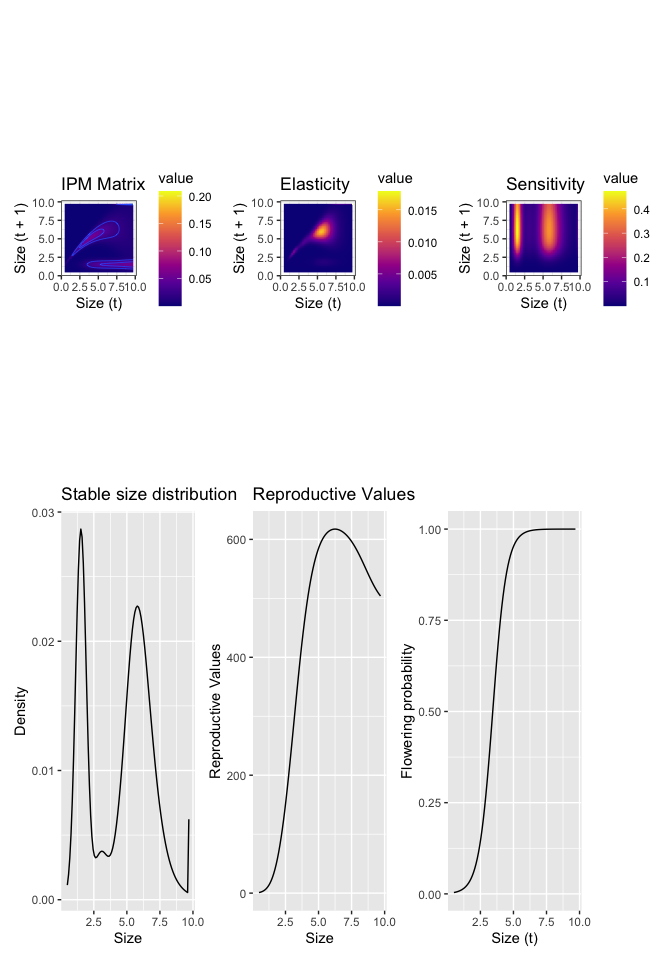<!-- -->

## Diagnostics

### passage times.
Start with life expectancy


``` r
Pmat = new("IPMmatrix", nDiscrete = 0, nEnvClass = 0, nBigMatrix = n, nrow = n, ncol = n, meshpoints = y, env.index = 0, names.discrete = "")
Pmat[, ] = P
str(Pmat)
```

```
## Formal class 'IPMmatrix' [package "IPMpack"] with 7 slots
##   ..@ .Data         : num [1:100, 1:100] 5.74e-14 5.44e-12 3.34e-10 1.31e-08 3.32e-07 ...
##   ..@ nDiscrete     : num 0
##   ..@ nEnvClass     : num 0
##   ..@ nBigMatrix    : num 100
##   ..@ meshpoints    : num [1:100] 0.496 0.589 0.682 0.775 0.868 ...
##   ..@ env.index     : num 0
##   ..@ names.discrete: chr ""
##   ..$ dim  : int [1:2] 100 100
##   ..$ names: chr [1:10000] "" NA NA NA ...
```

``` r
(mle=meanLifeExpect(Pmat))
```

```
##   [1]  1.067947  1.087713  1.113730  1.147586  1.191108  1.246350  1.315576
##   [8]  1.401236  1.505916  1.632291  1.783059  1.960869  2.168249  2.407523
##  [15]  2.680741  2.989599  3.335372  3.718851  4.140281  4.599314  5.094971
##  [22]  5.625612  6.188933  6.781973  7.401148  8.042312  8.700842  9.371742
##  [29] 10.049768 10.729572 11.405840 12.073441 12.727553 13.363778 13.978236
##  [36] 14.567626 15.129263 15.661088 16.161654 16.630090 17.066051 17.469656
##  [43] 17.841421 18.182190 18.493066 18.775348 19.030470 19.259956 19.465367
##  [50] 19.648272 19.810215 19.952690 20.077126 20.184874 20.277197 20.355265
##  [57] 20.420153 20.472840 20.514208 20.545051 20.566069 20.577880 20.581017
##  [64] 20.575940 20.563034 20.542616 20.514942 20.480211 20.438569 20.390117
##  [71] 20.334921 20.273016 20.204419 20.129138 20.047188 19.958599 19.863434
##  [78] 19.761806 19.653885 19.539915 19.420227 19.295243 19.165479 19.031551
##  [85] 18.894167 18.754117 18.612265 18.469531 18.326871 18.185259 18.045664
##  [92] 17.909031 17.776259 17.648186 17.525570 17.409080 17.299287 17.196656
##  [99] 17.101544 17.014203
```

plot the results


``` r
plot(y,meanLifeExpect(Pmat), xlab="Size (t)",ylab="Time")
```

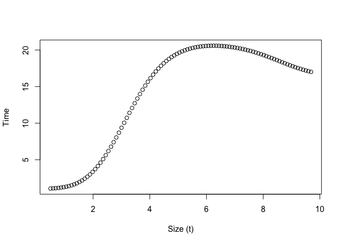<!-- -->

### Maximum size


``` r
par(mfrow=c(2,1),mar=c(4,5,2,2))
image(y,y,t(P), xlab="Size (t)",ylab="Size (t+1)",
           col=topo.colors(100), main="IPM matrix")
contour(y,y,t(P), add = TRUE, drawlabels = TRUE)
abline(0,1,lwd=3,lty=2)
plot(density(d$sizeNext[!is.na(d$sizeNext)]),xlab="Size(t+1)",
     main="Observed distribution of sizes")
```

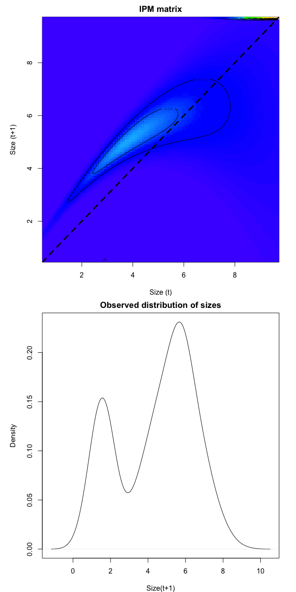<!-- -->
### Transient dynamics

IF the population is not at equilibrium what happens...

Asymptotic growth rate

``` r
(lam=Re(eigen(K)$values[1])) # asymptotic growth rate
```

```
## [1] 0.9765733
```

Damping ratio (ratio of dominant eigen value to the second largest one)
(what does the second largest eigen value represent?)

``` r
(damp=Re(eigen(K)$values[1])/Re(eigen(K)$values[2])) # damping ratio
```

```
## [1] 3.892877
```

Create a random starting structure and run it forward for 20 years to see when it achieves the asymptotic growth rate.
(Seems like you would want to do this a bunch of times if you cared)

``` r
initial.pop=runif(100) #random starting population structure
initial.pop=initial.pop/sum(initial.pop)
nyears=20
size.dist=matrix(NA,n,nyears)
lambda=rep(NA,nyears)
xold=initial.pop
for(i in 1:nyears){
  xnew=K%*%xold
  lambda[i]=sum(xnew)/sum(xold)
  size.dist[,i]=xnew
  xold=xnew
}
lambda
```

```
##  [1] 0.9889405 0.9471882 0.9659218 0.9749179 0.9767735 0.9768108 0.9766747
##  [8] 0.9766023 0.9765781 0.9765729 0.9765726 0.9765730 0.9765732 0.9765733
## [15] 0.9765733 0.9765733 0.9765733 0.9765733 0.9765733 0.9765733
```

