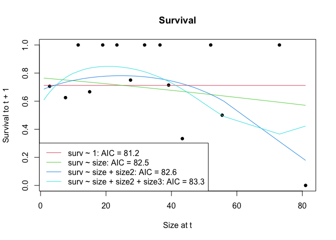
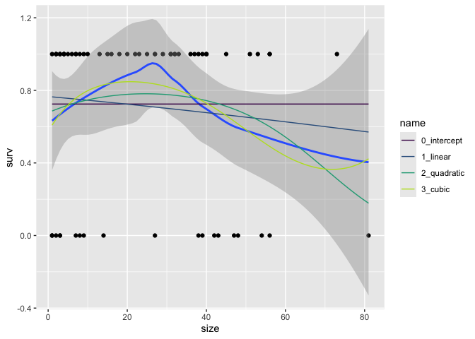
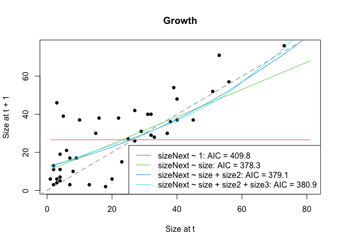
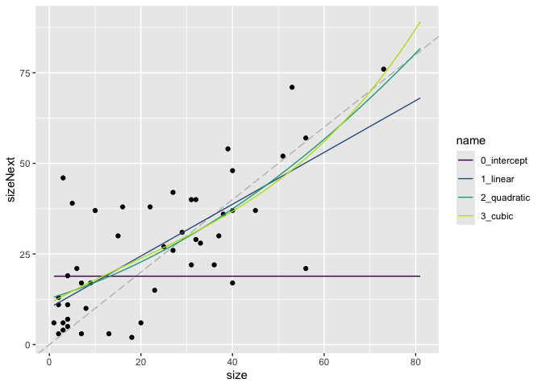
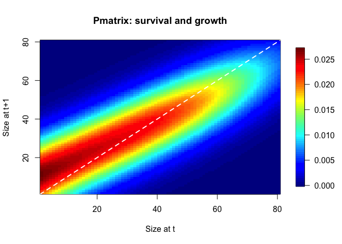
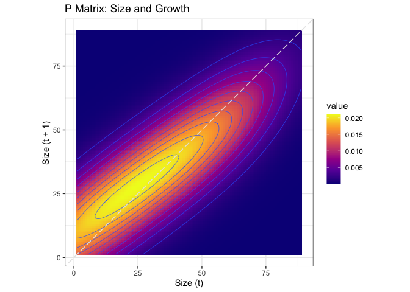
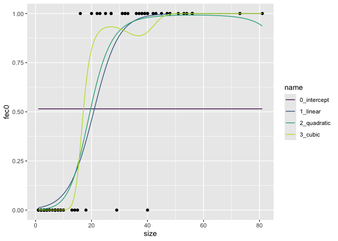
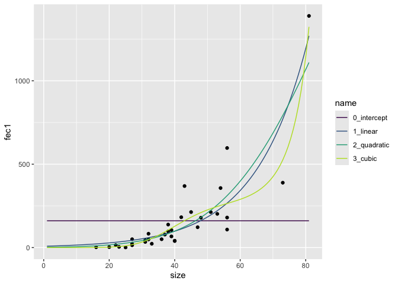

``` r
library(tidyverse)
```

```
## ── Attaching core tidyverse packages ──────────────────────── tidyverse 2.0.0 ──
## ✔ dplyr     1.1.4     ✔ readr     2.1.5
## ✔ forcats   1.0.0     ✔ stringr   1.5.1
## ✔ ggplot2   3.5.1     ✔ tibble    3.2.1
## ✔ lubridate 1.9.3     ✔ tidyr     1.3.1
## ✔ purrr     1.0.2     
## ── Conflicts ────────────────────────────────────────── tidyverse_conflicts() ──
## ✖ dplyr::filter() masks stats::filter()
## ✖ dplyr::lag()    masks stats::lag()
## ℹ Use the conflicted package (<http://conflicted.r-lib.org/>) to force all conflicts to become errors
```

``` r
library(broom)
#library(patchwork)
#library(ggbeeswarm)
library(magrittr)
```

```
## 
## Attaching package: 'magrittr'
## 
## The following object is masked from 'package:purrr':
## 
##     set_names
## 
## The following object is masked from 'package:tidyr':
## 
##     extract
```

``` r
#library(nlme)
library(IPMpack)
```

```
## Loading required package: Matrix
## 
## Attaching package: 'Matrix'
## 
## The following objects are masked from 'package:tidyr':
## 
##     expand, pack, unpack
## 
## Loading required package: MASS
## 
## Attaching package: 'MASS'
## 
## The following object is masked from 'package:dplyr':
## 
##     select
## 
## Loading required package: nlme
## 
## Attaching package: 'nlme'
## 
## The following object is masked from 'package:dplyr':
## 
##     collapse
```

``` r
#conflicted::conflict_prefer("select", "dplyr")
```


``` r
data("dataIPMpackHypericumCov")

d <- dataIPMpackHypericumCov
head(d)
```

```
##   id bald fireYear initial year TSLF size ontogeny fec0 fec1 fec2     fec3
## 1  5    1     1967    1994 1994   27    1        1    0   NA   NA 0.001216
## 2 22    1     1967    1994 1994   27    1        1    0   NA   NA 0.001216
## 3 33    1     1967    1994 1994   27    1        1    0   NA   NA 0.001216
## 4 41    1     1967    1994 1994   27    2        1    0   NA   NA 0.001216
## 5 55    1     1967    1994 1994   27    2        1    0   NA   NA 0.001216
## 6 42    1     1967    1994 1994   27    2        1    0   NA   NA 0.001216
##        fec4       goSB staySB      cov surv sizeNext ontogenyNext  covNext
## 1 0.1414214 0.08234362  0.672 1481.836    1        6            0 1420.622
## 2 0.1414214 0.08234362  0.672 1481.836    0       NA           NA 1420.622
## 3 0.1414214 0.08234362  0.672 1481.836    0       NA           NA 1420.622
## 4 0.1414214 0.08234362  0.672 1481.836    1        3            0 1420.622
## 5 0.1414214 0.08234362  0.672 1481.836    1       11            0 1420.622
## 6 0.1414214 0.08234362  0.672 1481.836    1       13            0 1420.622
```


``` r
skimr::skim(d)
```


Table: Data summary

|                         |     |
|:------------------------|:----|
|Name                     |d    |
|Number of rows           |761  |
|Number of columns        |20   |
|_______________________  |     |
|Column type frequency:   |     |
|numeric                  |20   |
|________________________ |     |
|Group variables          |None |


**Variable type: numeric**

|skim_variable | n_missing| complete_rate|    mean|     sd|      p0|     p25|     p50|     p75|    p100|hist  |
|:-------------|---------:|-------------:|-------:|------:|-------:|-------:|-------:|-------:|-------:|:-----|
|id            |         0|          1.00| 1253.07| 844.56|    1.00| 1060.00| 1467.00| 1540.00| 2914.00|▅▂▇▂▂ |
|bald          |         0|          1.00|    1.00|   0.00|    1.00|    1.00|    1.00|    1.00|    1.00|▁▁▇▁▁ |
|fireYear      |         0|          1.00| 1967.00|   0.00| 1967.00| 1967.00| 1967.00| 1967.00| 1967.00|▁▁▇▁▁ |
|initial       |         0|          1.00| 1996.22|   1.63| 1994.00| 1995.00| 1997.00| 1997.00| 1999.00|▇▁▇▂▂ |
|year          |         0|          1.00| 1996.46|   1.33| 1994.00| 1996.00| 1997.00| 1998.00| 1998.00|▃▃▇▇▇ |
|TSLF          |         0|          1.00|   29.46|   1.33|   27.00|   29.00|   30.00|   31.00|   31.00|▃▃▇▇▇ |
|size          |       255|          0.66|   21.35|  17.05|    1.00|    5.00|   20.00|   34.00|   81.00|▇▅▃▁▁ |
|ontogeny      |       255|          0.66|    0.29|   0.45|    0.00|    0.00|    0.00|    1.00|    1.00|▇▁▁▁▃ |
|fec0          |       255|          0.66|    0.55|   0.50|    0.00|    0.00|    1.00|    1.00|    1.00|▆▁▁▁▇ |
|fec1          |       483|          0.37|  107.26| 153.46|    1.00|   20.00|   53.50|  139.75| 1389.00|▇▁▁▁▁ |
|fec2          |       483|          0.37|   14.00|   0.00|   14.00|   14.00|   14.00|   14.00|   14.00|▁▁▇▁▁ |
|fec3          |         0|          1.00|    0.00|   0.00|    0.00|    0.00|    0.00|    0.00|    0.00|▁▁▁▁▇ |
|fec4          |         0|          1.00|    0.14|   0.00|    0.14|    0.14|    0.14|    0.14|    0.14|▁▁▇▁▁ |
|goSB          |         0|          1.00|    0.08|   0.00|    0.08|    0.08|    0.08|    0.08|    0.08|▁▁▁▁▇ |
|staySB        |         0|          1.00|    0.67|   0.00|    0.67|    0.67|    0.67|    0.67|    0.67|▁▁▇▁▁ |
|cov           |         0|          1.00| 1355.53| 136.32| 1113.54| 1414.27| 1420.62| 1425.96| 1481.84|▂▁▁▁▇ |
|surv          |       255|          0.66|    0.63|   0.48|    0.00|    0.00|    1.00|    1.00|    1.00|▅▁▁▁▇ |
|sizeNext      |       188|          0.75|   24.23|  17.20|    1.00|    7.00|   25.00|   38.00|   76.00|▇▅▅▂▁ |
|ontogenyNext  |       188|          0.75|    0.24|   0.43|    0.00|    0.00|    0.00|    0.00|    1.00|▇▁▁▁▂ |
|covNext       |         0|          1.00| 1418.66| 112.55| 1113.54| 1414.27| 1425.96| 1526.54| 1526.54|▁▁▁▇▃ |

``` r
d1 <- subset(d,is.na(d$size)==FALSE | d$ontogenyNext==1)
d1 <- subset(d1,d1$year==1994 | d1$year==1996)
```

some additional data:

``` r
fec2 <- 13.78 # number of seed per fruit
fec3 <- 0.001336 # probability of germination the year that the seed was prodiced
fec4 <- 0.14 # probability of seedling survival from germination to time of next census
goSB <- 0.08234528 # probability of a seed entering the seed bank
staySB <- 0.671 # probability of a seed staying in the seed bank
```

keep columns that we are going to use

``` r
d1 <- d1 |>
  dplyr::select(year, size, surv, sizeNext, fec0, fec1)
```

Add a variable to indicate the number of individuals changing size.  This will be be used later.  Set up stage and stage next


``` r
d1$number <- 1
d1$stageNext <- d1$stage <- "continuous"
d1$stage[is.na(d1$size)] <- NA
d1$stageNext[d1$surv==0] <- "dead"
```

Set up a seedbank data frame

``` r
seedbank <- data.frame(year="All",size=NA,surv=1,sizeNext=NA,fec0=NA,fec1=NA,
                       stage=c("seedbank","seedbank","continuous"),
                       stageNext=c("seedbank","continuous","seedbank"),
                       number=c(staySB,(1-staySB)*fec3*fec4,1))
seedbank
```

```
##   year size surv sizeNext fec0 fec1      stage  stageNext       number
## 1  All   NA    1       NA   NA   NA   seedbank   seedbank 6.710000e-01
## 2  All   NA    1       NA   NA   NA   seedbank continuous 6.153616e-05
## 3  All   NA    1       NA   NA   NA continuous   seedbank 1.000000e+00
```
combine data frames

``` r
d1 <- rbind(d1, seedbank)
```

## Analysis 

### 94 data


``` r
d94 <- subset(d1, d1$year == "1994" | d1$year == "All")
minSize<-min(d1$size,na.rm=T)
maxSize<-max(d1$size,na.rm=T)
x<-seq(from=minSize,to=maxSize,length=1001)
x0<-data.frame(size=x,size2=x^2,size3=x^3) # for later use
```

#### Survival and Growth Kernel

** Merow Version **

Survival


``` r
survModelComp(dataf = d94[!is.na(d$size),],
              expVars = c(surv~1, surv~size, surv~size + size2,
                          surv~size + size2 + size3),
              makePlot = TRUE, legendPos = "bottomleft", mainTitle = "Survival")
```

<!-- -->

```
## $summaryTable
##                     Exp. Vars              AIC
## 1                    surv ~ 1 81.2318701784179
## 2                 surv ~ size 82.5488383494282
## 3         surv ~ size + size2   82.58867293174
## 4 surv ~ size + size2 + size3 83.3292115781771
## 
## $survObjects
## $survObjects[[1]]
## An object of class "survObj"
## Slot "fit":
## 
## Call:  glm(formula = Formula, family = binomial, data = dataf)
## 
## Coefficients:
## (Intercept)  
##      0.9057  
## 
## Degrees of Freedom: 65 Total (i.e. Null);  65 Residual
## Null Deviance:	    79.23 
## Residual Deviance: 79.23 	AIC: 81.23
## 
## 
## $survObjects[[2]]
## An object of class "survObj"
## Slot "fit":
## 
## Call:  glm(formula = Formula, family = binomial, data = dataf)
## 
## Coefficients:
## (Intercept)         size  
##     1.18715     -0.01116  
## 
## Degrees of Freedom: 65 Total (i.e. Null);  64 Residual
## Null Deviance:	    79.23 
## Residual Deviance: 78.55 	AIC: 82.55
## 
## 
## $survObjects[[3]]
## An object of class "survObj"
## Slot "fit":
## 
## Call:  glm(formula = Formula, family = binomial, data = dataf)
## 
## Coefficients:
## (Intercept)         size        size2  
##   0.7396622    0.0433544   -0.0008809  
## 
## Degrees of Freedom: 65 Total (i.e. Null);  63 Residual
## Null Deviance:	    79.23 
## Residual Deviance: 76.59 	AIC: 82.59
## 
## 
## $survObjects[[4]]
## An object of class "survObj"
## Slot "fit":
## 
## Call:  glm(formula = Formula, family = binomial, data = dataf)
## 
## Coefficients:
## (Intercept)         size        size2        size3  
##   2.933e-01    1.520e-01   -4.724e-03    3.402e-05  
## 
## Degrees of Freedom: 65 Total (i.e. Null);  62 Residual
## Null Deviance:	    79.23 
## Residual Deviance: 75.33 	AIC: 83.33
```
choose quadratic

``` r
so94 <- makeSurvObj(d94, surv~size+I(size^2))
```


** JM Version **


``` r
newdata = tibble(size=seq(min(d94$size, na.rm = TRUE), max(d94$size, na.rm = TRUE), length.out=101))

surv.models <- tibble(name=c("0_intercept", "1_linear", "2_quadratic", "3_cubic"),
                      f = c("surv ~ 1", 
                            "surv ~ size", 
                            "surv ~ size + I(size^2)", 
                            "surv ~ size + I(size^2) + I(size^3)"))

surv.models <- surv.models %>%
  mutate(glm = map(f, ~ glm(as.formula(.), data = d94, family = "binomial") ),
         predict = map(glm, ~ cbind(newdata, surv=predict(., newdata, type = "response"))),
         glance = map(glm, glance))

surv.models %>% unnest(glance)
```

```
## # A tibble: 4 × 12
##   name     f     glm   predict null.deviance df.null logLik   AIC   BIC deviance
##   <chr>    <chr> <lis> <list>          <dbl>   <int>  <dbl> <dbl> <dbl>    <dbl>
## 1 0_inter… surv… <glm> <df>             81.2      68  -40.6  83.2  85.4     81.2
## 2 1_linear surv… <glm> <df>             79.2      65  -39.3  82.5  86.9     78.5
## 3 2_quadr… surv… <glm> <df>             79.2      65  -38.3  82.6  89.2     76.6
## 4 3_cubic  surv… <glm> <df>             79.2      65  -37.7  83.3  92.1     75.3
## # ℹ 2 more variables: df.residual <int>, nobs <int>
```
AIC is **VERY** similar.  Merow chose quadratic.


``` r
surv.models$predict[[1]]
```

```
##     size      surv
## 1    1.0 0.7246377
## 2    1.8 0.7246377
## 3    2.6 0.7246377
## 4    3.4 0.7246377
## 5    4.2 0.7246377
## 6    5.0 0.7246377
## 7    5.8 0.7246377
## 8    6.6 0.7246377
## 9    7.4 0.7246377
## 10   8.2 0.7246377
## 11   9.0 0.7246377
## 12   9.8 0.7246377
## 13  10.6 0.7246377
## 14  11.4 0.7246377
## 15  12.2 0.7246377
## 16  13.0 0.7246377
## 17  13.8 0.7246377
## 18  14.6 0.7246377
## 19  15.4 0.7246377
## 20  16.2 0.7246377
## 21  17.0 0.7246377
## 22  17.8 0.7246377
## 23  18.6 0.7246377
## 24  19.4 0.7246377
## 25  20.2 0.7246377
## 26  21.0 0.7246377
## 27  21.8 0.7246377
## 28  22.6 0.7246377
## 29  23.4 0.7246377
## 30  24.2 0.7246377
## 31  25.0 0.7246377
## 32  25.8 0.7246377
## 33  26.6 0.7246377
## 34  27.4 0.7246377
## 35  28.2 0.7246377
## 36  29.0 0.7246377
## 37  29.8 0.7246377
## 38  30.6 0.7246377
## 39  31.4 0.7246377
## 40  32.2 0.7246377
## 41  33.0 0.7246377
## 42  33.8 0.7246377
## 43  34.6 0.7246377
## 44  35.4 0.7246377
## 45  36.2 0.7246377
## 46  37.0 0.7246377
## 47  37.8 0.7246377
## 48  38.6 0.7246377
## 49  39.4 0.7246377
## 50  40.2 0.7246377
## 51  41.0 0.7246377
## 52  41.8 0.7246377
## 53  42.6 0.7246377
## 54  43.4 0.7246377
## 55  44.2 0.7246377
## 56  45.0 0.7246377
## 57  45.8 0.7246377
## 58  46.6 0.7246377
## 59  47.4 0.7246377
## 60  48.2 0.7246377
## 61  49.0 0.7246377
## 62  49.8 0.7246377
## 63  50.6 0.7246377
## 64  51.4 0.7246377
## 65  52.2 0.7246377
## 66  53.0 0.7246377
## 67  53.8 0.7246377
## 68  54.6 0.7246377
## 69  55.4 0.7246377
## 70  56.2 0.7246377
## 71  57.0 0.7246377
## 72  57.8 0.7246377
## 73  58.6 0.7246377
## 74  59.4 0.7246377
## 75  60.2 0.7246377
## 76  61.0 0.7246377
## 77  61.8 0.7246377
## 78  62.6 0.7246377
## 79  63.4 0.7246377
## 80  64.2 0.7246377
## 81  65.0 0.7246377
## 82  65.8 0.7246377
## 83  66.6 0.7246377
## 84  67.4 0.7246377
## 85  68.2 0.7246377
## 86  69.0 0.7246377
## 87  69.8 0.7246377
## 88  70.6 0.7246377
## 89  71.4 0.7246377
## 90  72.2 0.7246377
## 91  73.0 0.7246377
## 92  73.8 0.7246377
## 93  74.6 0.7246377
## 94  75.4 0.7246377
## 95  76.2 0.7246377
## 96  77.0 0.7246377
## 97  77.8 0.7246377
## 98  78.6 0.7246377
## 99  79.4 0.7246377
## 100 80.2 0.7246377
## 101 81.0 0.7246377
```


plot the fits

``` r
surv.predictions <- surv.models %>% dplyr::select(name, predict) %>% unnest(predict)

d94 %>% filter(!is.na(surv)) %>%
  ggplot(aes(x=size, y =surv)) +
  geom_point() +
  geom_smooth() + 
  geom_line(aes(color=name), data = surv.predictions) +
  scale_color_viridis_d(end = 0.9)
```

```
## `geom_smooth()` using method = 'loess' and formula = 'y ~ x'
```

```
## Warning: Removed 3 rows containing non-finite outside the scale range
## (`stat_smooth()`).
```

```
## Warning: Removed 3 rows containing missing values or values outside the scale range
## (`geom_point()`).
```

<!-- -->


Growth

** Merrow **

``` r
growthModelComp(dataf = d94, expVars = c(sizeNext~1, sizeNext~size,
                                         sizeNext~size + size2, sizeNext~size + size2 + size3), makePlot = TRUE,
                legendPos = "bottomright", mainTitle = "Growth")
```

```
## $summaryTable
##                         Exp. Vars   Reg. Type              AIC
## 1                    sizeNext ~ 1 constantVar 409.820215774606
## 2                 sizeNext ~ size constantVar 378.313543308947
## 3         sizeNext ~ size + size2 constantVar 379.068411444377
## 4 sizeNext ~ size + size2 + size3 constantVar 380.877520563861
## 
## $growthObjects
## $growthObjects[[1]]
## An object of class "growthObj"
## Slot "fit":
## 
## Call:
## lm(formula = Formula, data = dataf)
## 
## Coefficients:
## (Intercept)  
##        26.6  
## 
## 
## Slot "sd":
## [1] 18.33938
## 
## 
## $growthObjects[[2]]
## An object of class "growthObj"
## Slot "fit":
## 
## Call:
## lm(formula = Formula, data = dataf)
## 
## Coefficients:
## (Intercept)         size  
##     10.1394       0.7148  
## 
## 
## Slot "sd":
## [1] 12.98229
## 
## 
## $growthObjects[[3]]
## An object of class "growthObj"
## Slot "fit":
## 
## Call:
## lm(formula = Formula, data = dataf)
## 
## Coefficients:
## (Intercept)         size        size2  
##    12.70681      0.39113      0.00569  
## 
## 
## Slot "sd":
## [1] 12.95623
## 
## 
## $growthObjects[[4]]
## An object of class "growthObj"
## Slot "fit":
## 
## Call:
## lm(formula = Formula, data = dataf)
## 
## Coefficients:
## (Intercept)         size        size2        size3  
##  11.3739107    0.7010050   -0.0063340    0.0001176  
## 
## 
## Slot "sd":
## [1] 13.07943
```

``` r
abline(a = 0, b = 1, lty= 2, col = "gray", lwd=2)
```

<!-- -->

Choose linear

``` r
go94 <- makeGrowthObj(d94, sizeNext~size)
```

** Julin **

** JM Version **


``` r
growth.models <- tibble(name=c("0_intercept", "1_linear", "2_quadratic", "3_cubic"),
                      f = c("sizeNext ~ 1", 
                            "sizeNext ~ size", 
                            "sizeNext ~ size + I(size^2)", 
                            "sizeNext ~ size + I(size^2) + I(size^3)"))

growth.models <- growth.models %>%
  mutate(lm = map(f, ~ lm(as.formula(.), data = d94) ),
         predict = map(lm, ~ cbind(newdata, sizeNext=predict(., newdata))),
         glance = map(lm, glance))

growth.models %>% unnest(glance)
```

```
## # A tibble: 4 × 16
##   name      f     lm    predict r.squared adj.r.squared sigma statistic  p.value
##   <chr>     <chr> <lis> <list>      <dbl>         <dbl> <dbl>     <dbl>    <dbl>
## 1 0_interc… size… <lm>  <df>        0             0      18.2      NA   NA      
## 2 1_linear  size… <lm>  <df>        0.510         0.499  13.0      46.8  1.76e-8
## 3 2_quadra… size… <lm>  <df>        0.523         0.501  13.0      24.1  8.62e-8
## 4 3_cubic   size… <lm>  <df>        0.525         0.491  13.1      15.8  4.49e-7
## # ℹ 7 more variables: df <dbl>, logLik <dbl>, AIC <dbl>, BIC <dbl>,
## #   deviance <dbl>, df.residual <int>, nobs <int>
```
AIC is AIC is lowest for linear.

plot the fits

``` r
growth.predictions <- growth.models %>% dplyr::select(name, predict) %>% unnest(predict)

d94 %>% filter(!is.na(sizeNext) & !is.na(size)) %>%
  ggplot(aes(x=size, y =sizeNext)) +
  geom_point() +
  geom_abline(slope = 1, intercept = 0, lty = 5, color = "grey") + 
  geom_line(aes(color=name), data = growth.predictions) +
  scale_color_viridis_d(end = 0.9)
```

<!-- -->


Make the P matrix and plot it

** Merow **

``` r
Pmatrix94 <- makeIPMPmatrix(survObj = so94, growObj = go94,
                            minSize = minSize, maxSize = maxSize,
                            nBigMatrix = 80, correction = "constant")
require(fields)
```

```
## Loading required package: fields
```

```
## Loading required package: spam
```

```
## Spam version 2.11-0 (2024-10-03) is loaded.
## Type 'help( Spam)' or 'demo( spam)' for a short introduction 
## and overview of this package.
## Help for individual functions is also obtained by adding the
## suffix '.spam' to the function name, e.g. 'help( chol.spam)'.
```

```
## 
## Attaching package: 'spam'
```

```
## The following object is masked from 'package:Matrix':
## 
##     det
```

```
## The following objects are masked from 'package:base':
## 
##     backsolve, forwardsolve
```

```
## Loading required package: viridisLite
```

```
## 
## Try help(fields) to get started.
```

``` r
image.plot(Pmatrix94@meshpoints,
           Pmatrix94@meshpoints,
           t(Pmatrix94),
           main = "Pmatrix: survival and growth",
           xlab = "Size at t",
           ylab = "Size at t+1")
abline(a = 0, b = 1, lty= 2, col = "white", lwd=2)
```

<!-- -->
evaluate P matrix

``` r
diagnosticsPmatrix(Pmatrix94, growObj = go94, survObj = so94,
                   correction = "constant")
```

** Julin **

paramater data frame


``` r
params=data.frame(
  surv.int=NA, # Intercept from logistic regression of survival
  surv.slope1=NA, # Slope from logistic regression of survival
  surv.slope2=NA, # Quadratic slope from logistic regression of survival
  growth.int=NA, # Intercept from linear regression of growth
  growth.slope=NA, # Slope from linear regression of growth
  growth.sd=NA # Residual sd from the linear regression of growth
)
```

Get the survival coefficients.  Using the quadratic model.

``` r
# I am using broom:tidy to create a df with the coefficients.
surv.coefs <- surv.models %>% 
  filter(name == "2_quadratic") %>%
  mutate(coefs = map(glm, tidy)) %>% 
  dplyr::select(name, f, coefs) %>% 
  unnest(coefs) 

params$surv.int <- surv.coefs %>% filter(term == "(Intercept)") %>% pull(estimate)
params$surv.slope1 <- surv.coefs %>% filter(term == "size") %>% pull(estimate)
params$surv.slope2 <- surv.coefs %>% filter(term == "I(size^2)") %>% pull(estimate)
```

Get the growth coefficients.  Using the linear model.

``` r
growth.coefs <- growth.models %>% 
  filter(name == "1_linear") %>%
  mutate(coefs = map(lm, tidy)) %>% 
  dplyr::select(name, f, coefs) %>% 
  unnest(coefs)

params$growth.int <- growth.coefs %>% filter(term=="(Intercept)") %>% pull(estimate)
params$growth.slope <- growth.coefs %>% filter(term=="size") %>% pull(estimate)

# I am pulling sigma which is the _modeled_ standard deviation of the residuals.  Merow uses observed.  
params$growth.sd <- growth.models %>% filter(name=="1_linear") %>% unnest(glance) %>% pull(sigma)
```

Set up the functions

``` r
# 1. survival probability function
##This is inverse logit.  Provides survival probability based on size.
s.x=function(x,params) {
  u=exp(params$surv.int + params$surv.slope1*x + params$surv.slope2*x^2)
  return(u/(1+u))
}

# 2. growth function
## Return a probability distribution of new sizes at t+1 (xp) at a given size x.  
g.yx=function(xp,x,params) {
  dnorm(xp,mean=params$growth.int+params$growth.slope*x,sd=params$growth.sd)
}
```

Make a kernel
Define the parameters for integration

``` r
# the sizes we are integrating over
min.size=.9*min(c(d94$size, d94$sizeNext),na.rm=T)
max.size=1.1*max(c(d94$size, d94$sizeNext),na.rm=T)

n=100 # dimensions of the matrix

b=min.size+c(0:n)*(max.size-min.size)/n # boundary points
y=0.5*(b[1:n]+b[2:(n+1)]) # mesh points
h=y[2]-y[1] # step size
```

Make the matrix

``` r
G=h*outer(y,y,g.yx,params=params) # growth matrix
# OK for each value of y,y evaluate the growth function g.yx using params
# If I understand this correctly, the rows are x(t) and the columns are x(t+1)

S=s.x(y,params=params) # survival
# F=h*outer(y,y,f.yx,params=params) # reproduction matrix
P=G # placeholder; redefine P on the next line
for(i in 1:n) P[,i]=G[,i]*S[i] # growth/survival matrix
# K=P+F # full matrix
```

Plot the matrix

``` r
P %>% as_tibble() %>%
  set_colnames(y) %>% 
  mutate(size.t1=y) %>%
  pivot_longer(-size.t1, names_to = "size.t", names_transform = as.numeric) %>%
  ggplot(aes(x=size.t, y = size.t1)) +
  geom_raster(aes(fill = value)) +
  geom_contour(aes(z = value),lwd=.25) +
  geom_abline(intercept=0, slope = 1, color="gray90", lty=5) +
  scale_fill_viridis_c(option = "plasma") +
  labs(x = "Size (t)", y = "Size (t + 1)", title = "P Matrix: Size and Growth") +
  coord_equal() +
  theme_bw()
```

```
## Warning: The `x` argument of `as_tibble.matrix()` must have unique column names if
## `.name_repair` is omitted as of tibble 2.0.0.
## ℹ Using compatibility `.name_repair`.
## This warning is displayed once every 8 hours.
## Call `lifecycle::last_lifecycle_warnings()` to see where this warning was
## generated.
```

<!-- -->


evaluate P matrix -- Need a non-IPMpack way of doing this.
Merow (appendix C) says:

Calling the function PMatrixDiagnostics yields a figure
illustrating whether survival, life expectancy, and populations structure change with an increase
in the number of bins or an increase in the size range. 

To make this work I think we need a function that makes the Matrix for us based on some parameters (bin size, etc).  Then this can be called repeatedly.

``` r
diagnosticsPmatrix(Pmatrix94, growObj = go94, survObj = so94,
                   correction = "constant")
```


#### Fecundity Kernel

Compare different models for flowering probability:
getting an error

``` r
fec0.0_94 <- makeFecObj(d94, Formula = fec0~1, Family = "binomial")
fec0.1_94 <- makeFecObj(d94, Formula = fec0~size, Family = "binomial")
fec0.2_94 <- makeFecObj(d94, Formula = fec0~size+size2, Family = "binomial")
fec0.3_94 <- makeFecObj(d94, Formula = fec0~size+size2+size3, Family = "binomial")
```


``` r
newdata = tibble(size=seq(min(d94$size, na.rm = TRUE), max(d94$size, na.rm = TRUE), length.out=101))

fec0.models <- tibble(name=c("0_intercept", "1_linear", "2_quadratic", "3_cubic"),
                      f = c("fec0 ~ 1", 
                            "fec0 ~ size", 
                            "fec0 ~ size + I(size^2)", 
                            "fec0 ~ size + I(size^2) + I(size^3)"))

fec0.models <- fec0.models %>%
  mutate(glm = map(f, ~ glm(as.formula(.), data = d94, family = "binomial") ),
         predict = map(glm, ~ cbind(newdata, fec0=predict(., newdata, type = "response"))),
         glance = map(glm, glance))
```

```
## Warning: There was 1 warning in `mutate()`.
## ℹ In argument: `glm = map(f, ~glm(as.formula(.), data = d94, family =
##   "binomial"))`.
## Caused by warning:
## ! glm.fit: fitted probabilities numerically 0 or 1 occurred
```

``` r
fec0.models %>% unnest(glance)
```

```
## # A tibble: 4 × 12
##   name     f     glm   predict null.deviance df.null logLik   AIC   BIC deviance
##   <chr>    <chr> <lis> <list>          <dbl>   <int>  <dbl> <dbl> <dbl>    <dbl>
## 1 0_inter… fec0… <glm> <df>             91.4      65 -45.7   93.4  95.6     91.4
## 2 1_linear fec0… <glm> <df>             91.4      65 -12.9   29.9  34.3     25.9
## 3 2_quadr… fec0… <glm> <df>             91.4      65 -11.8   29.6  36.1     23.6
## 4 3_cubic  fec0… <glm> <df>             91.4      65  -9.64  27.3  36.0     19.3
## # ℹ 2 more variables: df.residual <int>, nobs <int>
```

``` r
# AIC lowest in cubic, although not by a ton.
```

plot predictions:

``` r
fec0.predictions <- fec0.models %>% dplyr::select(name, predict) %>% unnest(predict)

d94 %>% filter(!is.na(fec0)) %>%
  ggplot(aes(x=size, y =fec0)) +
  geom_point() +
  geom_line(aes(color=name), data = fec0.predictions) +
  scale_color_viridis_d(end = 0.9)
```

<!-- -->


Compare different models for number of fruits
getting an error

``` r
fec1.0_94 <- makeFecObj(d94, Formula = fec1~1, Family = "poisson")
fec1.1_94 <- makeFecObj(d94, Formula = fec1~size, Family = "poisson")
fec1.2_94 <- makeFecObj(d94, Formula = fec1~size+size2, Family = "poisson")
fec1.3_94 <- makeFecObj(d94, Formula = fec1~size+size2+size3, Family = "poisson")
```


``` r
fec1.models <- tibble(name=c("0_intercept", "1_linear", "2_quadratic", "3_cubic"),
                      f = c("fec1 ~ 1", 
                            "fec1 ~ size", 
                            "fec1 ~ size + I(size^2)", 
                            "fec1 ~ size + I(size^2) + I(size^3)"))

fec1.models <- fec1.models %>%
  mutate(glm = map(f, ~ glm(as.formula(.), data = d94, family = "poisson") ),
         predict = map(glm, ~ cbind(newdata, fec1=predict(., newdata, type = "response"))),
         glance = map(glm, glance))

fec1.models %>% unnest(glance)
```

```
## # A tibble: 4 × 12
##   name     f     glm   predict null.deviance df.null logLik   AIC   BIC deviance
##   <chr>    <chr> <lis> <list>          <dbl>   <int>  <dbl> <dbl> <dbl>    <dbl>
## 1 0_inter… fec1… <glm> <df>            7985.      33 -4094. 8191. 8192.    7985.
## 2 1_linear fec1… <glm> <df>            7985.      33  -903. 1809. 1812.    1601.
## 3 2_quadr… fec1… <glm> <df>            7985.      33  -848. 1701. 1706.    1491.
## 4 3_cubic  fec1… <glm> <df>            7985.      33  -671. 1350. 1356.    1138.
## # ℹ 2 more variables: df.residual <int>, nobs <int>
```

``` r
# AIC clearly lowest in cubic
```

plot predictions:

``` r
fec1.predictions <- fec1.models %>% dplyr::select(name, predict) %>% unnest(predict)

d94 %>% filter(!is.na(fec1)) %>%
  ggplot(aes(x=size, y =fec1)) +
  geom_point() +
  geom_line(aes(color=name), data = fec1.predictions) +
  scale_color_viridis_d(end=.9)
```

<!-- -->

put it together:

``` r
fo94 <- makeFecObj(d94, Formula=c(fec0~size+size2, fec1~size+size2+size3),
                   Family=c("binomial", "poisson"),
                   Transform=c("none", -1),
                   meanOffspringSize=mean(d94[is.na(d1$size)==TRUE &
                                                is.na(d94$sizeNext)==FALSE,"sizeNext"]),
                   sdOffspringSize=sd(d94[is.na(d1$size)==TRUE &
                                            is.na(d94$sizeNext)==FALSE,"sizeNext"]),
                   fecConstants=data.frame(fec2=fec2,fec3=fec3,fec4=fec4),
                   offspringSplitter=data.frame(seedbank=goSB,
                                                continuous=(1-goSB)),
                   vitalRatesPerOffspringType=data.frame(
                     seedbank=c(1,1,1,0,0),
                     continuous=c(1,1,1,1,1),
                     row.names=c("fec0","fec1",
                                 "fec2","fec3","fec4")))
```

