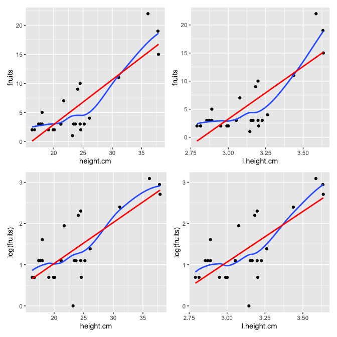
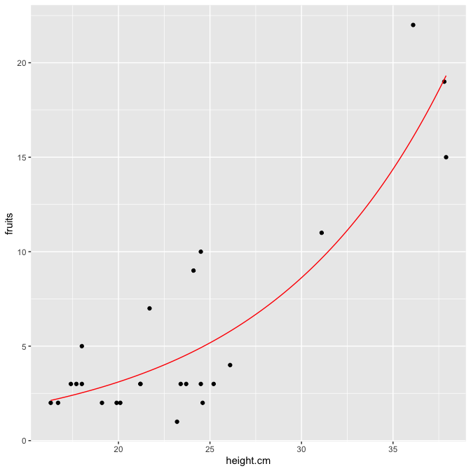
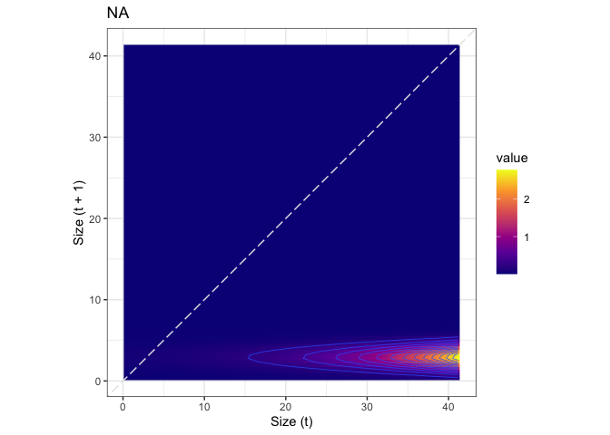

``` r
library(tidyverse)
library(patchwork)
library(tidymodels)
library(multilevelmod)
library(lmerTest)
library(broom.mixed)
library(modelr)
conflicted::conflict_prefer("select", "dplyr")
conflicted::conflict_prefer("filter", "dplyr")
conflicted::conflict_prefer("lag", "dplyr")
```


``` r
fruit <- read_csv("../input/WL2_2023_Fruits_forIPMs.csv") %>%
  filter(BedLoc!="K_5_C") %>% #get rid of duplicate locations
  filter(BedLoc!="B_32_A") %>% #get rid of duplicate locations
  filter(!is.na(pop), !str_detect(Genotype, ".*buff*"))  #remove buffers
```

```
## Rows: 25 Columns: 16
## ── Column specification ────────────────────────────────────────────────────────
## Delimiter: ","
## chr (7): block, BedLoc, bed, bed-col, Genotype, pop, elevation.group
## dbl (9): bed-row, mf, rep, flowers, fruits, FrFlN, elev_m, Lat, Long
## 
## ℹ Use `spec()` to retrieve the full column specification for this data.
## ℹ Specify the column types or set `show_col_types = FALSE` to quiet this message.
```

``` r
fruit
```

```
## # A tibble: 25 × 16
##    block BedLoc bed   `bed-row` `bed-col` Genotype pop      mf   rep flowers
##    <chr> <chr>  <chr>     <dbl> <chr>     <chr>    <chr> <dbl> <dbl>   <dbl>
##  1 A     A_1_A  A             1 A         TM2_6_11 TM2       6    11       0
##  2 B     A_43_A A            43 A         TM2_6_1  TM2       6     1       0
##  3 B     A_56_B A            56 B         TM2_2_12 TM2       2    12       0
##  4 A     A_23_D A            23 D         TM2_3_3  TM2       3     3       1
##  5 B     A_44_C A            44 C         TM2_6_3  TM2       6     3       1
##  6 C     B_37_A B            37 A         TM2_1_16 TM2       1    16       5
##  7 C     B_36_D B            36 D         TM2_1_4  TM2       1     4       2
##  8 C     B_43_D B            43 D         TM2_7_10 TM2       7    10      20
##  9 F     C_54_B C            54 B         TM2_1_14 TM2       1    14       2
## 10 E     C_32_D C            32 D         TM2_7_12 TM2       7    12       3
## # ℹ 15 more rows
## # ℹ 6 more variables: fruits <dbl>, FrFlN <dbl>, elevation.group <chr>,
## #   elev_m <dbl>, Lat <dbl>, Long <dbl>
```


``` r
pheno.dates <- read_csv("../input/WL2_2023_PhenologyDates.csv")
```

```
## Rows: 1826 Columns: 12
## ── Column specification ────────────────────────────────────────────────────────
## Delimiter: ","
## chr (10): block, bed, bed.col, pop, mf, rep, bud.date, flower.date, fruit.da...
## dbl  (1): bed.row
## lgl  (1): last.fruit.date
## 
## ℹ Use `spec()` to retrieve the full column specification for this data.
## ℹ Specify the column types or set `show_col_types = FALSE` to quiet this message.
```

``` r
pheno.dates
```

```
## # A tibble: 1,826 × 12
##    block bed   bed.row bed.col pop   mf    rep   bud.date flower.date fruit.date
##    <chr> <chr>   <dbl> <chr>   <chr> <chr> <chr> <chr>    <chr>       <chr>     
##  1 A     A           1 A       TM2   6     11    8/23/23  9/13/23     10/13/23  
##  2 A     A           1 B       LVTR1 7     1     <NA>     <NA>        <NA>      
##  3 A     A           2 A       SQ2   6     14    <NA>     <NA>        <NA>      
##  4 A     A           2 B       YO8   8     3     <NA>     <NA>        <NA>      
##  5 A     A           3 A       CC    2     3     <NA>     <NA>        <NA>      
##  6 A     A           3 B       YO11  5     14    <NA>     <NA>        <NA>      
##  7 A     A           4 A       BH    6     3     <NA>     <NA>        <NA>      
##  8 A     A           4 B       DPR   4     8     <NA>     <NA>        <NA>      
##  9 A     A           5 A       CP2   5     1     <NA>     <NA>        <NA>      
## 10 A     A           5 B       LVTR1 3     12    <NA>     <NA>        <NA>      
## # ℹ 1,816 more rows
## # ℹ 2 more variables: last.flower.date <chr>, last.fruit.date <lgl>
```


``` r
growth <- read_csv("../input/WL2-2023_Size_Combined.csv")
```

```
## Rows: 17336 Columns: 10
## ── Column specification ────────────────────────────────────────────────────────
## Delimiter: ","
## chr  (5): block, Genotype, pop.mf, parent.pop, survey.notes
## dbl  (4): mf, rep, height.cm, long.leaf.cm
## date (1): survey_date
## 
## ℹ Use `spec()` to retrieve the full column specification for this data.
## ℹ Specify the column types or set `show_col_types = FALSE` to quiet this message.
```

``` r
growth
```

```
## # A tibble: 17,336 × 10
##    survey_date block Genotype pop.mf parent.pop    mf   rep height.cm
##    <date>      <chr> <chr>    <chr>  <chr>      <dbl> <dbl>     <dbl>
##  1 2023-07-03  <NA>  CP2_1_1  CP2_1  CP2            1     1       0.5
##  2 2023-07-03  <NA>  CP2_1_2  CP2_1  CP2            1     2       0.7
##  3 2023-07-03  <NA>  CP2_1_3  CP2_1  CP2            1     3       1.1
##  4 2023-07-03  <NA>  CP2_1_4  CP2_1  CP2            1     4       0.8
##  5 2023-07-03  <NA>  CP2_1_5  CP2_1  CP2            1     5       0.9
##  6 2023-07-03  <NA>  CP2_1_6  CP2_1  CP2            1     6       1  
##  7 2023-07-03  <NA>  CP2_1_7  CP2_1  CP2            1     7       1.5
##  8 2023-07-03  <NA>  CP2_1_8  CP2_1  CP2            1     8       1.1
##  9 2023-07-03  <NA>  CP2_1_9  CP2_1  CP2            1     9       0.5
## 10 2023-07-03  <NA>  CP2_1_10 CP2_1  CP2            1    10       0.7
## # ℹ 17,326 more rows
## # ℹ 2 more variables: long.leaf.cm <dbl>, survey.notes <chr>
```


``` r
# I don't necessarily need all of these new variables but just keeping the code from the G+S models
growth2 <- growth %>% arrange(Genotype, survey_date) %>%
  select(-survey.notes, -long.leaf.cm) %>%
  group_by(Genotype) %>%
  mutate(l.height.cm = log(height.cm),
         l.height.cm.next = lead(l.height.cm),
         elapsed_days= lead(survey_date) - survey_date,
         elapsed_weeks = as.integer(elapsed_days)/7) %>%
  ungroup() %>%
  mutate(week = as.numeric(survey_date - ymd("2023-07-03")) / 7, # 7/03 = pre-transplant survey date
         week_char = as.character(week)) %>% 
  drop_na(block, l.height.cm, l.height.cm.next)

growth2 
```

```
## # A tibble: 5,894 × 14
##    survey_date block Genotype pop.mf parent.pop    mf   rep height.cm
##    <date>      <chr> <chr>    <chr>  <chr>      <dbl> <dbl>     <dbl>
##  1 2023-07-26  L     BH_1_1   BH_1   BH             1     1       4.7
##  2 2023-08-02  L     BH_1_1   BH_1   BH             1     1       4.8
##  3 2023-08-16  L     BH_1_1   BH_1   BH             1     1       4.9
##  4 2023-08-23  L     BH_1_1   BH_1   BH             1     1       5.7
##  5 2023-08-30  L     BH_1_1   BH_1   BH             1     1       4.9
##  6 2023-09-06  L     BH_1_1   BH_1   BH             1     1       3.6
##  7 2023-09-13  L     BH_1_1   BH_1   BH             1     1       4.4
##  8 2023-09-20  L     BH_1_1   BH_1   BH             1     1       5.1
##  9 2023-10-13  L     BH_1_1   BH_1   BH             1     1       5.6
## 10 2023-07-26  H     BH_1_10  BH_1   BH             1    10       3.1
## # ℹ 5,884 more rows
## # ℹ 6 more variables: l.height.cm <dbl>, l.height.cm.next <dbl>,
## #   elapsed_days <drtn>, elapsed_weeks <dbl>, week <dbl>, week_char <chr>
```

load survival

``` r
survival <- read_csv("../input/WL2_Mortality.csv")
```

```
## Rows: 1575 Columns: 12
## ── Column specification ────────────────────────────────────────────────────────
## Delimiter: ","
## chr (9): block, BedLoc, bed, bed.col, Genotype, pop.mf, parent.pop, death.da...
## dbl (3): bed.row, mf, rep
## 
## ℹ Use `spec()` to retrieve the full column specification for this data.
## ℹ Specify the column types or set `show_col_types = FALSE` to quiet this message.
```

``` r
survival2 <- survival %>% select(Genotype, death.date) %>%
  right_join(growth) %>%
  mutate(l.height.cm = log(height.cm)) %>%
  arrange(Genotype, survey_date) %>%
  select(-survey.notes, -long.leaf.cm) %>%
  group_by(Genotype) %>%
  mutate(elapsed_days= lead(survey_date) - survey_date,
         elapsed_weeks = as.integer(elapsed_days)/7,
         block = ifelse(is.na(block), unique(na.omit(block)), block), # fill in missing block info 
         death.date = lubridate::mdy(death.date),
         surv.next = ifelse(is.na(death.date), 1, death.date > lead(survey_date))) %>% 
  ungroup() %>%
  mutate(week = as.numeric(survey_date - ymd("2023-07-03")) / 7, # 7/03 = pre-transplant survey date
         week_char = as.character(round(week, 2)),
         ppmf = str_c(parent.pop, "_", mf)) %>% # allows me to specify RE for pp and mf separately.
  drop_na(surv.next, parent.pop, l.height.cm, elapsed_days)
```

```
## Joining with `by = join_by(Genotype)`
```

```
## Warning in right_join(., growth): Detected an unexpected many-to-many relationship between `x` and `y`.
## ℹ Row 1 of `x` matches multiple rows in `y`.
## ℹ Row 1362 of `y` matches multiple rows in `x`.
## ℹ If a many-to-many relationship is expected, set `relationship =
##   "many-to-many"` to silence this warning.
```

Here we are just going to predict fruit from size 2 months after transplant


``` r
fruit_growth <- growth2 %>% filter(survey_date=="2023-09-06") %>%
  select(Genotype, height.cm, l.height.cm) %>%
  right_join(fruit, by="Genotype")
```


``` r
p1 <- fruit_growth %>%
  ggplot(aes(x=height.cm, y=fruits)) +
  geom_point() +
  geom_smooth(se = FALSE) +
  geom_smooth(method="lm", color="red", se = FALSE) 

p2 <- fruit_growth %>%
  ggplot(aes(x=l.height.cm, y=fruits)) +
  geom_point() +
  geom_smooth(se = FALSE) +
  geom_smooth(method="lm", color="red", se = FALSE) 

p3 <- fruit_growth %>%
  ggplot(aes(x=height.cm, y=log(fruits))) +
  geom_point() +
  geom_smooth(se = FALSE) +
  geom_smooth(method="lm", color="red", se = FALSE) 

p4 <- fruit_growth %>%
  ggplot(aes(x=l.height.cm, y=log(fruits))) +
  geom_point() +
  geom_smooth(se = FALSE) +
  geom_smooth(method="lm", color="red", se = FALSE) 

(p1 + p2) / (p3 + p4)
```

```
## `geom_smooth()` using method = 'loess' and formula = 'y ~ x'
## `geom_smooth()` using formula = 'y ~ x'
## `geom_smooth()` using method = 'loess' and formula = 'y ~ x'
## `geom_smooth()` using formula = 'y ~ x'
## `geom_smooth()` using method = 'loess' and formula = 'y ~ x'
## `geom_smooth()` using formula = 'y ~ x'
## `geom_smooth()` using method = 'loess' and formula = 'y ~ x'
## `geom_smooth()` using formula = 'y ~ x'
```

<!-- -->

## Some models


``` r
fruit.spec <- poisson_reg() %>%
  set_engine("glmer", family = "poisson")

fruit.recipe <- fruit_growth %>%
  select(fruits, height.cm, l.height.cm, block) %>%
  recipe() %>%
  update_role(fruits, new_role = "outcome") %>% 
  update_role(c(height.cm, l.height.cm, block), new_role = "predictor") %>%
  step_poly(c(height.cm, l.height.cm), degree = 3, keep_original_cols = TRUE) %>%
  step_rename_at(contains("poly"), fn = \(x) str_replace(x, "_poly_", ".p"))


fruit.wflow <- workflow() %>%
  add_recipe(fruit.recipe)
```


``` r
fruit.models <- tibble(wflow=list(
  
  ml1_linear = {fruit.wflow %>%
      add_model(fruit.spec,
                formula = fruits ~ height.cm + (1|block)) },
  
  ml2_linear_log.height = {fruit.wflow %>%
      add_model(fruit.spec,
                formula = fruits ~ l.height.cm + (1|block)) },
  
  ml3_quad = {fruit.wflow %>%
      add_model(fruit.spec,
                formula = fruits ~ height.cm.p1 + height.cm.p2 + (1|block)) },
  
  ml4_quad_log.height = {fruit.wflow %>%
      add_model(fruit.spec,
                formula = fruits ~ l.height.cm.p1 + l.height.cm.p2 + (1|block)) },
  
  ml5_cubic = {fruit.wflow %>%
      add_model(fruit.spec,
                formula = fruits ~ height.cm.p1 + height.cm.p2 + height.cm.p3 + (1|block)) },
  
  ml6_cubic_log.height = {fruit.wflow %>%
      add_model(fruit.spec,
                formula = fruits ~ l.height.cm.p1 + l.height.cm.p2 + l.height.cm.p3  + (1|block)) }
), 
name = names(wflow))
```

Fit

``` r
#plan(multisession, workers = 7)

system.time( { # 110 seconds if using multisession; 
  fruit.models <- fruit.models %>%
    #mutate(fit = future_map(wflow, fit, data = fruit_growth,  .progress = TRUE, .options = furrr_options(packages = c("workflows", "multilevelmod"))),
    mutate(fit = map(wflow, fit, data = fruit_growth, .progress = TRUE),
           glance = map(fit, glance)
    ) 
})
```

```
##    user  system elapsed 
##   0.277   0.004   0.284
```

``` r
fruit.models %>% select(-wflow, -fit) %>% unnest(glance) %>% arrange(BIC)
```

```
## # A tibble: 6 × 8
##   name                   nobs sigma logLik   AIC   BIC deviance df.residual
##   <chr>                 <int> <dbl>  <dbl> <dbl> <dbl>    <dbl>       <int>
## 1 ml1_linear               25     1  -53.9  114.  117.     24.5          22
## 2 ml2_linear_log.height    25     1  -54.7  115.  119.     24.8          22
## 3 ml4_quad_log.height      25     1  -53.7  115.  120.     24.3          21
## 4 ml3_quad                 25     1  -53.9  116.  121.     24.7          21
## 5 ml5_cubic                25     1  -52.8  116.  122.     19.9          20
## 6 ml6_cubic_log.height     25     1  -53.3  117.  123.     20.2          20
```

``` r
#plan(sequential)
```

Linear is the best...

``` r
fruit.model.best <- fruit.models %>% unnest(glance) %>% slice_min(BIC, n=1) %>% pull(fit) %>% magrittr::extract2(1) %>% extract_fit_engine
```


Plot it


``` r
fruit_growth %>%
  ggplot(aes(x=height.cm, y=fruits)) +
  geom_point() +
  geom_function(fun = \(x) predict(fruit.model.best, newdata=tibble(height.cm=x), type = "response", re.form=NA), color="red")
```

<!-- -->

## Establishment and recruit size...

Also need something about probability of germination...

calculate survival for first time period

``` r
tm2.params <- list()

tm2.params$establishment.prob <- survival2 %>% 
  filter(parent.pop=="TM2") %>% 
  distinct(Genotype, death.date) %>%
  summarize(establisment = 
              sum(death.date > "2023-07-26" | is.na(death.date)) / n() ) %>%
  pull(establisment)
  

tm2.params <- growth %>% filter(survey_date=="2023-07-03", parent.pop=="TM2") %>%
  summarize(recruit.size=mean(height.cm),
            recruit.size.sd=sd(height.cm)) %>%
  append(tm2.params, .)

tm2.params 
```

```
## $establishment.prob
## [1] 0.6785714
## 
## $recruit.size
## [1] 2.913889
## 
## $recruit.size.sd
## [1] 1.074717
```

reproduction function:

``` r
f.xy <- function(xp, x, tm2.params) {
  tm2.params$establishment.prob *
    dnorm(xp, mean = tm2.params$recruit.size, sd = tm2.params$recruit.size.sd) *
    predict(fruit.model.best, newdata=tibble(height.cm=x), re.form = NA, type = "response")
}
```

make a matrix


``` r
minSize <- min(growth2$height.cm, na.rm = TRUE)*.95
maxSize <- max(growth2$height.cm, na.rm = TRUE)*1.05

nBigMatrix <- 100 # matrix dimensions
  b <- minSize + c(0:nBigMatrix) * (maxSize - minSize)/nBigMatrix # boundary points
  y <- 0.5 * (b[1:nBigMatrix] + b[2:(nBigMatrix + 1)]) # mesh points
  h <- y[2] - y[1] # step size
```


Functions to create the matrices

``` r
F <-  h*outer(y, y, f.xy, tm2.params=tm2.params)
```

Function to plot matrices

``` r
plotMatrix <- function(m, title=NA, y) {
m %>% as_tibble() %>%
  magrittr::set_colnames(y) %>% 
  mutate(size.t1=y) %>%
  pivot_longer(-size.t1, names_to = "size.t", names_transform = as.numeric) %>%
  ggplot(aes(x=size.t, y = size.t1)) +
  geom_raster(aes(fill = value)) +
  geom_contour(aes(z = value),lwd=.25) +
  geom_abline(intercept=0, slope = 1, color="gray90", lty=5) +
  scale_fill_viridis_c(option = "plasma") +
  labs(x = "Size (t)", y = "Size (t + 1)", title = title) +
  coord_equal() +
  theme_bw()
}
```

Create a tibble to hold the matrices from each pop and fill it

``` r
plotMatrix(F, y=y)
```

```
## Warning: The `x` argument of `as_tibble.matrix()` must have unique column names if
## `.name_repair` is omitted as of tibble 2.0.0.
## ℹ Using compatibility `.name_repair`.
## This warning is displayed once every 8 hours.
## Call `lifecycle::last_lifecycle_warnings()` to see where this warning was
## generated.
```

<!-- -->

