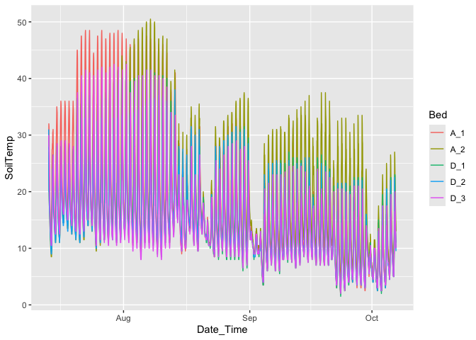
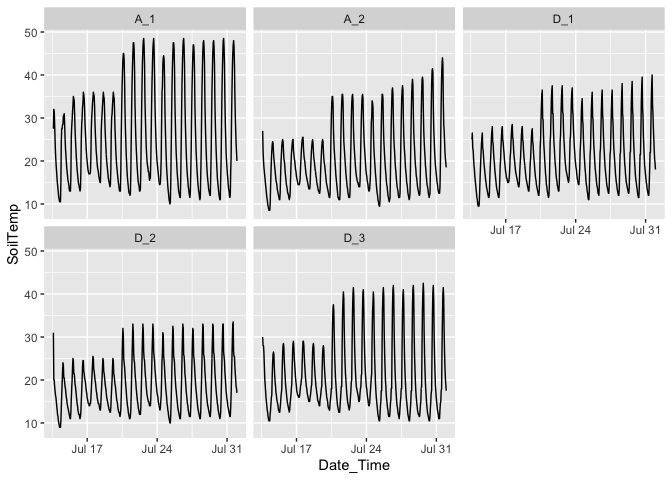
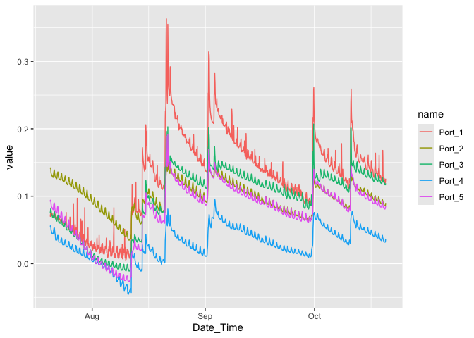
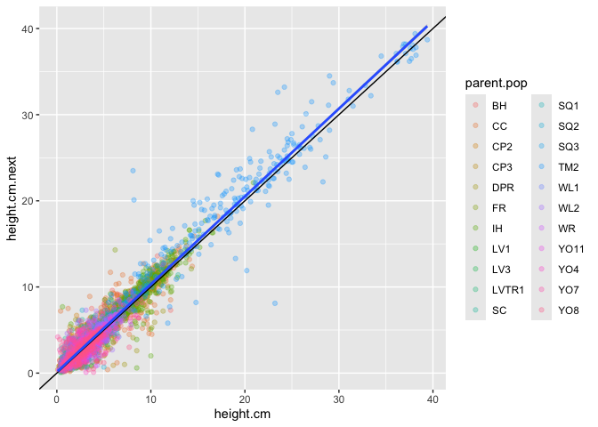
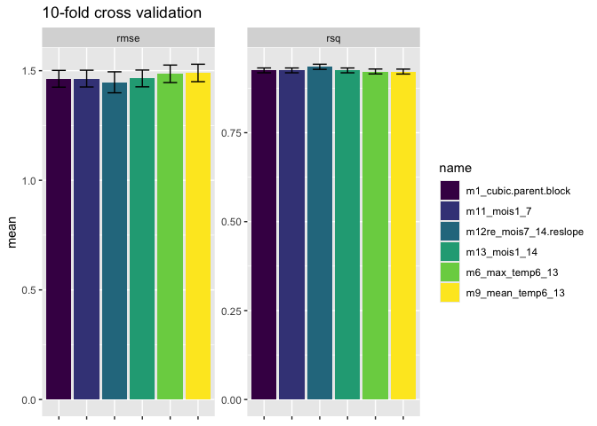
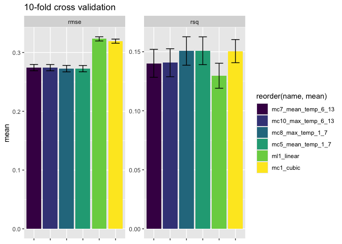

# TODO: GET THE TIME INTERVALS ON CLIMATE DATA CORRECT TO MATCH T+1!!


Testing WL2 2023 growth and survival models that include climate


``` r
library(tidyverse)
```

```
## ── Attaching core tidyverse packages ──────────────────────── tidyverse 2.0.0 ──
## ✔ dplyr     1.1.4     ✔ readr     2.1.5
## ✔ forcats   1.0.0     ✔ stringr   1.5.1
## ✔ ggplot2   3.5.1     ✔ tibble    3.2.1
## ✔ lubridate 1.9.4     ✔ tidyr     1.3.1
## ✔ purrr     1.0.4     
## ── Conflicts ────────────────────────────────────────── tidyverse_conflicts() ──
## ✖ dplyr::filter() masks stats::filter()
## ✖ dplyr::lag()    masks stats::lag()
## ℹ Use the conflicted package (<http://conflicted.r-lib.org/>) to force all conflicts to become errors
```

``` r
library(tidymodels)
```

```
## ── Attaching packages ────────────────────────────────────── tidymodels 1.3.0 ──
## ✔ broom        1.0.7     ✔ rsample      1.2.1
## ✔ dials        1.4.0     ✔ tune         1.3.0
## ✔ infer        1.0.7     ✔ workflows    1.2.0
## ✔ modeldata    1.4.0     ✔ workflowsets 1.1.0
## ✔ parsnip      1.3.0     ✔ yardstick    1.3.2
## ✔ recipes      1.1.1     
## ── Conflicts ───────────────────────────────────────── tidymodels_conflicts() ──
## ✖ scales::discard() masks purrr::discard()
## ✖ dplyr::filter()   masks stats::filter()
## ✖ recipes::fixed()  masks stringr::fixed()
## ✖ dplyr::lag()      masks stats::lag()
## ✖ yardstick::spec() masks readr::spec()
## ✖ recipes::step()   masks stats::step()
```

``` r
library(multilevelmod)
library(lmerTest)
```

```
## Loading required package: lme4
## Loading required package: Matrix
## 
## Attaching package: 'Matrix'
## 
## The following objects are masked from 'package:tidyr':
## 
##     expand, pack, unpack
## 
## 
## Attaching package: 'lmerTest'
## 
## The following object is masked from 'package:lme4':
## 
##     lmer
## 
## The following object is masked from 'package:recipes':
## 
##     step
## 
## The following object is masked from 'package:stats':
## 
##     step
```

``` r
library(broom.mixed)
library(furrr)
```

```
## Loading required package: future
```

``` r
library(modelr)
```

```
## 
## Attaching package: 'modelr'
## 
## The following objects are masked from 'package:yardstick':
## 
##     mae, mape, rmse
## 
## The following object is masked from 'package:broom':
## 
##     bootstrap
```

``` r
library(zoo)
```

```
## 
## Attaching package: 'zoo'
## 
## The following objects are masked from 'package:base':
## 
##     as.Date, as.Date.numeric
```

``` r
library(future)
plan(multisession, workers = 7)
conflicted::conflict_prefer("select", "dplyr")
```

```
## [conflicted] Will prefer dplyr::select over any other package.
```

``` r
conflicted::conflict_prefer("filter", "dplyr")
```

```
## [conflicted] Will prefer dplyr::filter over any other package.
```

``` r
conflicted::conflict_prefer("lag", "dplyr")
```

```
## [conflicted] Will prefer dplyr::lag over any other package.
```

## Import

### Climate data


## Read in soil temp


``` r
temp <- read_csv("../input/WL2_2022_2023_iButton_Data_Corrected.csv") %>%
  select(-`...3`) %>%
  mutate(Date_Time = mdy_hm(Date_Time)) %>%
  filter(Date_Time > ymd("2023-07-06"))
```

```
## New names:
## Rows: 14253 Columns: 4
## ── Column specification
## ──────────────────────────────────────────────────────── Delimiter: "," chr
## (3): Bed, Date_Time, ...3 dbl (1): SoilTemp
## ℹ Use `spec()` to retrieve the full column specification for this data. ℹ
## Specify the column types or set `show_col_types = FALSE` to quiet this message.
## • `` -> `...3`
```

``` r
head(temp)
```

```
## # A tibble: 6 × 3
##   Bed   Date_Time           SoilTemp
##   <chr> <dttm>                 <dbl>
## 1 A_1   2023-07-13 14:46:00     27.5
## 2 A_1   2023-07-13 15:46:00     32  
## 3 A_1   2023-07-13 16:46:00     31.5
## 4 A_1   2023-07-13 17:46:00     28.5
## 5 A_1   2023-07-13 18:46:00     25  
## 6 A_1   2023-07-13 19:46:00     22
```

``` r
skimr::skim(temp)
```


Table: Data summary

|                         |      |
|:------------------------|:-----|
|Name                     |temp  |
|Number of rows           |10240 |
|Number of columns        |3     |
|_______________________  |      |
|Column type frequency:   |      |
|character                |1     |
|numeric                  |1     |
|POSIXct                  |1     |
|________________________ |      |
|Group variables          |None  |


**Variable type: character**

|skim_variable | n_missing| complete_rate| min| max| empty| n_unique| whitespace|
|:-------------|---------:|-------------:|---:|---:|-----:|--------:|----------:|
|Bed           |         0|             1|   3|   3|     0|        5|          0|


**Variable type: numeric**

|skim_variable | n_missing| complete_rate|  mean|   sd|  p0|  p25| p50| p75| p100|hist  |
|:-------------|---------:|-------------:|-----:|----:|---:|----:|---:|---:|----:|:-----|
|SoilTemp      |         0|             1| 16.22| 8.51| 1.5| 10.5|  14|  20| 50.5|▅▇▂▁▁ |


**Variable type: POSIXct**

|skim_variable | n_missing| complete_rate|min                 |max                 |median              | n_unique|
|:-------------|---------:|-------------:|:-------------------|:-------------------|:-------------------|--------:|
|Date_Time     |         0|             1|2023-07-13 14:40:00 |2023-10-06 21:48:00 |2023-08-25 06:14:00 |    10240|


``` r
temp %>% ggplot(aes(x=Date_Time, y = SoilTemp, color= Bed)) + 
  geom_line()
```

<!-- -->

``` r
#Take a closer look
temp %>% mutate(month = month(Date_Time)) %>%
  filter(Date_Time > ymd("2023-07-17"), Date_Time <= ymd("2023-07-24")) %>%
  ggplot(aes(x=Date_Time, y = SoilTemp, color= Bed, lty = Bed)) + 
  geom_line() +
  scale_color_brewer(type="qual", palette = "Accent")
```

<!-- -->

``` r
temp %>% mutate(month = month(Date_Time)) %>%
  filter(month==7) %>%
  ggplot(aes(x=Date_Time, y = SoilTemp)) + 
  geom_line() +
  scale_color_brewer(type="qual", palette = "Accent") +
  facet_wrap(~Bed)
```

<!-- -->
Not sure how to deal with the differences here since we don't have something in every bed or block. For now I am going to take A_2


``` r
temp_summary <- temp %>%
  filter(Bed=="A_2") %>%
  mutate(Date=as.Date(Date_Time)) %>%
  filter(Date != min(Date), Date != max(Date)) %>% # trim ragged ends
  group_by(Date) %>%
  summarize(
    min_temp_d = min(SoilTemp),
    max_temp_d = max(SoilTemp),
    mean_temp_d = mean(SoilTemp)
  ) %>%
  mutate(
    across(ends_with("temp_d"), \(x) rollmean(x, k = 7, align = "left", fill = NA), .names="{.col}1_7"),
    across(ends_with("temp_d"), \(x) rollmean(x, k = 14, align = "center", fill = NA), .names="{.col}1_14"), 
    across(ends_with("1_7"), \(x) dplyr::lag(x, 7), .names = "{.col}_14") 
  ) %>%
  rename_with(\(x) str_replace(x, "1_7_14", "7_14"))

temp_summary
```

```
## # A tibble: 84 × 13
##    Date       min_temp_d max_temp_d mean_temp_d min_temp_d1_7 max_temp_d1_7
##    <date>          <dbl>      <dbl>       <dbl>         <dbl>         <dbl>
##  1 2023-07-14        8.5       24.5        15.8          11.8          26.4
##  2 2023-07-15       11         25          17.2          12.1          28  
##  3 2023-07-16       11         25          17.5          12.2          29.5
##  4 2023-07-17       14.5       25.5        18.9          12.6          31  
##  5 2023-07-18       13.5       25          18.2          12.4          32.2
##  6 2023-07-19       12.5       25          17.7          11.9          33.7
##  7 2023-07-20       11.5       35          20.5          11.6          35.4
##  8 2023-07-21       11         35.5        20.6          11.6          35.8
##  9 2023-07-22       11.5       35.5        20.7          11.6          36.3
## 10 2023-07-23       14         35.5        21.9          11.6          36.9
## # ℹ 74 more rows
## # ℹ 7 more variables: mean_temp_d1_7 <dbl>, min_temp_d1_14 <dbl>,
## #   max_temp_d1_14 <dbl>, mean_temp_d1_14 <dbl>, min_temp_d7_14 <dbl>,
## #   max_temp_d7_14 <dbl>, mean_temp_d7_14 <dbl>
```

## Read in soil moisture


``` r
moisture <- read_csv("../input/WL2_2023_Bed_C_Soil_Moisture_Corrected.csv") %>%
  mutate(Date_Time = mdy_hm(Date_Time)) 
```

```
## Rows: 2209 Columns: 6
## ── Column specification ────────────────────────────────────────────────────────
## Delimiter: ","
## chr (1): Date_Time
## dbl (5): Port_1, Port_2, Port_3, Port_4, Port_5
## 
## ℹ Use `spec()` to retrieve the full column specification for this data.
## ℹ Specify the column types or set `show_col_types = FALSE` to quiet this message.
```

``` r
head(moisture)
```

```
## # A tibble: 6 × 6
##   Date_Time           Port_1 Port_2 Port_3 Port_4 Port_5
##   <dttm>               <dbl>  <dbl>  <dbl>  <dbl>  <dbl>
## 1 2023-07-20 12:00:00  0.071  0.141  0.075  0.055  0.092
## 2 2023-07-20 13:00:00  0.07   0.142  0.077  0.056  0.094
## 3 2023-07-20 14:00:00  0.074  0.142  0.079  0.056  0.094
## 4 2023-07-20 15:00:00  0.076  0.141  0.081  0.055  0.094
## 5 2023-07-20 16:00:00  0.077  0.14   0.082  0.054  0.093
## 6 2023-07-20 17:00:00  0.077  0.136  0.081  0.052  0.091
```

``` r
skimr::skim(moisture)
```


Table: Data summary

|                         |         |
|:------------------------|:--------|
|Name                     |moisture |
|Number of rows           |2209     |
|Number of columns        |6        |
|_______________________  |         |
|Column type frequency:   |         |
|numeric                  |5        |
|POSIXct                  |1        |
|________________________ |         |
|Group variables          |None     |


**Variable type: numeric**

|skim_variable | n_missing| complete_rate| mean|   sd|    p0|  p25|  p50|  p75| p100|hist  |
|:-------------|---------:|-------------:|----:|----:|-----:|----:|----:|----:|----:|:-----|
|Port_1        |         0|             1| 0.13| 0.06|  0.00| 0.08| 0.14| 0.17| 0.36|▆▇▇▁▁ |
|Port_2        |         0|             1| 0.10| 0.02|  0.04| 0.08| 0.10| 0.12| 0.16|▁▅▇▇▂ |
|Port_3        |         0|             1| 0.10| 0.05| -0.01| 0.06| 0.12| 0.13| 0.21|▃▂▅▇▁ |
|Port_4        |         0|             1| 0.03| 0.02| -0.05| 0.01| 0.03| 0.05| 0.10|▁▂▇▆▁ |
|Port_5        |         0|             1| 0.08| 0.04| -0.03| 0.06| 0.09| 0.10| 0.19|▂▂▇▅▁ |


**Variable type: POSIXct**

|skim_variable | n_missing| complete_rate|min                 |max                 |median              | n_unique|
|:-------------|---------:|-------------:|:-------------------|:-------------------|:-------------------|--------:|
|Date_Time     |         0|             1|2023-07-20 12:00:00 |2023-10-20 12:00:00 |2023-09-04 12:00:00 |     2209|

``` r
moisture %>% pivot_longer(-Date_Time) %>%
  ggplot(aes(x=Date_Time, y = value, color= name)) + 
  geom_line()
```

<!-- -->
Will average across the ports


``` r
moisture_summary <- moisture %>%
  rowwise() %>%
  mutate(s_moisture = mean(c_across(-Date_Time)) ) %>%
  select(Date_Time, s_moisture) %>%
  mutate(Date=as.Date(Date_Time)) %>%
  group_by(Date) %>%
  summarize(
    mean_moisture_d = mean(s_moisture)
  ) %>%
  mutate(
    s_moisture_1_7 = rollmean(mean_moisture_d, k = 7, align = "left", fill = "extend"),
    s_moisture_1_14 = rollmean(mean_moisture_d, k = 14, align = "center", fill = "extend"),
    s_moisture_7_14 = dplyr::lag(s_moisture_1_7, 7)
  )

moisture_summary
```

```
## # A tibble: 93 × 5
##    Date       mean_moisture_d s_moisture_1_7 s_moisture_1_14 s_moisture_7_14
##    <date>               <dbl>          <dbl>           <dbl>           <dbl>
##  1 2023-07-20          0.0853         0.0714          0.0548         NA     
##  2 2023-07-21          0.0809         0.0669          0.0548         NA     
##  3 2023-07-22          0.0754         0.0622          0.0548         NA     
##  4 2023-07-23          0.0711         0.0577          0.0548         NA     
##  5 2023-07-24          0.0668         0.0529          0.0548         NA     
##  6 2023-07-25          0.0622         0.0479          0.0548         NA     
##  7 2023-07-26          0.0581         0.0430          0.0548         NA     
##  8 2023-07-27          0.0537         0.0381          0.0501          0.0714
##  9 2023-07-28          0.0484         0.0334          0.0456          0.0669
## 10 2023-07-29          0.0436         0.0290          0.0413          0.0622
## # ℹ 83 more rows
```


### Growth and survival data


``` r
growth <- read_csv("../input/WL2-2023_Size_Combined.csv")
```

```
## Rows: 17336 Columns: 10
## ── Column specification ────────────────────────────────────────────────────────
## Delimiter: ","
## chr  (5): block, Genotype, pop.mf, parent.pop, survey.notes
## dbl  (4): mf, rep, height.cm, long.leaf.cm
## date (1): survey_date
## 
## ℹ Use `spec()` to retrieve the full column specification for this data.
## ℹ Specify the column types or set `show_col_types = FALSE` to quiet this message.
```

``` r
growth
```

```
## # A tibble: 17,336 × 10
##    survey_date block Genotype pop.mf parent.pop    mf   rep height.cm
##    <date>      <chr> <chr>    <chr>  <chr>      <dbl> <dbl>     <dbl>
##  1 2023-07-03  <NA>  CP2_1_1  CP2_1  CP2            1     1       0.5
##  2 2023-07-03  <NA>  CP2_1_2  CP2_1  CP2            1     2       0.7
##  3 2023-07-03  <NA>  CP2_1_3  CP2_1  CP2            1     3       1.1
##  4 2023-07-03  <NA>  CP2_1_4  CP2_1  CP2            1     4       0.8
##  5 2023-07-03  <NA>  CP2_1_5  CP2_1  CP2            1     5       0.9
##  6 2023-07-03  <NA>  CP2_1_6  CP2_1  CP2            1     6       1  
##  7 2023-07-03  <NA>  CP2_1_7  CP2_1  CP2            1     7       1.5
##  8 2023-07-03  <NA>  CP2_1_8  CP2_1  CP2            1     8       1.1
##  9 2023-07-03  <NA>  CP2_1_9  CP2_1  CP2            1     9       0.5
## 10 2023-07-03  <NA>  CP2_1_10 CP2_1  CP2            1    10       0.7
## # ℹ 17,326 more rows
## # ℹ 2 more variables: long.leaf.cm <dbl>, survey.notes <chr>
```


``` r
survival <- read_csv("../input/WL2_Mortality.csv")
```

```
## Rows: 1575 Columns: 12
## ── Column specification ────────────────────────────────────────────────────────
## Delimiter: ","
## chr (9): block, BedLoc, bed, bed.col, Genotype, pop.mf, parent.pop, death.da...
## dbl (3): bed.row, mf, rep
## 
## ℹ Use `spec()` to retrieve the full column specification for this data.
## ℹ Specify the column types or set `show_col_types = FALSE` to quiet this message.
```

``` r
survival
```

```
## # A tibble: 1,575 × 12
##    block BedLoc bed   bed.row bed.col Genotype   pop.mf  parent.pop    mf   rep
##    <chr> <chr>  <chr>   <dbl> <chr>   <chr>      <chr>   <chr>      <dbl> <dbl>
##  1 A     A_1_A  A           1 A       TM2_6_11   TM2_6   TM2            6    11
##  2 A     A_1_B  A           1 B       LVTR1_7_1  LVTR1_7 LVTR1          7     1
##  3 A     A_2_A  A           2 A       SQ2_6_14   SQ2_6   SQ2            6    14
##  4 A     A_2_B  A           2 B       YO8_8_3    YO8_8   YO8            8     3
##  5 A     A_3_A  A           3 A       CC_2_3     CC_2    CC             2     3
##  6 A     A_3_B  A           3 B       YO11_5_14  YO11_5  YO11           5    14
##  7 A     A_4_A  A           4 A       BH_6_3     BH_6    BH             6     3
##  8 A     A_4_B  A           4 B       DPR_4_8    DPR_4   DPR            4     8
##  9 A     A_5_A  A           5 A       CP2_5_1    CP2_5   CP2            5     1
## 10 A     A_5_B  A           5 B       LVTR1_3_12 LVTR1_3 LVTR1          3    12
## # ℹ 1,565 more rows
## # ℹ 2 more variables: death.date <chr>, survey.notes <chr>
```

## Wrangle Growth

We want to predict size next from size.  In the Merow examples there was a column "size" and "size next" for each time step.  I guess we are going to need to do that here.

We also should compute the interval length 


``` r
growth2 <- growth %>% arrange(Genotype, survey_date) %>%
  select(-survey.notes, -long.leaf.cm) %>%
  group_by(Genotype) %>%
  mutate(height.cm.next = lead(height.cm),
         elapsed_days= lead(survey_date) - survey_date,
         elapsed_weeks = as.integer(elapsed_days)/7) %>%
  ungroup() %>%
  mutate(week = as.numeric(survey_date - ymd("2023-07-03")) / 7, # 7/03 = pre-transplant survey date
         week_char = as.character(week)) %>% 
  drop_na(block, height.cm, height.cm.next)

growth2 
```

```
## # A tibble: 5,894 × 13
##    survey_date block Genotype pop.mf parent.pop    mf   rep height.cm
##    <date>      <chr> <chr>    <chr>  <chr>      <dbl> <dbl>     <dbl>
##  1 2023-07-26  L     BH_1_1   BH_1   BH             1     1       4.7
##  2 2023-08-02  L     BH_1_1   BH_1   BH             1     1       4.8
##  3 2023-08-16  L     BH_1_1   BH_1   BH             1     1       4.9
##  4 2023-08-23  L     BH_1_1   BH_1   BH             1     1       5.7
##  5 2023-08-30  L     BH_1_1   BH_1   BH             1     1       4.9
##  6 2023-09-06  L     BH_1_1   BH_1   BH             1     1       3.6
##  7 2023-09-13  L     BH_1_1   BH_1   BH             1     1       4.4
##  8 2023-09-20  L     BH_1_1   BH_1   BH             1     1       5.1
##  9 2023-10-13  L     BH_1_1   BH_1   BH             1     1       5.6
## 10 2023-07-26  H     BH_1_10  BH_1   BH             1    10       3.1
## # ℹ 5,884 more rows
## # ℹ 5 more variables: height.cm.next <dbl>, elapsed_days <drtn>,
## #   elapsed_weeks <dbl>, week <dbl>, week_char <chr>
```

Add climate


``` r
growth2 <- growth2 %>% 
  left_join(temp_summary, by = c("survey_date" = "Date")) %>%
  left_join(moisture_summary, by = c("survey_date" = "Date"))
```

For easy visualization lets subset just to elapsed_days of 7


``` r
growth2 %>%
  filter(elapsed_days==7) %>%
  ggplot(aes(x=height.cm, y=height.cm.next)) +
  geom_point(aes(color=parent.pop), alpha = 0.3) +
  geom_abline() +
  geom_smooth(method="lm")
```

```
## `geom_smooth()` using formula = 'y ~ x'
```

<!-- -->

Do some model comparison

Define the formula


``` r
minSize <- min(growth2$height.cm, na.rm = TRUE)
maxSize <- max(growth2$height.cm, na.rm = TRUE)
# newdata = tibble(height.cm=seq(minSize, maxSize, length.out=101), elapsed_weeks = 1)
```

In order to be able to use the tidymodel tools on mixed effect models, it works best to add variables and formulas in the following way.  This is a bit cumbersome, but it will help later.

Start with the preferred model from the test of models without climate.

``` r
lmer.spec <- linear_reg() %>%
  set_engine("lmer")

growth.rec <- growth2 %>%
  select(height.cm.next, height.cm, elapsed_weeks, parent.pop, mf, block, contains("temp_d"), contains("s_moisture")) %>%
  recipe() %>%
  update_role(height.cm.next, new_role = "outcome") %>% 
  update_role(c(height.cm, elapsed_weeks, parent.pop, mf, block, contains("temp_d"), contains("s_moisture")), new_role = "predictor")

growth.rec.poly <- growth.rec %>% 
  step_poly(height.cm, degree = 3, keep_original_cols = TRUE)  %>%
  step_rename_at(contains("poly"), fn = \(x) str_replace(x, "_poly_", ".p"))

growth.wflow <- workflow() %>%
  add_recipe(growth.rec)

growth.wflow.poly <- workflow() %>% add_recipe(growth.rec.poly)

growth.models <- tibble(wflow=list(
  
  m1_cubic.parent.block = { growth.wflow.poly %>% 
      add_model(lmer.spec,
                formula = height.cm.next ~ height.cm.p1 + height.cm.p2 + height.cm.p3 + (1|parent.pop) + (1|block) )},
  
  m2_min_temp1_7 = { growth.wflow.poly %>% 
      add_model(lmer.spec,
                formula = height.cm.next ~ height.cm.p1 + height.cm.p2 + height.cm.p3 + min_temp_d1_7 + (1|parent.pop) + (1|block) )},
  
  m3_min_temp6_13 = { growth.wflow.poly %>% 
      add_model(lmer.spec,
                formula = height.cm.next ~ height.cm.p1 + height.cm.p2 + height.cm.p3 + min_temp_d7_14  + (1|parent.pop) + (1|block) )},
  
  m4_min_temp1_13 = { growth.wflow.poly %>% 
      add_model(lmer.spec,
                formula = height.cm.next ~ height.cm.p1 + height.cm.p2 + height.cm.p3 + min_temp_d1_14 + (1|parent.pop) + (1|block) )},
  
  m5_max_temp1_7 = { growth.wflow.poly %>% 
      add_model(lmer.spec,
                formula = height.cm.next ~ height.cm.p1 + height.cm.p2 + height.cm.p3 + max_temp_d1_7 + (1|parent.pop) + (1|block) )},
  
  # m5re_max_temp1_7 = { growth.wflow.poly %>% 
  #     add_model(lmer.spec,
  #               formula = height.cm.next ~ height.cm.p1 + height.cm.p2 + height.cm.p3 + max_temp_d1_7 + (max_temp_d1_7|parent.pop) + (1|block) )},
  
  m6_max_temp6_13 = { growth.wflow.poly %>% 
      add_model(lmer.spec,
                formula = height.cm.next ~ height.cm.p1 + height.cm.p2 + height.cm.p3 + max_temp_d7_14 + (1|parent.pop) + (1|block) )},
  
  m7_max_temp1_13 = { growth.wflow.poly %>% 
      add_model(lmer.spec,
                formula = height.cm.next ~ height.cm.p1 + height.cm.p2 + height.cm.p3 +  max_temp_d1_14 + (1|parent.pop) + (1|block) )},
  
  # convergence issue on cross-validation
  # m7re_max_temp1_13_reslope = { growth.wflow.poly %>% 
  #     add_model(lmer.spec,
  #               formula = height.cm.next ~ height.cm.p1 + height.cm.p2 + height.cm.p3 +  max_temp_d1_14 + (max_temp_d1_14|parent.pop) + (1|block) )},
  
  m8_mean_temp1_7 = { growth.wflow.poly %>% 
      add_model(lmer.spec,
                formula = height.cm.next ~ height.cm.p1 + height.cm.p2 + height.cm.p3  + mean_temp_d1_7 + (1|parent.pop) + (1|block) )},
  
  m9_mean_temp6_13 = { growth.wflow.poly %>% 
      add_model(lmer.spec,
                formula = height.cm.next ~ height.cm.p1 + height.cm.p2 + height.cm.p3 + mean_temp_d7_14 + (1|parent.pop) + (1|block) )},
  
  m10_mean_temp1_13 = { growth.wflow.poly %>% 
      add_model(lmer.spec,
                formula = height.cm.next ~ height.cm.p1 + height.cm.p2 + height.cm.p3 + mean_temp_d1_14 + (1|parent.pop) + (1|block) )},
  
  m11_mois1_7 = { growth.wflow.poly %>% 
      add_model(lmer.spec,
                formula = height.cm.next ~ height.cm.p1 + height.cm.p2 + height.cm.p3 + s_moisture_1_7 + (1|parent.pop) + (1|block) )},
  
  m12_mois7_14 = { growth.wflow.poly %>% 
      add_model(lmer.spec,
                formula = height.cm.next ~ height.cm.p1 + height.cm.p2 + height.cm.p3 + s_moisture_7_14 + (1|parent.pop) + (1|block) )},
  
  m12re_mois7_14.reslope = { growth.wflow.poly %>% 
      add_model(lmer.spec,
                formula = height.cm.next ~ height.cm.p1 + height.cm.p2 + height.cm.p3 + s_moisture_7_14 + (s_moisture_7_14|parent.pop) + (1|block) )},
  
  m13_mois1_14 = { growth.wflow.poly %>% 
      add_model(lmer.spec,
                formula = height.cm.next ~ height.cm.p1 + height.cm.p2 + height.cm.p3 + s_moisture_1_14 + (1|parent.pop) + (1|block) )},
  
  m14_mois1_7_maxtemp1_7 = { growth.wflow.poly %>% 
      add_model(lmer.spec,
                formula = height.cm.next ~ height.cm.p1 + height.cm.p2 + height.cm.p3 + s_moisture_1_7 + max_temp_d1_7 + (1|parent.pop) + (1|block) )}
  
),
name = names(wflow)
)
```

Fit the models

BEWARE NOBS IS DIFFERENT!


``` r
system.time( { # fast
  growth.models <- growth.models %>%
    mutate(fit = map(wflow, fit, data = drop_na(growth2, contains("temp_d"), contains("s_moisture") )),
           glance = map(fit, glance)
    ) 
})
```

```
##    user  system elapsed 
##   1.096   0.029   1.131
```

``` r
growth.models %>% select(-wflow, -fit) %>% unnest(glance) %>% arrange(BIC)
```

```
## # A tibble: 15 × 8
##    name                    nobs sigma logLik    AIC    BIC REMLcrit df.residual
##    <chr>                  <int> <dbl>  <dbl>  <dbl>  <dbl>    <dbl>       <int>
##  1 m12re_mois7_14.reslope  4694  1.27 -7842. 15705. 15769.   15685.        4684
##  2 m6_max_temp6_13         4694  1.28 -7854. 15723. 15775.   15707.        4686
##  3 m13_mois1_14            4694  1.28 -7854. 15724. 15776.   15708.        4686
##  4 m9_mean_temp6_13        4694  1.28 -7854. 15724. 15776.   15708.        4686
##  5 m11_mois1_7             4694  1.28 -7855. 15725. 15777.   15709.        4686
##  6 m12_mois7_14            4694  1.28 -7859. 15733. 15785.   15717.        4686
##  7 m7_max_temp1_13         4694  1.28 -7859. 15733. 15785.   15717.        4686
##  8 m10_mean_temp1_13       4694  1.28 -7860. 15735. 15787.   15719.        4686
##  9 m14_mois1_7_maxtemp1_7  4694  1.28 -7857. 15732. 15790.   15714.        4685
## 10 m1_cubic.parent.block   4694  1.28 -7868. 15749. 15795.   15735.        4687
## 11 m4_min_temp1_13         4694  1.28 -7866. 15749. 15800.   15733.        4686
## 12 m8_mean_temp1_7         4694  1.28 -7867. 15751. 15802.   15735.        4686
## 13 m2_min_temp1_7          4694  1.28 -7868. 15751. 15803.   15735.        4686
## 14 m5_max_temp1_7          4694  1.28 -7868. 15752. 15803.   15736.        4686
## 15 m3_min_temp6_13         4694  1.28 -7868. 15752. 15803.   15736.        4686
```

Concentrate on the five best models and do some cross validation

``` r
growth.models.best <- growth.models %>%
  unnest(glance) %>%
  slice_min(BIC, n=5) %>%
  bind_rows({growth.models %>% filter(name == "m1_cubic.parent.block") })

#growth.models.best$fit

set.seed(1001)
growth_folds <- vfold_cv(growth2, v = 10)

growth.models.best <- growth.models.best %>%
  mutate(resamples = map(wflow, fit_resamples, resamples = growth_folds, control = control_resamples(save_pred = TRUE, pkgs = "tidyverse"), .progress = TRUE))
```

```
## ! Fold01: preprocessor 1/1, model 1/1: Model failed to converge with max|grad| = 0.0140473 (tol = 0.002, compon...
```

```
## ■■■■■■ 17% | ETA: 6m

 ■■■■■■■■■■■ 33% | ETA: 2m

 ■■■■■■■■■■■■■■■■ 50% | ETA: 1m
## ■■■■■■■■■■■■■■■■■■■■■ 67% | ETA: 38s

 ■■■■■■■■■■■■■■■■■■■■■■■■■■ 83% | ETA: 15s
```


``` r
growth.models.best %>% 
  mutate(metrics = map(resamples, collect_metrics, type = "wide")) %>%
  select(name, metrics) %>%
  unnest(metrics) %>%
  select(-.config) %>%
  arrange(rmse)
```

```
## # A tibble: 6 × 3
##   name                    rmse   rsq
##   <chr>                  <dbl> <dbl>
## 1 m12re_mois7_14.reslope  1.45 0.935
## 2 m1_cubic.parent.block   1.46 0.925
## 3 m11_mois1_7             1.46 0.925
## 4 m13_mois1_14            1.46 0.925
## 5 m6_max_temp6_13         1.49 0.922
## 6 m9_mean_temp6_13        1.49 0.922
```

moisture help a bit.


``` r
growth.models.best %>% 
  mutate(metrics = map(resamples, collect_metrics, type = "long")) %>%
  select(name, metrics) %>%
  unnest(metrics) %>%
  arrange(.metric, mean) %>%
  select(name, .metric, mean, std_err)
```

```
## # A tibble: 12 × 4
##    name                   .metric  mean std_err
##    <chr>                  <chr>   <dbl>   <dbl>
##  1 m12re_mois7_14.reslope rmse    1.45  0.0479 
##  2 m1_cubic.parent.block  rmse    1.46  0.0382 
##  3 m11_mois1_7            rmse    1.46  0.0382 
##  4 m13_mois1_14           rmse    1.46  0.0383 
##  5 m6_max_temp6_13        rmse    1.49  0.0399 
##  6 m9_mean_temp6_13       rmse    1.49  0.0398 
##  7 m9_mean_temp6_13       rsq     0.922 0.00691
##  8 m6_max_temp6_13        rsq     0.922 0.00690
##  9 m13_mois1_14           rsq     0.925 0.00677
## 10 m11_mois1_7            rsq     0.925 0.00677
## 11 m1_cubic.parent.block  rsq     0.925 0.00676
## 12 m12re_mois7_14.reslope rsq     0.935 0.00723
```


``` r
growth.models.best %>% 
  mutate(metrics = map(resamples, collect_metrics, type = "long")) %>%
  select(name, metrics) %>%
  unnest(metrics) %>%
  arrange(.metric, mean) %>%
  select(name, .metric, mean, std_err) %>%
  ggplot(aes(x=name, y = mean, ymin=mean-std_err, ymax=mean+std_err, fill = name)) +
  geom_col() +
  geom_errorbar(width = 0.5) +
  facet_wrap(~.metric, scales = "free_y") +
  theme(axis.text.x = element_blank(), axis.title.x = element_blank()) +
  ggtitle("10-fold cross validation") +
  scale_fill_viridis_d()
```

<!-- -->

include moisture in the model

``` r
growth.model.final <- growth.models.best %>% filter(name == "m12re_mois7_14.reslope") %>% pull(fit) %>% magrittr::extract2(1)

growth.model.final
```

```
## ══ Workflow [trained] ══════════════════════════════════════════════════════════
## Preprocessor: Recipe
## Model: linear_reg()
## 
## ── Preprocessor ────────────────────────────────────────────────────────────────
## 2 Recipe Steps
## 
## • step_poly()
## • step_rename_at()
## 
## ── Model ───────────────────────────────────────────────────────────────────────
## Linear mixed model fit by REML ['lmerMod']
## Formula: height.cm.next ~ height.cm.p1 + height.cm.p2 + height.cm.p3 +  
##     s_moisture_7_14 + (s_moisture_7_14 | parent.pop) + (1 | block)
##    Data: data
## REML criterion at convergence: 15684.76
## Random effects:
##  Groups     Name            Std.Dev. Corr 
##  parent.pop (Intercept)     0.7952        
##             s_moisture_7_14 3.9412   -0.57
##  block      (Intercept)     0.1469        
##  Residual                   1.2703        
## Number of obs: 4694, groups:  parent.pop, 22; block, 13
## Fixed Effects:
##     (Intercept)     height.cm.p1     height.cm.p2     height.cm.p3  
##           5.148          304.224            3.504           -8.496  
## s_moisture_7_14  
##           1.672
```

For plotting the prediction curve, it looks like I can't combine `geom_function` and `facet_wrap` so I will compute the prediction curves myself and then combine in the plots


``` r
newdata.growth <- growth2 %>%
  group_by(parent.pop) %>%
  summarize(minSize = min(height.cm, na.rm = TRUE),
            maxSize = max(height.cm, na.rm = TRUE)) %>%
  
  # generate a "newdata" data frame for each parent.pop
  mutate(newdata = pmap(list(parent.pop, minSize, maxSize), \(p, x, y) tibble(parent.pop = p,
                                                                              elapsed_weeks = 1,
                                                                              height.cm = seq(x, y, length.out = 101)))) %>%
  select(newdata) %>%
  unnest(newdata)

newdata.growth <- growth.rec.poly %>% # These steps are necessary to add the polynomials to the new data
  update_role(mf, block, new_role = "unused") %>%
  update_role_requirements(role="unused", bake = FALSE) %>%
  prep() %>% bake(newdata.growth)

growth.predictions <- extract_fit_engine(growth.model.final) %>%
  predict(newdata.growth, re.form = ~ (1 | parent.pop)) %>%
  cbind(newdata.growth, height.cm.next=.)
```

Plot it.  Points are actual data (height.next vs height).  The blue line is the model prediction, the red line is slope = 1.

``` r
growth2 %>%
  ggplot(aes(x=height.cm, y = height.cm.next)) +
  geom_point(alpha=.25) +
  geom_line(data = growth.predictions, color = "blue") +
  geom_abline(intercept = 0, slope = 1, color = "red", lty=2 ) +
  #geom_smooth(color = "red") +
  facet_wrap(~parent.pop, scales = "free")
```

## On to survival

Since we want to predict survival as a function of size, we need to combine the data sets


``` r
survival2 <- survival %>% select(Genotype, death.date) %>%
  right_join(growth) %>%
  mutate(l.height.cm = log(height.cm)) %>%
  arrange(Genotype, survey_date) %>%
  select(-survey.notes, -long.leaf.cm) %>%
  group_by(Genotype) %>%
  mutate(elapsed_days= lead(survey_date) - survey_date,
         elapsed_weeks = as.integer(elapsed_days)/7,
         block = ifelse(is.na(block), unique(na.omit(block)), block), # fill in missing block info 
         death.date = lubridate::mdy(death.date),
         surv.next = ifelse(is.na(death.date), 1, death.date > lead(survey_date))) %>% 
  ungroup() %>%
  mutate(week = as.numeric(survey_date - ymd("2023-07-03")) / 7, # 7/03 = pre-transplant survey date
         week_char = as.character(round(week, 2)),
         ppmf = str_c(parent.pop, "_", mf)) %>% # allows me to specify RE for pp and mf separately.
  drop_na(surv.next, parent.pop, l.height.cm, elapsed_days)
```

```
## Joining with `by = join_by(Genotype)`
```

```
## Warning in right_join(., growth): Detected an unexpected many-to-many relationship between `x` and `y`.
## ℹ Row 1 of `x` matches multiple rows in `y`.
## ℹ Row 1362 of `y` matches multiple rows in `x`.
## ℹ If a many-to-many relationship is expected, set `relationship =
##   "many-to-many"` to silence this warning.
```

``` r
# check it
survival2 %>% select(Genotype, death.date, survey_date, surv.next, l.height.cm)
```

```
## # A tibble: 8,070 × 5
##    Genotype death.date survey_date surv.next l.height.cm
##    <chr>    <date>     <date>          <dbl>       <dbl>
##  1 BH_1_1   NA         2023-07-03          1       0.693
##  2 BH_1_1   NA         2023-07-26          1       1.55 
##  3 BH_1_1   NA         2023-08-02          1       1.57 
##  4 BH_1_1   NA         2023-08-16          1       1.59 
##  5 BH_1_1   NA         2023-08-23          1       1.74 
##  6 BH_1_1   NA         2023-08-30          1       1.59 
##  7 BH_1_1   NA         2023-09-06          1       1.28 
##  8 BH_1_1   NA         2023-09-13          1       1.48 
##  9 BH_1_1   NA         2023-09-20          1       1.63 
## 10 BH_1_1   NA         2023-10-13          1       1.72 
## # ℹ 8,060 more rows
```


## add climate data


``` r
survival2 <- survival2 %>% 
  left_join(temp_summary, by = c("survey_date" = "Date")) %>%
  left_join(moisture_summary, by = c("survey_date" = "Date"))
```

Try the best linear and cubic models

``` r
surv.spec <- linear_reg() %>%
  set_engine("glmer", family = "binomial")

surv.rec <- survival2 %>%
  select(surv.next, l.height.cm, elapsed_weeks, week, parent.pop, block, contains("temp_d"), contains("s_moisture") ) %>%
  recipe() %>%
  update_role(surv.next, new_role = "outcome") %>% 
  update_role(c(l.height.cm, elapsed_weeks, week, parent.pop, block, contains("temp_d"), contains("s_moisture")), new_role = "predictor") 

surv.rec.poly <- surv.rec %>% 
  step_poly(l.height.cm, degree = 3, keep_original_cols = TRUE)  %>%
  step_poly(week, degree = 3, keep_original_cols = TRUE) %>%
  step_normalize(all_numeric_predictors()) %>%
  step_rename_at(contains("poly"), fn = \(x) str_replace(x, "_poly_", ".p"))

surv.wflow <- workflow() %>%
  add_recipe(surv.rec)

surv.wflow.poly <- workflow() %>% add_recipe(surv.rec.poly)

surv.models <- tibble(wflow=list(
  
  ml1_linear = {surv.wflow %>%
      add_model(surv.spec,
                formula = surv.next ~ l.height.cm + week + (1|parent.pop) + (1|block)) },
  
  ml2_min_temp_1_7 = {surv.wflow %>%
      add_model(surv.spec,
                formula = surv.next ~ l.height.cm + week + min_temp_d1_7 + (1|parent.pop) + (1|block)) },
  
  ml3_min_temp_1_13 = {surv.wflow %>%
      add_model(surv.spec,
                formula = surv.next ~ l.height.cm + week + min_temp_d1_14 +(1|parent.pop) + (1|block)) },
  
  ml4_min_temp_6_13 = {surv.wflow %>%
      add_model(surv.spec,
                formula = surv.next ~ l.height.cm + week + min_temp_d7_14 + (1|parent.pop) + (1|block)) },
  
  ml5_mean_temp_1_7 = {surv.wflow %>%
      add_model(surv.spec,
                formula = surv.next ~ l.height.cm + week + mean_temp_d1_7 + (1|parent.pop) + (1|block)) },
  
  ml1_mean_temp_1_13 = {surv.wflow %>%
      add_model(surv.spec,
                formula = surv.next ~ l.height.cm + week + mean_temp_d1_14 + (1|parent.pop) + (1|block)) },
  
  ml1_mean_temp_6_13 = {surv.wflow %>%
      add_model(surv.spec,
                formula = surv.next ~ l.height.cm + week + mean_temp_d7_14 +(1|parent.pop) + (1|block)) },
  
  ml1_max_temp_1_7 = {surv.wflow %>%
      add_model(surv.spec,
                formula = surv.next ~ l.height.cm + week + max_temp_d1_7 + (1|parent.pop) + (1|block)) },
  
  ml1_max_temp_1_13 = {surv.wflow %>%
      add_model(surv.spec,
                formula = surv.next ~ l.height.cm + week + max_temp_d1_14 + (1|parent.pop) + (1|block)) },
  
  ml1_max_temp_6_13 = {surv.wflow %>%
      add_model(surv.spec,
                formula = surv.next ~ l.height.cm + week + max_temp_d7_14 + (1|parent.pop) + (1|block)) },
  
  ml1_s_moisture_1_7 = {surv.wflow %>%
      add_model(surv.spec,
                formula = surv.next ~ l.height.cm + week + s_moisture_1_7 + (1|parent.pop) + (1|block)) },
  
  ml1_s_moisture_7_14 = {surv.wflow %>%
      add_model(surv.spec,
                formula = surv.next ~ l.height.cm + week + s_moisture_7_14 + (1|parent.pop) + (1|block)) },
  
  ml1_s_moisture_1_14 = {surv.wflow %>%
      add_model(surv.spec,
                formula = surv.next ~ l.height.cm + week + s_moisture_1_14 + (1|parent.pop) + (1|block)) },
  
  mc1_cubic = {surv.wflow.poly %>%
      add_model(surv.spec,
                formula = surv.next ~ l.height.cm.p1 + elapsed_weeks + week.p1 + week.p2 + week.p3 + l.height.cm.p2 + l.height.cm.p3 + (1|parent.pop) + (1|block)) },
  
  mc2_min_temp_1_7 = {surv.wflow.poly %>%
      add_model(surv.spec,
                formula = surv.next ~ l.height.cm.p1 + elapsed_weeks + week.p1 + week.p2 + week.p3 + l.height.cm.p2 + l.height.cm.p3 + min_temp_d1_7 + (1|parent.pop) + (1|block)) },
  
  mc3_min_temp_1_13 = {surv.wflow.poly %>%
      add_model(surv.spec,
                formula = surv.next ~ l.height.cm.p1 + elapsed_weeks + week.p1 + week.p2 + week.p3 + l.height.cm.p2 + l.height.cm.p3 + min_temp_d1_14 +(1|parent.pop) + (1|block)) },
  
  mc4_min_temp_6_13 = {surv.wflow.poly %>%
      add_model(surv.spec,
                formula = surv.next ~ l.height.cm.p1 + elapsed_weeks + week.p1 + week.p2 + week.p3 + l.height.cm.p2 + l.height.cm.p3 + min_temp_d7_14 + (1|parent.pop) + (1|block)) },
  
  mc5_mean_temp_1_7 = {surv.wflow.poly %>%
      add_model(surv.spec,
                formula = surv.next ~ l.height.cm.p1 + elapsed_weeks + week.p1 + week.p2 + week.p3 + l.height.cm.p2 + l.height.cm.p3 + mean_temp_d1_7 + (1|parent.pop) + (1|block)) },
  
  mc6_mean_temp_1_13 = {surv.wflow.poly %>%
      add_model(surv.spec,
                formula = surv.next ~ l.height.cm.p1 + elapsed_weeks + week.p1 + week.p2 + week.p3 + l.height.cm.p2 + l.height.cm.p3 + mean_temp_d1_14 + (1|parent.pop) + (1|block)) },
  
  mc7_mean_temp_6_13 = {surv.wflow.poly %>%
      add_model(surv.spec,
                formula = surv.next ~ l.height.cm.p1 + elapsed_weeks + week.p1 + week.p2 + week.p3 + l.height.cm.p2 + l.height.cm.p3 + mean_temp_d7_14 +(1|parent.pop) + (1|block)) },
  
  mc8_max_temp_1_7 = {surv.wflow.poly %>%
      add_model(surv.spec,
                formula = surv.next ~ l.height.cm.p1 + elapsed_weeks + week.p1 + week.p2 + week.p3 + l.height.cm.p2 + l.height.cm.p3 + max_temp_d1_7 + (1|parent.pop) + (1|block)) },
  
  mc9_max_temp_1_13 = {surv.wflow.poly %>%
      add_model(surv.spec,
                formula = surv.next ~ l.height.cm.p1 + elapsed_weeks + week.p1 + week.p2 + week.p3 + l.height.cm.p2 + l.height.cm.p3 + max_temp_d1_14 + (1|parent.pop) + (1|block)) },
  
  mc10_max_temp_6_13 = {surv.wflow.poly %>%
      add_model(surv.spec,
                formula = surv.next ~ l.height.cm.p1 + elapsed_weeks + week.p1 + week.p2 + week.p3 + l.height.cm.p2 + l.height.cm.p3 + max_temp_d7_14 + (1|parent.pop) + (1|block)) },
  
  mc11_moisture_1_7 = {surv.wflow.poly %>%
      add_model(surv.spec,
                formula = surv.next ~ l.height.cm.p1 + elapsed_weeks + week.p1 + week.p2 + week.p3 + l.height.cm.p2 + l.height.cm.p3 + s_moisture_1_7 + (1|parent.pop) + (1|block)) },
  
  mc12_moisture_7_14 = {surv.wflow.poly %>%
      add_model(surv.spec,
                formula = surv.next ~ l.height.cm.p1 + elapsed_weeks + week.p1 + week.p2 + week.p3 + l.height.cm.p2 + l.height.cm.p3 + s_moisture_7_14 + (1|parent.pop) + (1|block)) },
  
  mc13_moisture_1_14 = {surv.wflow.poly %>%
      add_model(surv.spec,
                formula = surv.next ~ l.height.cm.p1 + elapsed_weeks + week.p1 + week.p2 + week.p3 + l.height.cm.p2 + l.height.cm.p3 + s_moisture_1_14 + (1|parent.pop) + (1|block)) }
  
),
name = names(wflow)
)
```

Fit the models


``` r
plan(multisession, workers = 7)

system.time( { # 110 seconds if using multisession; 
  surv.models <- surv.models %>%
    mutate(fit = future_map(wflow, fit, data = drop_na(survival2,contains("temp_d"), contains("s_moisture") ),  .progress = TRUE, .options = furrr_options(packages = c("workflows", "multilevelmod"))),
           #mutate(fit = map(wflow, fit, data = survival2, .progress = TRUE),
           glance = map(fit, glance)
    ) 
})
```

```
## Warning: There were 8 warnings in `mutate()`.
## The first warning was:
## ℹ In argument: `fit = future_map(...)`.
## Caused by warning in `checkConv()`:
## ! Model failed to converge with max|grad| = 0.0023351 (tol = 0.002, component 1)
## ℹ Run `dplyr::last_dplyr_warnings()` to see the 7 remaining warnings.
```

```
##    user  system elapsed 
##   3.061   0.566  17.500
```

``` r
surv.models %>% select(-wflow, -fit) %>% unnest(glance) %>% arrange(BIC)
```

```
## # A tibble: 26 × 8
##    name                nobs sigma logLik   AIC   BIC deviance df.residual
##    <chr>              <int> <dbl>  <dbl> <dbl> <dbl>    <dbl>       <int>
##  1 mc1_cubic           5086     1  -990. 2000. 2066.    1915.        5076
##  2 mc5_mean_temp_1_7   5086     1  -987. 1996. 2068.    1910.        5075
##  3 mc8_max_temp_1_7    5086     1  -988. 1998. 2070.    1911.        5075
##  4 mc10_max_temp_6_13  5086     1  -988. 1999. 2071.    1911.        5075
##  5 mc7_mean_temp_6_13  5086     1  -988. 1999. 2071.    1911.        5075
##  6 mc12_moisture_7_14  5086     1  -989. 2000. 2072.    1912.        5075
##  7 mc13_moisture_1_14  5086     1  -989. 2000. 2072.    1913.        5075
##  8 mc11_moisture_1_7   5086     1  -989. 2001. 2073.    1913.        5075
##  9 mc2_min_temp_1_7    5086     1  -990. 2001. 2073.    1914.        5075
## 10 mc4_min_temp_6_13   5086     1  -990. 2002. 2073.    1914.        5075
## # ℹ 16 more rows
```

``` r
plan(sequential)
```


``` r
surv.models <- surv.models %>% mutate(messages = map(fit, \(x) {x <- extract_fit_engine(x)
c(x@optinfo$message, unlist(x@optinfo$warnings), unlist(x@optinfo$conv$lme4$messages))
})
) 

surv.models %>% select(name, messages) %>% unnest(messages) %>% filter(str_detect(messages, "Model"))
```

```
## # A tibble: 8 × 2
##   name                messages                                                  
##   <chr>               <chr>                                                     
## 1 ml3_min_temp_1_13   Model failed to converge with max|grad| = 0.0023351 (tol …
## 2 ml1_max_temp_6_13   Model failed to converge with max|grad| = 0.00207062 (tol…
## 3 ml1_s_moisture_7_14 Model failed to converge with max|grad| = 0.00276135 (tol…
## 4 mc3_min_temp_1_13   Model failed to converge with max|grad| = 0.00447883 (tol…
## 5 mc8_max_temp_1_7    Model failed to converge with max|grad| = 0.0165987 (tol …
## 6 mc9_max_temp_1_13   Model failed to converge with max|grad| = 0.00204013 (tol…
## 7 mc11_moisture_1_7   Model failed to converge with max|grad| = 0.00722823 (tol…
## 8 mc13_moisture_1_14  Model failed to converge with max|grad| = 0.032244 (tol =…
```
convergence failures...


Take a look at some of the best models...

Concentrate on the five best models

``` r
surv.models.best <- surv.models %>%
  unnest(glance) %>%
  filter(rank(BIC) <= 5 | str_detect(name, "ml1_linear")) %>%
  arrange(BIC)

surv.models.best %>% select(-wflow, -fit)
```

```
## # A tibble: 6 × 9
##   name               nobs sigma logLik   AIC   BIC deviance df.residual messages
##   <chr>             <int> <dbl>  <dbl> <dbl> <dbl>    <dbl>       <int> <named >
## 1 mc1_cubic          5086     1  -990. 2000. 2066.    1915.        5076 <chr>   
## 2 mc5_mean_temp_1_7  5086     1  -987. 1996. 2068.    1910.        5075 <chr>   
## 3 mc8_max_temp_1_7   5086     1  -988. 1998. 2070.    1911.        5075 <chr>   
## 4 mc10_max_temp_6_…  5086     1  -988. 1999. 2071.    1911.        5075 <chr>   
## 5 mc7_mean_temp_6_…  5086     1  -988. 1999. 2071.    1911.        5075 <chr>   
## 6 ml1_linear         5086     1 -1147. 2304. 2336.    2235.        5081 <chr>
```


``` r
surv.models.best %>%
  pull(fit) 
```

```
## $mc1_cubic
## ══ Workflow [trained] ══════════════════════════════════════════════════════════
## Preprocessor: Recipe
## Model: linear_reg()
## 
## ── Preprocessor ────────────────────────────────────────────────────────────────
## 4 Recipe Steps
## 
## • step_poly()
## • step_poly()
## • step_normalize()
## • step_rename_at()
## 
## ── Model ───────────────────────────────────────────────────────────────────────
## Generalized linear mixed model fit by maximum likelihood (Laplace
##   Approximation) [glmerMod]
##  Family: binomial  ( logit )
## Formula: surv.next ~ l.height.cm.p1 + elapsed_weeks + week.p1 + week.p2 +  
##     week.p3 + l.height.cm.p2 + l.height.cm.p3 + (1 | parent.pop) +  
##     (1 | block)
##    Data: data
##       AIC       BIC    logLik  deviance  df.resid 
## 2000.2408 2065.5833 -990.1204 1980.2408      5076 
## Random effects:
##  Groups     Name        Std.Dev.
##  parent.pop (Intercept) 0.4716  
##  block      (Intercept) 0.3249  
## Number of obs: 5086, groups:  parent.pop, 22; block, 13
## Fixed Effects:
##    (Intercept)  l.height.cm.p1   elapsed_weeks         week.p1         week.p2  
##        3.54202         1.05742         0.13218         0.23425        -1.17981  
##        week.p3  l.height.cm.p2  l.height.cm.p3  
##        0.06194        -0.08228        -0.18071  
## 
## $mc5_mean_temp_1_7
## ══ Workflow [trained] ══════════════════════════════════════════════════════════
## Preprocessor: Recipe
## Model: linear_reg()
## 
## ── Preprocessor ────────────────────────────────────────────────────────────────
## 4 Recipe Steps
## 
## • step_poly()
## • step_poly()
## • step_normalize()
## • step_rename_at()
## 
## ── Model ───────────────────────────────────────────────────────────────────────
## Generalized linear mixed model fit by maximum likelihood (Laplace
##   Approximation) [glmerMod]
##  Family: binomial  ( logit )
## Formula: surv.next ~ l.height.cm.p1 + elapsed_weeks + week.p1 + week.p2 +  
##     week.p3 + l.height.cm.p2 + l.height.cm.p3 + mean_temp_d1_7 +  
##     (1 | parent.pop) + (1 | block)
##    Data: data
##       AIC       BIC    logLik  deviance  df.resid 
## 1996.3608 2068.2375 -987.1804 1974.3608      5075 
## Random effects:
##  Groups     Name        Std.Dev.
##  parent.pop (Intercept) 0.4742  
##  block      (Intercept) 0.3178  
## Number of obs: 5086, groups:  parent.pop, 22; block, 13
## Fixed Effects:
##    (Intercept)  l.height.cm.p1   elapsed_weeks         week.p1         week.p2  
##        3.57969         1.05872         0.08822        -0.21636        -1.03417  
##        week.p3  l.height.cm.p2  l.height.cm.p3  mean_temp_d1_7  
##       -0.26976        -0.08229        -0.18490        -0.63543  
## 
## $mc8_max_temp_1_7
## ══ Workflow [trained] ══════════════════════════════════════════════════════════
## Preprocessor: Recipe
## Model: linear_reg()
## 
## ── Preprocessor ────────────────────────────────────────────────────────────────
## 4 Recipe Steps
## 
## • step_poly()
## • step_poly()
## • step_normalize()
## • step_rename_at()
## 
## ── Model ───────────────────────────────────────────────────────────────────────
## Generalized linear mixed model fit by maximum likelihood (Laplace
##   Approximation) [glmerMod]
##  Family: binomial  ( logit )
## Formula: surv.next ~ l.height.cm.p1 + elapsed_weeks + week.p1 + week.p2 +  
##     week.p3 + l.height.cm.p2 + l.height.cm.p3 + max_temp_d1_7 +  
##     (1 | parent.pop) + (1 | block)
##    Data: data
##       AIC       BIC    logLik  deviance  df.resid 
## 1998.1671 2070.0439 -988.0836 1976.1671      5075 
## Random effects:
##  Groups     Name        Std.Dev.
##  parent.pop (Intercept) 0.4726  
##  block      (Intercept) 0.3211  
## Number of obs: 5086, groups:  parent.pop, 22; block, 13
## Fixed Effects:
##    (Intercept)  l.height.cm.p1   elapsed_weeks         week.p1         week.p2  
##        3.56537         1.05488         0.12885        -0.11153        -0.90677  
##        week.p3  l.height.cm.p2  l.height.cm.p3   max_temp_d1_7  
##       -0.27796        -0.08123        -0.18442        -0.59540  
## optimizer (Nelder_Mead) convergence code: 0 (OK) ; 0 optimizer warnings; 1 lme4 warnings 
## 
## $mc10_max_temp_6_13
## ══ Workflow [trained] ══════════════════════════════════════════════════════════
## Preprocessor: Recipe
## Model: linear_reg()
## 
## ── Preprocessor ────────────────────────────────────────────────────────────────
## 4 Recipe Steps
## 
## • step_poly()
## • step_poly()
## • step_normalize()
## • step_rename_at()
## 
## ── Model ───────────────────────────────────────────────────────────────────────
## Generalized linear mixed model fit by maximum likelihood (Laplace
##   Approximation) [glmerMod]
##  Family: binomial  ( logit )
## Formula: surv.next ~ l.height.cm.p1 + elapsed_weeks + week.p1 + week.p2 +  
##     week.p3 + l.height.cm.p2 + l.height.cm.p3 + max_temp_d7_14 +  
##     (1 | parent.pop) + (1 | block)
##    Data: data
##       AIC       BIC    logLik  deviance  df.resid 
## 1998.6291 2070.5058 -988.3145 1976.6291      5075 
## Random effects:
##  Groups     Name        Std.Dev.
##  parent.pop (Intercept) 0.4760  
##  block      (Intercept) 0.3346  
## Number of obs: 5086, groups:  parent.pop, 22; block, 13
## Fixed Effects:
##    (Intercept)  l.height.cm.p1   elapsed_weeks         week.p1         week.p2  
##        3.54626         1.06752         0.15159         0.33715        -1.28506  
##        week.p3  l.height.cm.p2  l.height.cm.p3  max_temp_d7_14  
##        0.05355        -0.08229        -0.18345         0.22989  
## 
## $mc7_mean_temp_6_13
## ══ Workflow [trained] ══════════════════════════════════════════════════════════
## Preprocessor: Recipe
## Model: linear_reg()
## 
## ── Preprocessor ────────────────────────────────────────────────────────────────
## 4 Recipe Steps
## 
## • step_poly()
## • step_poly()
## • step_normalize()
## • step_rename_at()
## 
## ── Model ───────────────────────────────────────────────────────────────────────
## Generalized linear mixed model fit by maximum likelihood (Laplace
##   Approximation) [glmerMod]
##  Family: binomial  ( logit )
## Formula: surv.next ~ l.height.cm.p1 + elapsed_weeks + week.p1 + week.p2 +  
##     week.p3 + l.height.cm.p2 + l.height.cm.p3 + mean_temp_d7_14 +  
##     (1 | parent.pop) + (1 | block)
##    Data: data
##       AIC       BIC    logLik  deviance  df.resid 
## 1998.9784 2070.8552 -988.4892 1976.9784      5075 
## Random effects:
##  Groups     Name        Std.Dev.
##  parent.pop (Intercept) 0.4763  
##  block      (Intercept) 0.3344  
## Number of obs: 5086, groups:  parent.pop, 22; block, 13
## Fixed Effects:
##     (Intercept)   l.height.cm.p1    elapsed_weeks          week.p1  
##         3.54506          1.06899          0.14222          0.34033  
##         week.p2          week.p3   l.height.cm.p2   l.height.cm.p3  
##        -1.23044          0.08117         -0.08272         -0.18277  
## mean_temp_d7_14  
##         0.19197  
## 
## $ml1_linear
## ══ Workflow [trained] ══════════════════════════════════════════════════════════
## Preprocessor: Recipe
## Model: linear_reg()
## 
## ── Preprocessor ────────────────────────────────────────────────────────────────
## 0 Recipe Steps
## 
## ── Model ───────────────────────────────────────────────────────────────────────
## Generalized linear mixed model fit by maximum likelihood (Laplace
##   Approximation) [glmerMod]
##  Family: binomial  ( logit )
## Formula: surv.next ~ l.height.cm + week + (1 | parent.pop) + (1 | block)
##    Data: data
##       AIC       BIC    logLik  deviance  df.resid 
##  2303.808  2336.479 -1146.904  2293.808      5081 
## Random effects:
##  Groups     Name        Std.Dev.
##  parent.pop (Intercept) 0.4353  
##  block      (Intercept) 0.2445  
## Number of obs: 5086, groups:  parent.pop, 22; block, 13
## Fixed Effects:
## (Intercept)  l.height.cm         week  
##     -0.1676       1.2599       0.1875
```


``` r
set.seed(1001)
surv_folds <- vfold_cv(survival2, v = 10)

system.time( { #127 seconds
  surv.models.best <- surv.models.best %>%
    mutate(resamples = map(wflow, fit_resamples, resamples = surv_folds, control = control_resamples(save_pred = TRUE)))
})
```

```
## → A | warning: Model failed to converge with max|grad| = 0.00532985 (tol = 0.002, component 1)
```

```
## 
There were issues with some computations   A: x1

                                                 
→ B | warning: Model failed to converge with max|grad| = 0.0092228 (tol = 0.002, component 1)
## There were issues with some computations   A: x1

There were issues with some computations   A: x1   B: x1

                                                         
→ C | warning: Model failed to converge with max|grad| = 0.0046653 (tol = 0.002, component 1)
## There were issues with some computations   A: x1   B: x1

There were issues with some computations   A: x1   B: x1   C: x1

                                                                 
→ D | warning: Model failed to converge with max|grad| = 0.019216 (tol = 0.002, component 1)
## There were issues with some computations   A: x1   B: x1   C: x1

There were issues with some computations   A: x1   B: x1   C: x1   D: x1

                                                                         
→ E | warning: Model failed to converge with max|grad| = 0.00328708 (tol = 0.002, component 1)
## There were issues with some computations   A: x1   B: x1   C: x1   D: x1

There were issues with some computations   A: x1   B: x1   C: x1   D: x1   E: x1

                                                                                 
→ F | warning: Model failed to converge with max|grad| = 0.0180951 (tol = 0.002, component 1)
## There were issues with some computations   A: x1   B: x1   C: x1   D: x1   E: x1

There were issues with some computations   A: x1   B: x1   C: x1   D: x1   E: x…

                                                                                 
→ G | warning: Model failed to converge with max|grad| = 0.00447652 (tol = 0.002, component 1)
## There were issues with some computations   A: x1   B: x1   C: x1   D: x1   E: x…

There were issues with some computations   A: x1   B: x1   C: x1   D: x1   E: x…

                                                                                 
→ H | warning: Model failed to converge with max|grad| = 0.00989717 (tol = 0.002, component 1)
## There were issues with some computations   A: x1   B: x1   C: x1   D: x1   E: x…

There were issues with some computations   A: x1   B: x1   C: x1   D: x1   E: x…

                                                                                 
→ I | warning: Model failed to converge with max|grad| = 0.0375758 (tol = 0.002, component 1)
## There were issues with some computations   A: x1   B: x1   C: x1   D: x1   E: x…

There were issues with some computations   A: x1   B: x1   C: x1   D: x1   E: x…

                                                                                 
→ J | warning: Model failed to converge with max|grad| = 0.0068653 (tol = 0.002, component 1)
## There were issues with some computations   A: x1   B: x1   C: x1   D: x1   E: x…

There were issues with some computations   A: x1   B: x1   C: x1   D: x1   E: x…

There were issues with some computations   A: x1   B: x1   C: x1   D: x1   E: x…
## → A | warning: Model failed to converge with max|grad| = 0.00235133 (tol = 0.002, component 1)
## 
There were issues with some computations   A: x1

                                                 
→ B | warning: Model failed to converge with max|grad| = 0.00719575 (tol = 0.002, component 1)
## There were issues with some computations   A: x1

There were issues with some computations   A: x1   B: x1

                                                         
→ C | warning: Model failed to converge with max|grad| = 0.00225857 (tol = 0.002, component 1)
## There were issues with some computations   A: x1   B: x1

There were issues with some computations   A: x1   B: x1   C: x1

                                                                 
→ D | warning: Model failed to converge with max|grad| = 0.0574685 (tol = 0.002, component 1)
## There were issues with some computations   A: x1   B: x1   C: x1

There were issues with some computations   A: x1   B: x1   C: x1   D: x1

                                                                         
→ E | warning: Model failed to converge with max|grad| = 0.0174416 (tol = 0.002, component 1)
## There were issues with some computations   A: x1   B: x1   C: x1   D: x1

There were issues with some computations   A: x1   B: x1   C: x1   D: x1   E: x1

                                                                                 
→ F | warning: Model failed to converge with max|grad| = 0.00776728 (tol = 0.002, component 1)
## There were issues with some computations   A: x1   B: x1   C: x1   D: x1   E: x1

There were issues with some computations   A: x1   B: x1   C: x1   D: x1   E: x…

                                                                                 
→ G | warning: Model failed to converge with max|grad| = 0.0032732 (tol = 0.002, component 1)
## There were issues with some computations   A: x1   B: x1   C: x1   D: x1   E: x…

There were issues with some computations   A: x1   B: x1   C: x1   D: x1   E: x…

                                                                                 
→ H | warning: Model failed to converge with max|grad| = 0.00246938 (tol = 0.002, component 1)
## There were issues with some computations   A: x1   B: x1   C: x1   D: x1   E: x…

There were issues with some computations   A: x1   B: x1   C: x1   D: x1   E: x…

There were issues with some computations   A: x1   B: x1   C: x1   D: x1   E: x…
## → A | warning: Model failed to converge with max|grad| = 0.00233604 (tol = 0.002, component 1)
## 
There were issues with some computations   A: x1

                                                 
→ B | warning: Model failed to converge with max|grad| = 0.00751994 (tol = 0.002, component 1)
## There were issues with some computations   A: x1

There were issues with some computations   A: x1   B: x1

There were issues with some computations   A: x1   B: x1
## → A | warning: Model failed to converge with max|grad| = 0.00322658 (tol = 0.002, component 1)
## 
There were issues with some computations   A: x1

                                                 
→ B | warning: Model failed to converge with max|grad| = 0.00236596 (tol = 0.002, component 1)
## There were issues with some computations   A: x1

There were issues with some computations   A: x1   B: x1

There were issues with some computations   A: x1   B: x1
```

```
##    user  system elapsed 
## 136.623   5.644 144.005
```


``` r
surv.models.best %>% 
  mutate(metrics = map(resamples, collect_metrics, type = "wide")) %>%
  select(name, metrics) %>%
  unnest(metrics) %>%
  select(-.config) %>%
  arrange(desc(rsq))
```

```
## # A tibble: 6 × 3
##   name                rmse   rsq
##   <chr>              <dbl> <dbl>
## 1 mc5_mean_temp_1_7  0.273 0.151
## 2 mc8_max_temp_1_7   0.273 0.151
## 3 mc1_cubic          0.319 0.150
## 4 mc10_max_temp_6_13 0.274 0.141
## 5 mc7_mean_temp_6_13 0.274 0.140
## 6 ml1_linear         0.323 0.130
```
cubic with mean or max temp in the past 7 days is best


``` r
surv.models.best %>% 
  mutate(metrics = map(resamples, collect_metrics, type = "long")) %>%
  select(name, metrics) %>%
  unnest(metrics) %>%
  arrange(.metric, mean) %>%
  select(name, .metric, mean, std_err)
```

```
## # A tibble: 12 × 4
##    name               .metric  mean std_err
##    <chr>              <chr>   <dbl>   <dbl>
##  1 mc5_mean_temp_1_7  rmse    0.273 0.00538
##  2 mc8_max_temp_1_7   rmse    0.273 0.00551
##  3 mc10_max_temp_6_13 rmse    0.274 0.00536
##  4 mc7_mean_temp_6_13 rmse    0.274 0.00536
##  5 mc1_cubic          rmse    0.319 0.00353
##  6 ml1_linear         rmse    0.323 0.00355
##  7 ml1_linear         rsq     0.130 0.0106 
##  8 mc7_mean_temp_6_13 rsq     0.140 0.0118 
##  9 mc10_max_temp_6_13 rsq     0.141 0.0119 
## 10 mc1_cubic          rsq     0.150 0.00981
## 11 mc8_max_temp_1_7   rsq     0.151 0.0120 
## 12 mc5_mean_temp_1_7  rsq     0.151 0.0118
```


``` r
surv.models.best %>% 
  mutate(metrics = map(resamples, collect_metrics, type = "long")) %>%
  select(name, metrics) %>%
  unnest(metrics) %>%
  arrange(.metric, mean) %>%
  select(name, .metric, mean, std_err) %>%
  ggplot(aes(x=reorder(name, mean), y = mean, ymin=mean-std_err, ymax=mean+std_err, fill = reorder(name, mean))) +
  geom_col() +
  geom_errorbar(width = 0.5) +
  facet_wrap(~.metric, scales = "free_y") +
  theme(axis.text.x = element_blank(), axis.title.x = element_blank()) +
  ggtitle("10-fold cross validation") +
  scale_fill_viridis_d()
```

<!-- -->


``` r
surv.model.final <- surv.models.best %>% slice_min(BIC) %>% pull(fit) %>% magrittr::extract2(1)
```

For plotting the prediction curve, it looks like I can't combine `geom_function` and `facet_wrap` so I will compute the prediction curves myself and then combine in the plots.


``` r
newdata.survival <- survival2 %>%
  group_by(parent.pop, week) %>%
  reframe(l.height.cm = seq(min(l.height.cm, na.rm = TRUE),
                          max(l.height.cm, na.rm = TRUE),
                          length.out = 101),
          elapsed_weeks = 1) %>%
  filter(parent.pop != "WV")

surv.predictions <- surv.model.final %>% 
  extract_fit_engine() %>%
  predict(newdata.survival, type = "response", re.form = ~ (1 | parent.pop)) %>%
  cbind(newdata.survival, surv.next=.)

surv.predictions %>%
  ungroup() %>%
  nest(.by = parent.pop) %>% 
  mutate(plot = map2(data, parent.pop, \(x, pp) {
    ggplot(x, aes(x=l.height.cm, y = surv.next)) +
      geom_smooth(color = "grey50", lty=3, se = FALSE, method = "gam", data = {survival2 %>% filter(parent.pop==pp)}) + 
      geom_line() +
      facet_wrap(~week, scale = "free_x") +
      geom_point(alpha = 0.3, data = {survival2 %>% filter(parent.pop==pp)}) + 
      ggtitle(pp) +
      scale_color_brewer(type = "qual", palette = "Accent")
  })) %>%
  pull(plot) %>% walk(print)
```


``` r
surv.model.final <- surv.model.final %>% extract_fit_engine()
growth.model.final <- growth.model.final %>% extract_fit_engine()
```

