Intitial attempt at making a growth/survival matrix from WL2 2023, now using random effects


``` r
library(tidyverse)
```

```
## ── Attaching core tidyverse packages ──────────────────────── tidyverse 2.0.0 ──
## ✔ dplyr     1.1.4     ✔ readr     2.1.5
## ✔ forcats   1.0.0     ✔ stringr   1.5.1
## ✔ ggplot2   3.5.1     ✔ tibble    3.2.1
## ✔ lubridate 1.9.3     ✔ tidyr     1.3.1
## ✔ purrr     1.0.2     
## ── Conflicts ────────────────────────────────────────── tidyverse_conflicts() ──
## ✖ dplyr::filter() masks stats::filter()
## ✖ dplyr::lag()    masks stats::lag()
## ℹ Use the conflicted package (<http://conflicted.r-lib.org/>) to force all conflicts to become errors
```

``` r
library(tidymodels)
```

```
## ── Attaching packages ────────────────────────────────────── tidymodels 1.2.0 ──
## ✔ broom        1.0.6     ✔ rsample      1.2.1
## ✔ dials        1.3.0     ✔ tune         1.2.1
## ✔ infer        1.0.7     ✔ workflows    1.1.4
## ✔ modeldata    1.4.0     ✔ workflowsets 1.1.0
## ✔ parsnip      1.2.1     ✔ yardstick    1.3.1
## ✔ recipes      1.1.0     
## ── Conflicts ───────────────────────────────────────── tidymodels_conflicts() ──
## ✖ scales::discard() masks purrr::discard()
## ✖ dplyr::filter()   masks stats::filter()
## ✖ recipes::fixed()  masks stringr::fixed()
## ✖ dplyr::lag()      masks stats::lag()
## ✖ yardstick::spec() masks readr::spec()
## ✖ recipes::step()   masks stats::step()
## • Use suppressPackageStartupMessages() to eliminate package startup messages
```

``` r
library(multilevelmod)
library(lmerTest)
```

```
## Loading required package: lme4
## Loading required package: Matrix
## 
## Attaching package: 'Matrix'
## 
## The following objects are masked from 'package:tidyr':
## 
##     expand, pack, unpack
## 
## 
## Attaching package: 'lmerTest'
## 
## The following object is masked from 'package:lme4':
## 
##     lmer
## 
## The following object is masked from 'package:recipes':
## 
##     step
## 
## The following object is masked from 'package:stats':
## 
##     step
```

``` r
library(broom.mixed)
library(doMC)
```

```
## Loading required package: foreach
## 
## Attaching package: 'foreach'
## 
## The following objects are masked from 'package:purrr':
## 
##     accumulate, when
## 
## Loading required package: iterators
## Loading required package: parallel
```

``` r
library(furrr)
```

```
## Loading required package: future
```

``` r
library(modelr)
```

```
## 
## Attaching package: 'modelr'
## 
## The following objects are masked from 'package:yardstick':
## 
##     mae, mape, rmse
## 
## The following object is masked from 'package:broom':
## 
##     bootstrap
```

``` r
registerDoMC(cores = 7)
conflicted::conflict_prefer("select", "dplyr")
```

```
## [conflicted] Will prefer dplyr::select over any other package.
```

``` r
conflicted::conflict_prefer("filter", "dplyr")
```

```
## [conflicted] Will prefer dplyr::filter over any other package.
```

``` r
conflicted::conflict_prefer("lag", "dplyr")
```

```
## [conflicted] Will prefer dplyr::lag over any other package.
```

## Import the data


``` r
growth <- read_csv("../input/WL2-2023_Size_Combined.csv")
```

```
## Rows: 17336 Columns: 10
## ── Column specification ────────────────────────────────────────────────────────
## Delimiter: ","
## chr  (5): block, Genotype, pop.mf, parent.pop, survey.notes
## dbl  (4): mf, rep, height.cm, long.leaf.cm
## date (1): survey_date
## 
## ℹ Use `spec()` to retrieve the full column specification for this data.
## ℹ Specify the column types or set `show_col_types = FALSE` to quiet this message.
```

``` r
growth
```

```
## # A tibble: 17,336 × 10
##    survey_date block Genotype pop.mf parent.pop    mf   rep height.cm
##    <date>      <chr> <chr>    <chr>  <chr>      <dbl> <dbl>     <dbl>
##  1 2023-07-03  <NA>  CP2_1_1  CP2_1  CP2            1     1       0.5
##  2 2023-07-03  <NA>  CP2_1_2  CP2_1  CP2            1     2       0.7
##  3 2023-07-03  <NA>  CP2_1_3  CP2_1  CP2            1     3       1.1
##  4 2023-07-03  <NA>  CP2_1_4  CP2_1  CP2            1     4       0.8
##  5 2023-07-03  <NA>  CP2_1_5  CP2_1  CP2            1     5       0.9
##  6 2023-07-03  <NA>  CP2_1_6  CP2_1  CP2            1     6       1  
##  7 2023-07-03  <NA>  CP2_1_7  CP2_1  CP2            1     7       1.5
##  8 2023-07-03  <NA>  CP2_1_8  CP2_1  CP2            1     8       1.1
##  9 2023-07-03  <NA>  CP2_1_9  CP2_1  CP2            1     9       0.5
## 10 2023-07-03  <NA>  CP2_1_10 CP2_1  CP2            1    10       0.7
## # ℹ 17,326 more rows
## # ℹ 2 more variables: long.leaf.cm <dbl>, survey.notes <chr>
```


``` r
survival <- read_csv("../input/WL2_Mortality.csv")
```

```
## Rows: 1575 Columns: 12
## ── Column specification ────────────────────────────────────────────────────────
## Delimiter: ","
## chr (9): block, BedLoc, bed, bed.col, Genotype, pop.mf, parent.pop, death.da...
## dbl (3): bed.row, mf, rep
## 
## ℹ Use `spec()` to retrieve the full column specification for this data.
## ℹ Specify the column types or set `show_col_types = FALSE` to quiet this message.
```

``` r
survival
```

```
## # A tibble: 1,575 × 12
##    block BedLoc bed   bed.row bed.col Genotype   pop.mf  parent.pop    mf   rep
##    <chr> <chr>  <chr>   <dbl> <chr>   <chr>      <chr>   <chr>      <dbl> <dbl>
##  1 A     A_1_A  A           1 A       TM2_6_11   TM2_6   TM2            6    11
##  2 A     A_1_B  A           1 B       LVTR1_7_1  LVTR1_7 LVTR1          7     1
##  3 A     A_2_A  A           2 A       SQ2_6_14   SQ2_6   SQ2            6    14
##  4 A     A_2_B  A           2 B       YO8_8_3    YO8_8   YO8            8     3
##  5 A     A_3_A  A           3 A       CC_2_3     CC_2    CC             2     3
##  6 A     A_3_B  A           3 B       YO11_5_14  YO11_5  YO11           5    14
##  7 A     A_4_A  A           4 A       BH_6_3     BH_6    BH             6     3
##  8 A     A_4_B  A           4 B       DPR_4_8    DPR_4   DPR            4     8
##  9 A     A_5_A  A           5 A       CP2_5_1    CP2_5   CP2            5     1
## 10 A     A_5_B  A           5 B       LVTR1_3_12 LVTR1_3 LVTR1          3    12
## # ℹ 1,565 more rows
## # ℹ 2 more variables: death.date <chr>, survey.notes <chr>
```

## Wrangle Growth

We want to predict size next from size.  In the Merow examples there was a column "size" and "size next" for each time step.  I guess we are going to need to do that here.

We also should compute the interval length 


``` r
growth2 <- growth %>% arrange(Genotype, survey_date) %>%
  select(-survey.notes, -long.leaf.cm) %>%
  group_by(Genotype) %>%
  mutate(height.cm.next = lead(height.cm),
         elapsed_days= lead(survey_date) - survey_date,
         elapsed_weeks = as.integer(elapsed_days)/7) %>%
  ungroup() %>%
  mutate(week = as.numeric(survey_date - ymd("2023-07-03")) / 7, # 7/03 = pre-transplant survey date
         week_char = as.character(week)) %>% 
  drop_na(block, height.cm, height.cm.next)

growth2 
```

```
## # A tibble: 5,894 × 13
##    survey_date block Genotype pop.mf parent.pop    mf   rep height.cm
##    <date>      <chr> <chr>    <chr>  <chr>      <dbl> <dbl>     <dbl>
##  1 2023-07-26  L     BH_1_1   BH_1   BH             1     1       4.7
##  2 2023-08-02  L     BH_1_1   BH_1   BH             1     1       4.8
##  3 2023-08-16  L     BH_1_1   BH_1   BH             1     1       4.9
##  4 2023-08-23  L     BH_1_1   BH_1   BH             1     1       5.7
##  5 2023-08-30  L     BH_1_1   BH_1   BH             1     1       4.9
##  6 2023-09-06  L     BH_1_1   BH_1   BH             1     1       3.6
##  7 2023-09-13  L     BH_1_1   BH_1   BH             1     1       4.4
##  8 2023-09-20  L     BH_1_1   BH_1   BH             1     1       5.1
##  9 2023-10-13  L     BH_1_1   BH_1   BH             1     1       5.6
## 10 2023-07-26  H     BH_1_10  BH_1   BH             1    10       3.1
## # ℹ 5,884 more rows
## # ℹ 5 more variables: height.cm.next <dbl>, elapsed_days <drtn>,
## #   elapsed_weeks <dbl>, week <dbl>, week_char <chr>
```

For easy visualization lets subset just to elapsed_days of 7


``` r
growth2 %>%
  filter(elapsed_days==7) %>%
  ggplot(aes(x=height.cm, y=height.cm.next)) +
  geom_point(aes(color=parent.pop), alpha = 0.3) +
  geom_abline() +
  geom_smooth(method="lm")
```

```
## `geom_smooth()` using formula = 'y ~ x'
```

<!-- -->

Do some model comparison

Define the formula


``` r
minSize <- min(growth2$height.cm, na.rm = TRUE)
maxSize <- max(growth2$height.cm, na.rm = TRUE)
# newdata = tibble(height.cm=seq(minSize, maxSize, length.out=101), elapsed_weeks = 1)
```


In order to be able to use the tidymodel tools on mixed effect models, it works best to add variables and formulas in the following way.  This is a bit cumbersome, but it will help later.

elapsed weeks is probably important, it is the time between survey dates, so if it has been 2 weeks instead of 1, we expect more growth

``` r
lmer.spec <- linear_reg() %>%
  set_engine("lmer")

growth.rec <- growth2 %>%
  select(height.cm.next, height.cm, elapsed_weeks, parent.pop, mf, block) %>%
  recipe() %>%
  update_role(height.cm.next, new_role = "outcome") %>% 
  update_role(c(height.cm, elapsed_weeks, parent.pop, mf, block), new_role = "predictor")

growth.rec.poly <- growth.rec %>% 
  step_poly(height.cm, degree = 3, keep_original_cols = TRUE)  %>%
  step_rename_at(contains("poly"), fn = \(x) str_replace(x, "_poly_", ".p"))

growth.wflow <- workflow() %>%
  add_recipe(growth.rec)

growth.wflow.poly <- workflow() %>% add_recipe(growth.rec.poly)

growth.models <- tibble(wflow=list(
  
### Models with only Random Effects
  m1_block = {growth.wflow %>%
      add_model(lmer.spec,
                formula = height.cm.next ~ (1|block)) },
  
  m2_parent = { growth.wflow %>% 
      add_model(lmer.spec,
                formula = height.cm.next ~ (1|parent.pop) )},
  
  m3_block.parent = { growth.wflow %>% 
      add_model(lmer.spec,
                formula = height.cm.next ~ (1|parent.pop) + (1|block) )},
  
  m4_block.parent.mf = { growth.wflow %>% 
      add_model(lmer.spec,
                formula = height.cm.next ~ (1|parent.pop/mf) + (1|block) )},
  
### Models with a linear height component.  Compare also having random effects slope for height w.r.t. parent.pop and block.
  
  m5_linear.parent.mf.block = { growth.wflow %>% 
      add_model(lmer.spec,
                formula = height.cm.next ~ height.cm + (1|parent.pop/mf) + (1|block) )},
  
  m6_linear.parent.mf.block.slope = { growth.wflow %>% 
      add_model(lmer.spec,
                formula = height.cm.next ~ height.cm + (height.cm|parent.pop/mf) + (1|block) )},
  
  m7_linear.parent.mf.block.slope.slope = { growth.wflow %>% 
      add_model(lmer.spec,
                formula = height.cm.next ~ height.cm + (height.cm|parent.pop/mf) + (height.cm|block) )},
  
  # adding this after looking at m7...intercept and slope for mf have a correlation of -1.00.  Also, very little variation attributable to mf, so remove it all the way.
  m7s_linear.parent.block.slope.slope = { growth.wflow %>% 
      add_model(lmer.spec,
                formula = height.cm.next ~ height.cm + (height.cm|parent.pop) + (height.cm|block) )},

### Models with a linear height component and elapsed weeks.
  
  m8_linear_with_weeks_int.parent = { growth.wflow %>% 
      add_model(lmer.spec,
                formula = height.cm.next ~ height.cm*elapsed_weeks + (1|parent.pop/mf) + (1|block) )},
  
  m9_linear_with_weeks_int.parent.all.slope = { growth.wflow %>% 
      add_model(lmer.spec,
                formula = height.cm.next ~ height.cm*elapsed_weeks + (height.cm|parent.pop/mf) + (height.cm|block) )},

### Models with quadratic and cubic terms for height
  
  m10_quadratic.parent.mf.block = { growth.wflow.poly %>% 
      add_model(lmer.spec,
                formula = height.cm.next ~ height.cm.p1 + height.cm.p2 + (1|parent.pop/mf) + (1|block) )},
  
  m11_cubic.parent.mf.block = { growth.wflow.poly %>% 
      add_model(lmer.spec,
                formula = height.cm.next ~ height.cm.p1 + height.cm.p2 + height.cm.p3 + (1|parent.pop/mf) + (1|block) )},

  # also try m11 without mf because m11 fits well but has no variance associated with mf.

  m11s_cubic.parent.block = { growth.wflow.poly %>% 
      add_model(lmer.spec,
                formula = height.cm.next ~ height.cm.p1 + height.cm.p2 + height.cm.p3 + (1|parent.pop) + (1|block) )},

  m12_quadratic_weeks.parent.height.slope = { growth.wflow.poly %>% 
      add_model(lmer.spec,
                formula = height.cm.next ~ height.cm.p1*elapsed_weeks*parent.pop + height.cm.p2 + (height.cm.p1 + height.cm.p2 | parent.pop / mf) + (height.cm.p1 + height.cm.p2 | block) )}, 
  
  m13_cubic_weeks.parent.height.slope = { growth.wflow.poly %>% 
      add_model(lmer.spec,
                formula = height.cm.next ~ height.cm.p1*elapsed_weeks*parent.pop + height.cm.p2 + height.cm.p3 + (height.cm.p1 + height.cm.p2 | parent.pop) + (height.cm.p1 + height.cm.p2 | block) )}
),
name = names(wflow)
)
```

Fit the models


``` r
system.time( { # 190 seconds
  growth.models <- growth.models %>%
    mutate(fit = map(wflow, fit, data = growth2),
           glance = map(fit, glance)
    ) 
})
```

```
## boundary (singular) fit: see help('isSingular')
## boundary (singular) fit: see help('isSingular')
## boundary (singular) fit: see help('isSingular')
## boundary (singular) fit: see help('isSingular')
## boundary (singular) fit: see help('isSingular')
## boundary (singular) fit: see help('isSingular')
## boundary (singular) fit: see help('isSingular')
```

```
## Warning: There were 6 warnings in `mutate()`.
## The first warning was:
## ℹ In argument: `fit = map(wflow, fit, data = growth2)`.
## Caused by warning in `checkConv()`:
## ! Model failed to converge with max|grad| = 0.0396309 (tol = 0.002, component 1)
## ℹ Run `dplyr::last_dplyr_warnings()` to see the 5 remaining warnings.
```

```
##    user  system elapsed 
## 186.933   1.043 189.305
```

``` r
growth.models %>% select(-wflow, -fit) %>% unnest(glance) %>% arrange(BIC)
```

```
## # A tibble: 15 × 8
##    name                    nobs sigma  logLik    AIC    BIC REMLcrit df.residual
##    <chr>                  <int> <dbl>   <dbl>  <dbl>  <dbl>    <dbl>       <int>
##  1 m7s_linear.parent.blo…  5894  1.28  -9911. 19840. 19901.   19822.        5885
##  2 m7_linear.parent.mf.b…  5894  1.28  -9901. 19827. 19907.   19803.        5882
##  3 m9_linear_with_weeks_…  5894  1.27  -9896. 19820. 19913.   19792.        5880
##  4 m13_cubic_weeks.paren…  5894  1.24  -9521. 19249. 19937.   19043.        5791
##  5 m12_quadratic_weeks.p…  5894  1.23  -9504. 19223. 19945.   19007.        5786
##  6 m11s_cubic.parent.blo…  5894  1.30  -9962. 19939. 19985.   19925.        5887
##  7 m11_cubic.parent.mf.b…  5894  1.30  -9962. 19941. 19994.   19925.        5886
##  8 m6_linear.parent.mf.b…  5894  1.29  -9956. 19931. 19998.   19911.        5884
##  9 m10_quadratic.parent.…  5894  1.31  -9997. 20009. 20056.   19995.        5887
## 10 m5_linear.parent.mf.b…  5894  1.31 -10009. 20031. 20071.   20019.        5888
## 11 m8_linear_with_weeks_…  5894  1.31 -10001. 20018. 20072.   20002.        5886
## 12 m4_block.parent.mf      5894  2.60 -14206. 28421. 28455.   28411.        5889
## 13 m3_block.parent         5894  2.78 -14476. 28961. 28987.   28953.        5890
## 14 m2_parent               5894  2.84 -14581. 29168. 29188.   29162.        5891
## 15 m1_block                5894  4.95 -17804. 35614. 35634.   35608.        5891
```

Concentrate on the five best models.

``` r
growth.models.best <- growth.models %>%
  unnest(glance) %>%
  slice_min(BIC, n=6)

growth.models.best$fit
```

```
## $m7s_linear.parent.block.slope.slope
## ══ Workflow [trained] ══════════════════════════════════════════════════════════
## Preprocessor: Recipe
## Model: linear_reg()
## 
## ── Preprocessor ────────────────────────────────────────────────────────────────
## 0 Recipe Steps
## 
## ── Model ───────────────────────────────────────────────────────────────────────
## Linear mixed model fit by REML ['lmerMod']
## Formula: height.cm.next ~ height.cm + (height.cm | parent.pop) + (height.cm |  
##     block)
##    Data: data
## REML criterion at convergence: 19822.39
## Random effects:
##  Groups     Name        Std.Dev. Corr 
##  parent.pop (Intercept) 0.51327       
##             height.cm   0.13055  -0.06
##  block      (Intercept) 0.22838       
##             height.cm   0.05246  -0.95
##  Residual               1.28147       
## Number of obs: 5894, groups:  parent.pop, 22; block, 13
## Fixed Effects:
## (Intercept)    height.cm  
##      0.7282       0.8036  
## optimizer (nloptwrap) convergence code: 0 (OK) ; 0 optimizer warnings; 1 lme4 warnings 
## 
## $m7_linear.parent.mf.block.slope.slope
## ══ Workflow [trained] ══════════════════════════════════════════════════════════
## Preprocessor: Recipe
## Model: linear_reg()
## 
## ── Preprocessor ────────────────────────────────────────────────────────────────
## 0 Recipe Steps
## 
## ── Model ───────────────────────────────────────────────────────────────────────
## Linear mixed model fit by REML ['lmerMod']
## Formula: 
## height.cm.next ~ height.cm + (height.cm | parent.pop/mf) + (height.cm |  
##     block)
##    Data: data
## REML criterion at convergence: 19802.61
## Random effects:
##  Groups        Name        Std.Dev. Corr 
##  mf:parent.pop (Intercept) 0.11050       
##                height.cm   0.03097  -1.00
##  parent.pop    (Intercept) 0.51355       
##                height.cm   0.12636  -0.02
##  block         (Intercept) 0.22867       
##                height.cm   0.05355  -0.94
##  Residual                  1.27640       
## Number of obs: 5894, groups:  mf:parent.pop, 140; parent.pop, 22; block, 13
## Fixed Effects:
## (Intercept)    height.cm  
##      0.7451       0.8001  
## optimizer (nloptwrap) convergence code: 0 (OK) ; 0 optimizer warnings; 1 lme4 warnings 
## 
## $m9_linear_with_weeks_int.parent.all.slope
## ══ Workflow [trained] ══════════════════════════════════════════════════════════
## Preprocessor: Recipe
## Model: linear_reg()
## 
## ── Preprocessor ────────────────────────────────────────────────────────────────
## 0 Recipe Steps
## 
## ── Model ───────────────────────────────────────────────────────────────────────
## Linear mixed model fit by REML ['lmerMod']
## Formula: 
## height.cm.next ~ height.cm * elapsed_weeks + (height.cm | parent.pop/mf) +  
##     (height.cm | block)
##    Data: data
## REML criterion at convergence: 19791.95
## Random effects:
##  Groups        Name        Std.Dev. Corr 
##  mf:parent.pop (Intercept) 0.11004       
##                height.cm   0.03086  -1.00
##  parent.pop    (Intercept) 0.51951       
##                height.cm   0.12205  -0.01
##  block         (Intercept) 0.23209       
##                height.cm   0.05381  -0.95
##  Residual                  1.27394       
## Number of obs: 5894, groups:  mf:parent.pop, 140; parent.pop, 22; block, 13
## Fixed Effects:
##             (Intercept)                height.cm            elapsed_weeks  
##                 0.96819                  0.78335                 -0.18345  
## height.cm:elapsed_weeks  
##                 0.01685  
## optimizer (nloptwrap) convergence code: 0 (OK) ; 0 optimizer warnings; 1 lme4 warnings 
## 
## $m13_cubic_weeks.parent.height.slope
## ══ Workflow [trained] ══════════════════════════════════════════════════════════
## Preprocessor: Recipe
## Model: linear_reg()
## 
## ── Preprocessor ────────────────────────────────────────────────────────────────
## 2 Recipe Steps
## 
## • step_poly()
## • step_rename_at()
## 
## ── Model ───────────────────────────────────────────────────────────────────────
## Linear mixed model fit by REML ['lmerMod']
## Formula: height.cm.next ~ height.cm.p1 * elapsed_weeks * parent.pop +  
##     height.cm.p2 + height.cm.p3 + (height.cm.p1 + height.cm.p2 |  
##     parent.pop) + (height.cm.p1 + height.cm.p2 | block)
##    Data: data
## REML criterion at convergence: 19042.51
## Random effects:
##  Groups     Name         Std.Dev. Corr       
##  parent.pop (Intercept)   0.4439             
##             height.cm.p1  1.9744  -0.46      
##             height.cm.p2 65.4658   0.51 -1.00
##  block      (Intercept)   0.1230             
##             height.cm.p1 33.4906  0.87       
##             height.cm.p2 20.8545  0.66  0.81 
##  Residual                 1.2441             
## Number of obs: 5894, groups:  parent.pop, 22; block, 13
## Fixed Effects:
##                                (Intercept)  
##                                  5.909e+00  
##                               height.cm.p1  
##                                  2.920e+02  
##                              elapsed_weeks  
##                                 -2.414e-01  
##                               parent.popCC  
##                                  4.020e-01  
##                              parent.popCP2  
##                                 -8.885e-01  
##                              parent.popCP3  
##                                 -1.210e+00  
##                              parent.popDPR  
##                                 -2.943e-01  
##                               parent.popFR  
##                                  2.613e-01  
##                               parent.popIH  
##                                  1.420e-01  
##                              parent.popLV1  
##                                 -1.200e+00  
##                              parent.popLV3  
##                                 -7.736e-01  
##                            parent.popLVTR1  
##                                 -1.299e+00  
##                               parent.popSC  
##                                 -4.866e-01  
##                              parent.popSQ1  
##                                 -7.166e-01  
##                              parent.popSQ2  
##                                 -9.514e-01  
##                              parent.popSQ3  
##                                 -1.659e+00  
##                              parent.popTM2  
## 
## ...
## and 150 more lines.
## 
## $m12_quadratic_weeks.parent.height.slope
## ══ Workflow [trained] ══════════════════════════════════════════════════════════
## Preprocessor: Recipe
## Model: linear_reg()
## 
## ── Preprocessor ────────────────────────────────────────────────────────────────
## 2 Recipe Steps
## 
## • step_poly()
## • step_rename_at()
## 
## ── Model ───────────────────────────────────────────────────────────────────────
## Linear mixed model fit by REML ['lmerMod']
## Formula: height.cm.next ~ height.cm.p1 * elapsed_weeks * parent.pop +  
##     height.cm.p2 + (height.cm.p1 + height.cm.p2 | parent.pop/mf) +  
##     (height.cm.p1 + height.cm.p2 | block)
##    Data: data
## REML criterion at convergence: 19007.43
## Random effects:
##  Groups        Name         Std.Dev. Corr       
##  mf:parent.pop (Intercept)   0.07564            
##                height.cm.p1 18.15232  0.65      
##                height.cm.p2 15.49268 -0.21  0.61
##  parent.pop    (Intercept)   7.02525            
##                height.cm.p1  3.73170 0.67       
##                height.cm.p2 64.75381 0.93  0.38 
##  block         (Intercept)   0.12272            
##                height.cm.p1 30.11312 0.86       
##                height.cm.p2 19.31283 0.56  0.71 
##  Residual                    1.23375            
## Number of obs: 5894, groups:  mf:parent.pop, 140; parent.pop, 22; block, 13
## Fixed Effects:
##                                (Intercept)  
##                                  4.763e+00  
##                               height.cm.p1  
##                                  3.076e+02  
##                              elapsed_weeks  
##                                 -2.365e-01  
##                               parent.popCC  
##                                 -7.647e+00  
##                              parent.popCP2  
##                                  2.684e+00  
##                              parent.popCP3  
##                                  6.387e+00  
##                              parent.popDPR  
##                                 -2.280e+00  
##                               parent.popFR  
##                                  7.922e+00  
##                               parent.popIH  
##                                 -3.853e+00  
##                              parent.popLV1  
##                                  5.693e-01  
##                              parent.popLV3  
##                                  1.550e+00  
##                            parent.popLVTR1  
##                                 -1.693e-01  
##                               parent.popSC  
##                                 -7.675e-01  
##                              parent.popSQ1  
##                                 -4.486e-01  
##                              parent.popSQ2  
##                                  2.899e+00  
## 
## ...
## and 151 more lines.
## 
## $m11s_cubic.parent.block
## ══ Workflow [trained] ══════════════════════════════════════════════════════════
## Preprocessor: Recipe
## Model: linear_reg()
## 
## ── Preprocessor ────────────────────────────────────────────────────────────────
## 2 Recipe Steps
## 
## • step_poly()
## • step_rename_at()
## 
## ── Model ───────────────────────────────────────────────────────────────────────
## Linear mixed model fit by REML ['lmerMod']
## Formula: height.cm.next ~ height.cm.p1 + height.cm.p2 + height.cm.p3 +  
##     (1 | parent.pop) + (1 | block)
##    Data: data
## REML criterion at convergence: 19924.67
## Random effects:
##  Groups     Name        Std.Dev.
##  parent.pop (Intercept) 0.6040  
##  block      (Intercept) 0.1011  
##  Residual               1.3017  
## Number of obs: 5894, groups:  parent.pop, 22; block, 13
## Fixed Effects:
##  (Intercept)  height.cm.p1  height.cm.p2  height.cm.p3  
##        5.219       329.085         8.266       -12.293
```


Do some cross-validation to better assess predictive power

``` r
set.seed(1001)
growth_folds <- vfold_cv(growth2, v = 10)

growth.models.best <- growth.models.best %>%
  mutate(resamples = map(wflow, fit_resamples, resamples = growth_folds, control = control_resamples(save_pred = TRUE), .progress = TRUE))
```

```
## ■■■■■■ 17% | ETA: 6s

 ■■■■■■■■■■■ 33% | ETA: 10s

 ■■■■■■■■■■■■■■■■ 50% | ETA: 9s
## ■■■■■■■■■■■■■■■■■■■■■ 67% | ETA: 1m

 ■■■■■■■■■■■■■■■■■■■■■■■■■■ 83% | ETA: 2m
```


``` r
growth.models.best %>% 
  mutate(metrics = map(resamples, collect_metrics, type = "wide")) %>%
  select(name, metrics) %>%
  unnest(metrics) %>%
  select(-.config) %>%
  arrange(rmse)
```

```
## # A tibble: 6 × 3
##   name                                       rmse   rsq
##   <chr>                                     <dbl> <dbl>
## 1 m11s_cubic.parent.block                    1.46 0.925
## 2 m12_quadratic_weeks.parent.height.slope    1.49 0.921
## 3 m13_cubic_weeks.parent.height.slope        1.53 0.922
## 4 m9_linear_with_weeks_int.parent.all.slope  1.77 0.925
## 5 m7s_linear.parent.block.slope.slope        1.78 0.925
## 6 m7_linear.parent.mf.block.slope.slope      1.79 0.925
```
Interesting.  The rsq is very similar for all models, but m11 clearly wins on rmse.


``` r
growth.models.best %>% 
  mutate(metrics = map(resamples, collect_metrics, type = "long")) %>%
  select(name, metrics) %>%
  unnest(metrics) %>%
  arrange(.metric, mean) %>%
  select(name, .metric, mean, std_err)
```

```
## # A tibble: 12 × 4
##    name                                      .metric  mean std_err
##    <chr>                                     <chr>   <dbl>   <dbl>
##  1 m11s_cubic.parent.block                   rmse    1.46  0.0382 
##  2 m12_quadratic_weeks.parent.height.slope   rmse    1.49  0.0651 
##  3 m13_cubic_weeks.parent.height.slope       rmse    1.53  0.0615 
##  4 m9_linear_with_weeks_int.parent.all.slope rmse    1.77  0.0292 
##  5 m7s_linear.parent.block.slope.slope       rmse    1.78  0.0255 
##  6 m7_linear.parent.mf.block.slope.slope     rmse    1.79  0.0256 
##  7 m12_quadratic_weeks.parent.height.slope   rsq     0.921 0.00847
##  8 m13_cubic_weeks.parent.height.slope       rsq     0.922 0.00807
##  9 m9_linear_with_weeks_int.parent.all.slope rsq     0.925 0.00689
## 10 m11s_cubic.parent.block                   rsq     0.925 0.00676
## 11 m7s_linear.parent.block.slope.slope       rsq     0.925 0.00614
## 12 m7_linear.parent.mf.block.slope.slope     rsq     0.925 0.00614
```


``` r
growth.models.best %>% 
  mutate(metrics = map(resamples, collect_metrics, type = "long")) %>%
  select(name, metrics) %>%
  unnest(metrics) %>%
  arrange(.metric, mean) %>%
  select(name, .metric, mean, std_err) %>%
  ggplot(aes(x=name, y = mean, ymin=mean-std_err, ymax=mean+std_err, fill = name)) +
  geom_col() +
  geom_errorbar(width = 0.5) +
  facet_wrap(~.metric, scales = "free_y") +
  theme(axis.text.x = element_blank(), axis.title.x = element_blank()) +
  ggtitle("10-fold cross validation") +
  scale_fill_viridis_d()
```

<!-- -->

So, we go with simplified m11 (or possibly m12 if we decide we need weeks).

``` r
growth.model.final <- growth.models.best %>% filter(name == "m11s_cubic.parent.block") %>% pull(fit) %>% magrittr::extract2(1)

growth.model.final
```

```
## ══ Workflow [trained] ══════════════════════════════════════════════════════════
## Preprocessor: Recipe
## Model: linear_reg()
## 
## ── Preprocessor ────────────────────────────────────────────────────────────────
## 2 Recipe Steps
## 
## • step_poly()
## • step_rename_at()
## 
## ── Model ───────────────────────────────────────────────────────────────────────
## Linear mixed model fit by REML ['lmerMod']
## Formula: height.cm.next ~ height.cm.p1 + height.cm.p2 + height.cm.p3 +  
##     (1 | parent.pop) + (1 | block)
##    Data: data
## REML criterion at convergence: 19924.67
## Random effects:
##  Groups     Name        Std.Dev.
##  parent.pop (Intercept) 0.6040  
##  block      (Intercept) 0.1011  
##  Residual               1.3017  
## Number of obs: 5894, groups:  parent.pop, 22; block, 13
## Fixed Effects:
##  (Intercept)  height.cm.p1  height.cm.p2  height.cm.p3  
##        5.219       329.085         8.266       -12.293
```

For plotting the prediction curve, it looks like I can't combine `geom_function` and `facet_wrap` so I will compute the prediction curves myself and then combine in the plots


``` r
newdata.growth <- growth2 %>%
  group_by(parent.pop) %>%
  summarize(minSize = min(height.cm, na.rm = TRUE),
            maxSize = max(height.cm, na.rm = TRUE)) %>%
  
  # generate a "newdata" data frame for each parent.pop
  mutate(newdata = pmap(list(parent.pop, minSize, maxSize), \(p, x, y) tibble(parent.pop = p,
                                                                              elapsed_weeks = 1,
                                                                              height.cm = seq(x, y, length.out = 101)))) %>%
  select(newdata) %>%
  unnest(newdata)

newdata.growth <- growth.rec.poly %>% # These steps are necessary to add the polynomials to the new data
  update_role(mf, block, new_role = "unused") %>%
  update_role_requirements(role="unused", bake = FALSE) %>%
  prep() %>% bake(newdata.growth)

growth.predictions <- extract_fit_engine(growth.model.final) %>%
  predict(newdata.growth, re.form = ~ (1 | parent.pop)) %>%
  cbind(newdata.growth, height.cm.next=.)
```

Plot it.  Points are actual data (height.next vs height).  The blue line is the model prediction, the red line is slope = 1.

``` r
growth2 %>%
  ggplot(aes(x=height.cm, y = height.cm.next)) +
  geom_point(alpha=.25) +
  geom_line(data = growth.predictions, color = "blue") +
  geom_abline(intercept = 0, slope = 1, color = "red", lty=2 ) +
  #geom_smooth(color = "red") +
  facet_wrap(~parent.pop, scales = "free")
```

<!-- -->

## On to survival

Since we want to predict survival as a function of size, we need to combine the data sets


``` r
survival2 <- survival %>% select(Genotype, death.date) %>%
  right_join(growth) %>%
  arrange(Genotype, survey_date) %>%
  select(-survey.notes, -long.leaf.cm) %>%
  group_by(Genotype) %>%
  mutate(elapsed_days= lead(survey_date) - survey_date,
         elapsed_weeks = as.integer(elapsed_days)/7,
         block = ifelse(is.na(block), unique(na.omit(block)), block), # fill in missing block info 
         death.date = lubridate::mdy(death.date),
         surv.next = ifelse(is.na(death.date), 1, death.date > lead(survey_date))) %>% 
  ungroup() %>%
  mutate(week = as.numeric(survey_date - ymd("2023-07-03")) / 7, # 7/03 = pre-transplant survey date
         week_char = as.character(round(week, 2)),
         ppmf = str_c(parent.pop, "_", mf)) %>% # allows me to specify RE for pp and mf separately.
  drop_na(surv.next, parent.pop, height.cm, elapsed_days)
```

```
## Joining with `by = join_by(Genotype)`
```

```
## Warning in right_join(., growth): Detected an unexpected many-to-many relationship between `x` and `y`.
## ℹ Row 1 of `x` matches multiple rows in `y`.
## ℹ Row 1362 of `y` matches multiple rows in `x`.
## ℹ If a many-to-many relationship is expected, set `relationship =
##   "many-to-many"` to silence this warning.
```

``` r
# check it
survival2 %>% select(Genotype, death.date, survey_date, surv.next, height.cm)
```

```
## # A tibble: 8,070 × 5
##    Genotype death.date survey_date surv.next height.cm
##    <chr>    <date>     <date>          <dbl>     <dbl>
##  1 BH_1_1   NA         2023-07-03          1       2  
##  2 BH_1_1   NA         2023-07-26          1       4.7
##  3 BH_1_1   NA         2023-08-02          1       4.8
##  4 BH_1_1   NA         2023-08-16          1       4.9
##  5 BH_1_1   NA         2023-08-23          1       5.7
##  6 BH_1_1   NA         2023-08-30          1       4.9
##  7 BH_1_1   NA         2023-09-06          1       3.6
##  8 BH_1_1   NA         2023-09-13          1       4.4
##  9 BH_1_1   NA         2023-09-20          1       5.1
## 10 BH_1_1   NA         2023-10-13          1       5.6
## # ℹ 8,060 more rows
```
I SHOULD TRY DIFFERENT OPTIMIZERS TO SEE IF I CAN GET MORE OF THESE TO CONVERGE

``` r
surv.spec <- linear_reg() %>%
  set_engine("glmer", family = "binomial")

surv.rec <- survival2 %>%
  select(surv.next, height.cm, elapsed_weeks, week, parent.pop, mf, ppmf, block) %>%
  recipe() %>%
  update_role(surv.next, new_role = "outcome") %>% 
  update_role(c(height.cm, elapsed_weeks, week, parent.pop, mf, ppmf, block), new_role = "predictor")

surv.rec.poly <- surv.rec %>% 
  step_poly(height.cm, degree = 3, keep_original_cols = TRUE)  %>%
  step_poly(week, degree = 3, keep_original_cols = TRUE) %>%
  step_rename_at(contains("poly"), fn = \(x) str_replace(x, "_poly_", ".p"))

surv.wflow <- workflow() %>%
  add_recipe(surv.rec)

surv.wflow.poly <- workflow() %>% add_recipe(surv.rec.poly)

surv.models <- tibble(wflow=list(
  m1_RE = {surv.wflow %>%
      add_model(surv.spec,
                formula = surv.next ~ (1|parent.pop/mf) + (1|block)) },
  
  m1b_RE2 = {surv.wflow %>% # reality check; this should be the same as M1
      add_model(surv.spec,
                formula = surv.next ~ (1|parent.pop) + (1|ppmf) + (1|block)) },
  
  m2_linear = {surv.wflow %>%
      add_model(surv.spec,
                formula = surv.next ~ height.cm + (1|parent.pop/mf) + (1|block)) },
  
  m2_linear.week_cont = {surv.wflow %>%
      add_model(surv.spec,
                formula = surv.next ~ height.cm + week + (1|parent.pop/mf) + (1|block)) },
  
  m2e_linear.elap_weeks = {surv.wflow %>%
      add_model(surv.spec,
                formula = surv.next ~ height.cm + elapsed_weeks + (1|parent.pop/mf) + (1|block)) },
  
  m2wne_linear.elap_weeks.week_cont = {surv.wflow %>%
      add_model(surv.spec,
                formula = surv.next ~ height.cm + week + elapsed_weeks + (1|parent.pop/mf) + (1|block)) },
  
  m3_linear.slope.parent.pop = {surv.wflow %>%
      add_model(surv.spec,
                formula = surv.next ~ height.cm + (height.cm|parent.pop) + (1|ppmf) + (1|block)) },
  
  m5_linear.slope.parent.pop.mf = {surv.wflow %>%
      add_model(surv.spec,
                formula = surv.next ~ height.cm + (height.cm|parent.pop/mf) + (1|block)) },
  
  m6_linear.slope.parent.pop.mf.block = {surv.wflow %>%
      add_model(surv.spec,
                formula = surv.next ~ height.cm + (height.cm|parent.pop/mf) + (height.cm|block)) },
  
  m7_quad = {surv.wflow.poly %>%
      add_model(surv.spec,
                formula = surv.next ~ height.cm + height.cm.p2 + (1|parent.pop/mf) + (1|block)) },
  
  m8_quad.slope.parent.pop = {surv.wflow.poly %>%
      add_model(surv.spec,
                formula = surv.next ~ height.cm.p1 + height.cm.p2 + (height.cm.p1 + height.cm.p2|parent.pop) + (1|ppmf) + (1|block)) }
  
),
name = names(wflow)
)

  
  #Too Slow when including date as a slope for RE, so remove that
  # Still does not converge
  # m6d_linear.date.slope.parent.pop.mf.block = {surv.wflow %>%
  #     add_model(surv.spec,
  #               formula = surv.next ~ height.cm + week_char + (height.cm|parent.pop/mf) + (height.cm|block)) },
  # 
  # m6e_linear.weeks.slope.parent.pop.mf.block = {surv.wflow %>%
  #     add_model(surv.spec,
  #               formula = surv.next ~ height.cm + elapsed_weeks + (elapsed_weeks + height.cm|parent.pop/mf) + (height.cm|block)) },
  
  # Does not converge
  #   m7_quad = {surv.wflow %>%
  #     add_model(surv.spec,
  #               formula = surv.next ~ height.cm + height.cm.p2 + (1|parent.pop/mf) + (1|block)) },
  # 
  # m7d_quad.date = {surv.wflow %>%
  #     add_model(surv.spec,
  #               formula = surv.next ~ height.cm + week_char + height.cm.p2 + (1|parent.pop/mf) + (1|block)) },
  # 
  # m7e_quad.weeks = {surv.wflow %>%
  #     add_model(surv.spec,
  #               formula = surv.next ~ height.cm + elapsed_weeks + height.cm.p2 + (1|parent.pop/mf) + (1|block)) },
  
 
  # Fails to converge
  # m9_quad.slope.parent.pop.mf = {surv.wflow %>%
  #     add_model(surv.spec,
  #               formula = surv.next ~ height.cm + height.cm.p2 + (height.cm + height.cm.p2|parent.pop/mf) + (1|block)) },
  

  
  # Keep date out of RE so it will fit
  # Still fails to converge
  # m10d_quad.date.slope.parent.pop.mf.blck = {surv.wflow %>%
  #     add_model(surv.spec,
  #               formula = surv.next ~ height.cm + week_char + height.cm.p2 + (height.cm + height.cm.p2|parent.pop/mf) + (height.cm + height.cm.p2|block)) },
  # 
  # m10e_quad.weeks.slope.parent.pop.mf.blck = {surv.wflow %>%
  #     add_model(surv.spec,
  #               formula = surv.next ~ height.cm + elapsed_weeks + height.cm.p2 + (height.cm + height.cm.p2 + elapsed_weeks|parent.pop/mf) + (height.cm + height.cm.p2 + elapsed_weeks|block)) },
  # 

 
  # m10_quad.slope.parent.pop.mf.blck = {surv.wflow.poly %>%
  #    add_model(surv.spec,
  #              formula = surv.next ~ height.cm.p1 + height.cm.p2 + (height.cm.p1 + height.cm.p2|parent.pop/mf) + (height.cm.p1 + height.cm.p2|block)) },
  
  # m11_cubic = {surv.wflow.poly %>%
  #     add_model(surv.spec,
  #               formula = surv.next ~ height.cm.p1 + height.cm.p2 + height.cm.p3 + (1|parent.pop/mf) + (1|block)) },
  # 
  # m11e_cubic.elap_weeks = {surv.wflow.poly %>%
  #     add_model(surv.spec,
  #               formula = surv.next ~ height.cm.p1 + elapsed_weeks + height.cm.p2 + height.cm.p3 + (1|parent.pop/mf) + (1|block)) },
  # 
  # m11wne_cubic.date.elap_weeks.weeks_cont = {surv.wflow.poly %>%
  #     add_model(surv.spec,
  #               formula = surv.next ~ height.cm.p1 + elapsed_weeks + week + height.cm.p2 + height.cm.p3 + (1|parent.pop/mf) + (1|block)) },
  # 
  # m11wnec_cubic.date.elap_weeks.cubic.weeks_cont = {surv.wflow.poly %>%
  #     add_model(surv.spec,
  #               formula = surv.next ~ height.cm.p1 + elapsed_weeks + week.p1 + week.p2 + week.p3 + height.cm.p2 + height.cm.p3 + (1|parent.pop/mf) + (1|block)) },
# 
#   m12_cubic.slope.parent.pop = {surv.wflow.poly %>%
#       add_model(surv.spec,
#                 formula = surv.next ~ height.cm.p1 + height.cm.p2 + height.cm.p3 + (height.cm.p1|parent.pop) + (1|ppmf) + (1|block)) },
#   
#   m12wn_cubic.week_cont.slope.parent.pop = {surv.wflow.poly %>%
#       add_model(surv.spec,
#                 formula = surv.next ~ height.cm.p1 + week + height.cm.p2 + height.cm.p3 + (height.cm.p1|parent.pop) + (1|ppmf) + (1|block)) },
#   
#   m12e_cubic.elap_weeks.slope.parent.pop = {surv.wflow.poly %>%
#       add_model(surv.spec,
#                 formula = surv.next ~ height.cm.p1 + elapsed_weeks + height.cm.p2 + height.cm.p3 + (height.cm.p1|parent.pop) + (1|ppmf) + (1|block)) },
#   
#   m12wne_cubic.date.elap_weeks.weeks_cont.slope.parent.pop = {surv.wflow.poly %>%
#       add_model(surv.spec,
#                 formula = surv.next ~ height.cm.p1 + elapsed_weeks + week + height.cm.p2 + height.cm.p3 + (height.cm.p1|parent.pop) + (1|ppmf) + (1|block)) },
#   
#   m13_cubic.slope.parent.pop.blk = {surv.wflow.poly %>%
#       add_model(surv.spec,
#                 formula = surv.next ~ height.cm.p1 + height.cm.p2 + height.cm.p3 + (height.cm.p1|parent.pop) + (1|ppmf) + (height.cm|block)) },
#   
#   m13wn_cubic.week_cont.slope.parent.pop.blk = {surv.wflow.poly %>%
#       add_model(surv.spec,
#                 formula = surv.next ~ height.cm.p1 + week + height.cm.p2 + height.cm.p3 + (height.cm.p1|parent.pop) + (1|ppmf) + (height.cm|block)) },
#   
#   m13e_cubic.elap_weeks.slope.parent.pop.blk = {surv.wflow.poly %>%
#       add_model(surv.spec,
#                 formula = surv.next ~ height.cm.p1 + elapsed_weeks + height.cm.p2 + height.cm.p3 + (height.cm.p1|parent.pop) + (1|ppmf) + (height.cm.p1|block)) },
#   
#   m13wne_cubic.date.elap_weeks.weeks_cont.slope.parent.pop.blk = {surv.wflow.poly %>%
#       add_model(surv.spec,
#                 formula = surv.next ~ height.cm.p1 + elapsed_weeks + week + height.cm.p2 + height.cm.p3 + (height.cm.p1|parent.pop) + (1|ppmf) + (height.cm.p1|block)) }
```

Fit the models


``` r
plan(multisession, workers = 7)

system.time( { # 110 seconds if using multisession; 
  surv.models <- surv.models %>%
        mutate(fit = future_map(wflow, fit, data = survival2, .progress = TRUE, .options = furrr_options(packages = c("workflows", "multilevelmod"))),
    #mutate(fit = map(wflow, fit, data = survival2, .progress = TRUE),
           glance = map(fit, glance)
    ) 
})
```

```
## boundary (singular) fit: see help('isSingular')
```

```
##    user  system elapsed 
##   3.765   0.558 114.119
```

``` r
surv.models %>% select(-wflow, -fit) %>% unnest(glance) %>% arrange(BIC)
```

```
## # A tibble: 11 × 8
##    name                       nobs sigma logLik   AIC   BIC deviance df.residual
##    <chr>                     <int> <dbl>  <dbl> <dbl> <dbl>    <dbl>       <int>
##  1 m2wne_linear.elap_weeks.…  8070     1 -2675. 5364. 5413.    5242.        8063
##  2 m2_linear.week_cont        8070     1 -2683. 5378. 5420.    5255.        8064
##  3 m2e_linear.elap_weeks      8070     1 -2715. 5442. 5484.    5283.        8064
##  4 m3_linear.slope.parent.p…  8070     1 -2738. 5489. 5538.    5240.        8063
##  5 m5_linear.slope.parent.p…  8070     1 -2734. 5487. 5549.    5185.        8061
##  6 m6_linear.slope.parent.p…  8070     1 -2726. 5473. 5550.    5139.        8059
##  7 m8_quad.slope.parent.pop   8070     1 -2729. 5480. 5557.    5232.        8059
##  8 m7_quad                    8070     1 -2753. 5518. 5560.    5314.        8064
##  9 m2_linear                  8070     1 -2770. 5551. 5586.    5351.        8065
## 10 m1_RE                      8070     1 -3016. 6040. 6068.    5803.        8066
## 11 m1b_RE2                    8070     1 -3016. 6040. 6068.    5803.        8066
```

``` r
plan(sequential)
```


``` r
surv.models <- surv.models %>% mutate(messages = map(fit, \(x) {x <- extract_fit_engine(x)
c(x@optinfo$message, unlist(x@optinfo$warnings), unlist(x@optinfo$conv$lme4$messages))
})
) 

surv.models %>% select(name, messages) %>% unnest(messages) %>% filter(str_detect(messages, "Model"))
```

```
## # A tibble: 0 × 2
## # ℹ 2 variables: name <chr>, messages <chr>
```


``` r
save.image(file="../output/WL2_2023_growth_survival_models.Rdata")
```

Take a look at some of the best models...

Concentrate on the three best models

``` r
surv.models.best <- surv.models %>%
  unnest(glance) %>%
  filter(rank(BIC) <= 5 ) %>%
  arrange(BIC)

surv.models.best
```

```
## # A tibble: 5 × 11
##   wflow        name           fit         nobs sigma logLik   AIC   BIC deviance
##   <named list> <chr>          <named li> <int> <dbl>  <dbl> <dbl> <dbl>    <dbl>
## 1 <workflow>   m2wne_linear.… <workflow>  8070     1 -2675. 5364. 5413.    5242.
## 2 <workflow>   m2_linear.wee… <workflow>  8070     1 -2683. 5378. 5420.    5255.
## 3 <workflow>   m2e_linear.el… <workflow>  8070     1 -2715. 5442. 5484.    5283.
## 4 <workflow>   m3_linear.slo… <workflow>  8070     1 -2738. 5489. 5538.    5240.
## 5 <workflow>   m5_linear.slo… <workflow>  8070     1 -2734. 5487. 5549.    5185.
## # ℹ 2 more variables: df.residual <int>, messages <named list>
```


``` r
surv.models.best %>%
  pull(fit) 
```

```
## $m2wne_linear.elap_weeks.week_cont
## ══ Workflow [trained] ══════════════════════════════════════════════════════════
## Preprocessor: Recipe
## Model: linear_reg()
## 
## ── Preprocessor ────────────────────────────────────────────────────────────────
## 0 Recipe Steps
## 
## ── Model ───────────────────────────────────────────────────────────────────────
## Generalized linear mixed model fit by maximum likelihood (Laplace
##   Approximation) [glmerMod]
##  Family: binomial  ( logit )
## Formula: surv.next ~ height.cm + week + elapsed_weeks + (1 | parent.pop/mf) +  
##     (1 | block)
##    Data: data
##       AIC       BIC    logLik  deviance  df.resid 
##  5363.768  5412.739 -2674.884  5349.768      8063 
## Random effects:
##  Groups        Name        Std.Dev.
##  mf:parent.pop (Intercept) 0.07332 
##  parent.pop    (Intercept) 0.37330 
##  block         (Intercept) 0.47461 
## Number of obs: 8070, groups:  mf:parent.pop, 148; parent.pop, 23; block, 13
## Fixed Effects:
##   (Intercept)      height.cm           week  elapsed_weeks  
##        0.8034         0.2674         0.1016        -0.1844  
## 
## $m2_linear.week_cont
## ══ Workflow [trained] ══════════════════════════════════════════════════════════
## Preprocessor: Recipe
## Model: linear_reg()
## 
## ── Preprocessor ────────────────────────────────────────────────────────────────
## 0 Recipe Steps
## 
## ── Model ───────────────────────────────────────────────────────────────────────
## Generalized linear mixed model fit by maximum likelihood (Laplace
##   Approximation) [glmerMod]
##  Family: binomial  ( logit )
## Formula: surv.next ~ height.cm + week + (1 | parent.pop/mf) + (1 | block)
##    Data: data
##       AIC       BIC    logLik  deviance  df.resid 
##  5377.723  5419.699 -2682.862  5365.723      8064 
## Random effects:
##  Groups        Name        Std.Dev.
##  mf:parent.pop (Intercept) 0.08545 
##  parent.pop    (Intercept) 0.38147 
##  block         (Intercept) 0.47259 
## Number of obs: 8070, groups:  mf:parent.pop, 148; parent.pop, 23; block, 13
## Fixed Effects:
## (Intercept)    height.cm         week  
##      0.2343       0.2947       0.1302  
## 
## $m2e_linear.elap_weeks
## ══ Workflow [trained] ══════════════════════════════════════════════════════════
## Preprocessor: Recipe
## Model: linear_reg()
## 
## ── Preprocessor ────────────────────────────────────────────────────────────────
## 0 Recipe Steps
## 
## ── Model ───────────────────────────────────────────────────────────────────────
## Generalized linear mixed model fit by maximum likelihood (Laplace
##   Approximation) [glmerMod]
##  Family: binomial  ( logit )
## Formula: surv.next ~ height.cm + elapsed_weeks + (1 | parent.pop/mf) +  
##     (1 | block)
##    Data: data
##       AIC       BIC    logLik  deviance  df.resid 
##  5441.602  5483.577 -2714.801  5429.602      8064 
## Random effects:
##  Groups        Name        Std.Dev.
##  mf:parent.pop (Intercept) 0.1892  
##  parent.pop    (Intercept) 0.4062  
##  block         (Intercept) 0.4963  
## Number of obs: 8070, groups:  mf:parent.pop, 148; parent.pop, 23; block, 13
## Fixed Effects:
##   (Intercept)      height.cm  elapsed_weeks  
##        1.5066         0.3298        -0.3855  
## 
## $m3_linear.slope.parent.pop
## ══ Workflow [trained] ══════════════════════════════════════════════════════════
## Preprocessor: Recipe
## Model: linear_reg()
## 
## ── Preprocessor ────────────────────────────────────────────────────────────────
## 0 Recipe Steps
## 
## ── Model ───────────────────────────────────────────────────────────────────────
## Generalized linear mixed model fit by maximum likelihood (Laplace
##   Approximation) [glmerMod]
##  Family: binomial  ( logit )
## Formula: surv.next ~ height.cm + (height.cm | parent.pop) + (1 | ppmf) +  
##     (1 | block)
##    Data: data
##       AIC       BIC    logLik  deviance  df.resid 
##  5489.283  5538.255 -2737.642  5475.283      8063 
## Random effects:
##  Groups     Name        Std.Dev. Corr 
##  ppmf       (Intercept) 0.2887        
##  parent.pop (Intercept) 0.5038        
##             height.cm   0.2782   -0.70
##  block      (Intercept) 0.4933        
## Number of obs: 8070, groups:  ppmf, 148; parent.pop, 23; block, 13
## Fixed Effects:
## (Intercept)    height.cm  
##      0.1523       0.6389  
## 
## $m5_linear.slope.parent.pop.mf
## ══ Workflow [trained] ══════════════════════════════════════════════════════════
## Preprocessor: Recipe
## Model: linear_reg()
## 
## ── Preprocessor ────────────────────────────────────────────────────────────────
## 0 Recipe Steps
## 
## ── Model ───────────────────────────────────────────────────────────────────────
## Generalized linear mixed model fit by maximum likelihood (Laplace
##   Approximation) [glmerMod]
##  Family: binomial  ( logit )
## Formula: surv.next ~ height.cm + (height.cm | parent.pop/mf) + (1 | block)
##    Data: data
##       AIC       BIC    logLik  deviance  df.resid 
##  5486.501  5549.464 -2734.250  5468.501      8061 
## Random effects:
##  Groups        Name        Std.Dev. Corr 
##  mf:parent.pop (Intercept) 0.5219        
##                height.cm   0.1533   -0.90
##  parent.pop    (Intercept) 0.4439        
##                height.cm   0.2492   -0.61
##  block         (Intercept) 0.4991        
## Number of obs: 8070, groups:  mf:parent.pop, 148; parent.pop, 23; block, 13
## Fixed Effects:
## (Intercept)    height.cm  
##      0.1407       0.6424
```


``` r
set.seed(1001)
surv_folds <- vfold_cv(survival2, v = 10)

system.time( { #127 seconds
  surv.models.best <- surv.models.best %>%
    mutate(resamples = map(wflow, fit_resamples, resamples = surv_folds, control = control_resamples(save_pred = TRUE)))
})
```

```
##    user  system elapsed 
## 133.081   3.572  27.164
```


``` r
surv.models.best %>% 
  mutate(metrics = map(resamples, collect_metrics, type = "wide")) %>%
  select(name, metrics) %>%
  unnest(metrics) %>%
  select(-.config) %>%
  arrange(desc(rsq))
```

```
## # A tibble: 5 × 3
##   name                               rmse   rsq
##   <chr>                             <dbl> <dbl>
## 1 m2wne_linear.elap_weeks.week_cont 0.324 0.123
## 2 m2_linear.week_cont               0.324 0.123
## 3 m2e_linear.elap_weeks             0.325 0.118
## 4 m5_linear.slope.parent.pop.mf     0.328 0.102
## 5 m3_linear.slope.parent.pop        0.328 0.102
```
cubic for both weeks and size is the best


``` r
surv.models.best %>% 
  mutate(metrics = map(resamples, collect_metrics, type = "long")) %>%
  select(name, metrics) %>%
  unnest(metrics) %>%
  arrange(.metric, mean) %>%
  select(name, .metric, mean, std_err)
```

```
## # A tibble: 10 × 4
##    name                              .metric  mean std_err
##    <chr>                             <chr>   <dbl>   <dbl>
##  1 m2wne_linear.elap_weeks.week_cont rmse    0.324 0.00368
##  2 m2_linear.week_cont               rmse    0.324 0.00365
##  3 m2e_linear.elap_weeks             rmse    0.325 0.00365
##  4 m3_linear.slope.parent.pop        rmse    0.328 0.00383
##  5 m5_linear.slope.parent.pop.mf     rmse    0.328 0.00382
##  6 m3_linear.slope.parent.pop        rsq     0.102 0.00970
##  7 m5_linear.slope.parent.pop.mf     rsq     0.102 0.00971
##  8 m2e_linear.elap_weeks             rsq     0.118 0.00976
##  9 m2_linear.week_cont               rsq     0.123 0.00946
## 10 m2wne_linear.elap_weeks.week_cont rsq     0.123 0.00990
```


``` r
surv.models.best %>% 
  mutate(metrics = map(resamples, collect_metrics, type = "long")) %>%
  select(name, metrics) %>%
  unnest(metrics) %>%
  arrange(.metric, mean) %>%
  select(name, .metric, mean, std_err) %>%
  ggplot(aes(x=reorder(name, mean), y = mean, ymin=mean-std_err, ymax=mean+std_err, fill = reorder(name, mean))) +
  geom_col() +
  geom_errorbar(width = 0.5) +
  facet_wrap(~.metric, scales = "free_y") +
  theme(axis.text.x = element_blank(), axis.title.x = element_blank()) +
  ggtitle("10-fold cross validation") +
  scale_fill_viridis_d()
```

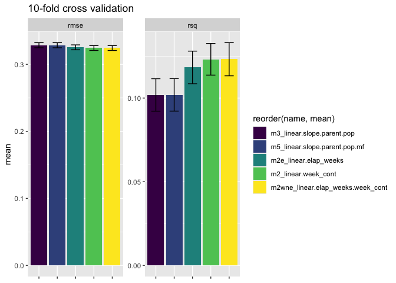<!-- -->


``` r
surv.model.final <- surv.models.best %>% slice_min(BIC) %>% pull(fit) %>% magrittr::extract2(1)
```

For plotting the prediction curve, it looks like I can't combine `geom_function` and `facet_wrap` so I will compute the prediction curves myself and then combine in the plots.


``` r
newdata.survival <- survival2 %>%
  group_by(parent.pop, week) %>%
  reframe(height.cm = seq(min(height.cm, na.rm = TRUE),
                               max(height.cm, na.rm = TRUE),
                               length.out = 101),
          elapsed_weeks = 1) %>%
  filter(parent.pop != "WV")

surv.predictions <- surv.model.final %>% 
  extract_fit_engine() %>%
  predict(newdata.survival, type = "response", re.form = ~ (1 | parent.pop)) %>%
  cbind(newdata.survival, surv.next=.)

surv.predictions %>%
  ungroup() %>%
  nest(.by = parent.pop) %>% 
  mutate(plot = map2(data, parent.pop, \(x, pp) {
  ggplot(x, aes(x=height.cm, y = surv.next)) +
      geom_smooth(color = "grey50", lty=3, se = FALSE, method = "gam", data = {survival2 %>% filter(parent.pop==pp)}) + 
      geom_line() +
      facet_wrap(~week, scale = "free_x") +
      geom_point(alpha = 0.3, data = {survival2 %>% filter(parent.pop==pp)}) + 
      ggtitle(pp) +
      scale_color_brewer(type = "qual", palette = "Accent")
  })) %>%
  pull(plot) %>% walk(print)
```

```
## `geom_smooth()` using formula = 'y ~ s(x, bs = "cs")'
```

```
## Warning: Failed to fit group -1.
## Failed to fit group -1.
## Failed to fit group -1.
## Failed to fit group -1.
## Failed to fit group -1.
## Failed to fit group -1.
## Caused by error in `gam.reparam()`:
## ! NA/NaN/Inf in foreign function call (arg 3)
```

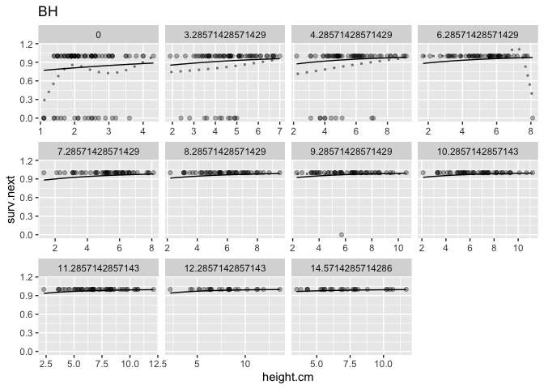<!-- -->

```
## `geom_smooth()` using formula = 'y ~ s(x, bs = "cs")'
```

```
## Warning: Failed to fit group -1.
## Failed to fit group -1.
## Failed to fit group -1.
## Failed to fit group -1.
## Failed to fit group -1.
## Caused by error in `gam.reparam()`:
## ! NA/NaN/Inf in foreign function call (arg 3)
```

```
## Warning: Failed to fit group -1.
## Caused by error in `smooth.construct.cr.smooth.spec()`:
## ! x has insufficient unique values to support 10 knots: reduce k.
```

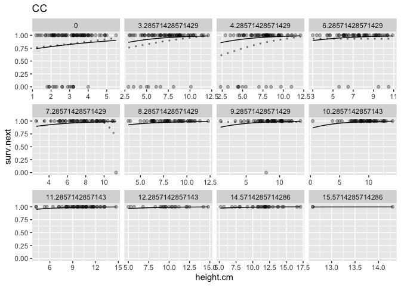<!-- -->

```
## `geom_smooth()` using formula = 'y ~ s(x, bs = "cs")'
```

```
## Warning: Failed to fit group -1.
## Caused by error in `smooth.construct.cr.smooth.spec()`:
## ! x has insufficient unique values to support 10 knots: reduce k.
```

```
## Warning: Failed to fit group -1.
## Failed to fit group -1.
## Failed to fit group -1.
## Caused by error in `gam.reparam()`:
## ! NA/NaN/Inf in foreign function call (arg 3)
```

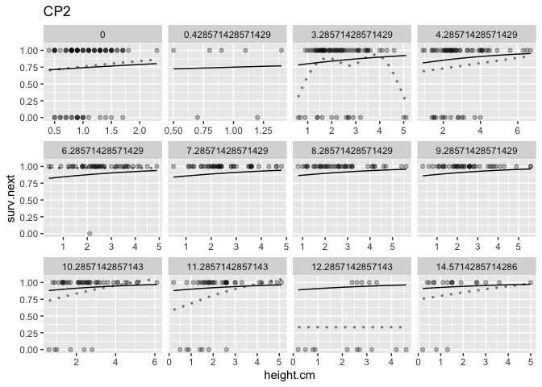<!-- -->

```
## `geom_smooth()` using formula = 'y ~ s(x, bs = "cs")'
```

```
## Warning: Failed to fit group -1.
## Failed to fit group -1.
## Failed to fit group -1.
## Failed to fit group -1.
## Caused by error in `smooth.construct.cr.smooth.spec()`:
## ! x has insufficient unique values to support 10 knots: reduce k.
```

```
## Warning: Failed to fit group -1.
## Caused by error in `smooth.construct.cr.smooth.spec()`:
## ! x has insufficient unique values to support 10 knots: reduce k.
```

```
## Warning: Failed to fit group -1.
## Caused by error in `gam.reparam()`:
## ! NA/NaN/Inf in foreign function call (arg 3)
```

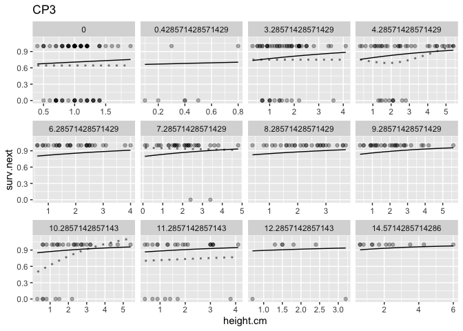<!-- -->

```
## `geom_smooth()` using formula = 'y ~ s(x, bs = "cs")'
```

```
## Warning: Failed to fit group -1.
## Caused by error in `gam.reparam()`:
## ! NA/NaN/Inf in foreign function call (arg 3)
```

```
## Warning: Failed to fit group -1.
## Caused by error in `smooth.construct.cr.smooth.spec()`:
## ! x has insufficient unique values to support 10 knots: reduce k.
```

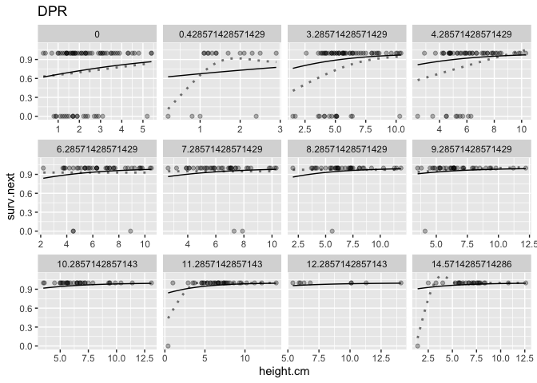<!-- -->

```
## `geom_smooth()` using formula = 'y ~ s(x, bs = "cs")'
```

```
## Warning: Failed to fit group -1.
## Failed to fit group -1.
## Failed to fit group -1.
## Caused by error in `gam.reparam()`:
## ! NA/NaN/Inf in foreign function call (arg 3)
```

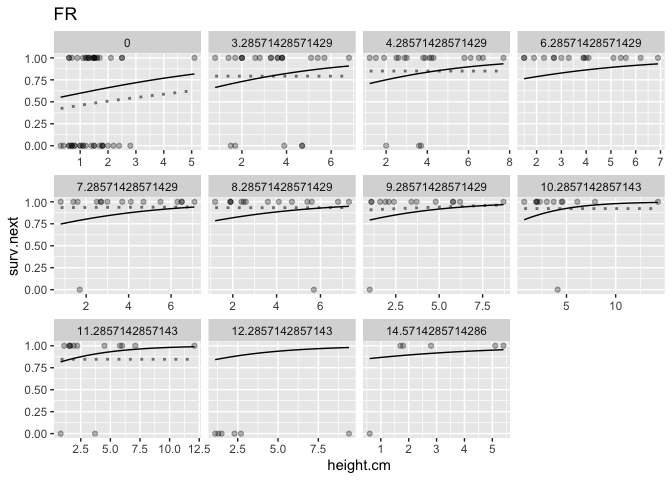<!-- -->

```
## `geom_smooth()` using formula = 'y ~ s(x, bs = "cs")'
```

```
## Warning: Failed to fit group -1.
## Caused by error in `gam.reparam()`:
## ! NA/NaN/Inf in foreign function call (arg 3)
```

```
## Warning: Failed to fit group -1.
## Failed to fit group -1.
## Failed to fit group -1.
## Failed to fit group -1.
## Caused by error in `gam.reparam()`:
## ! NA/NaN/Inf in foreign function call (arg 3)
```

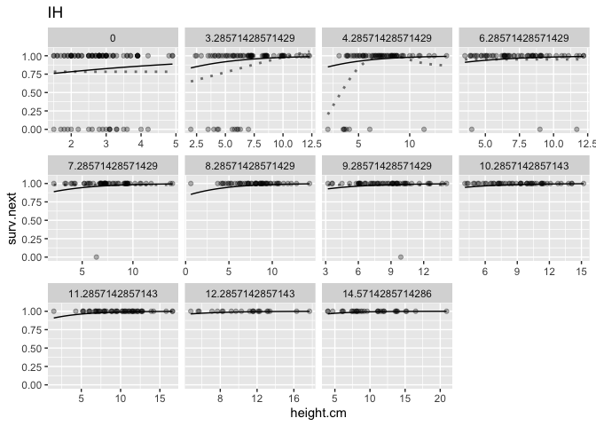<!-- -->

```
## `geom_smooth()` using formula = 'y ~ s(x, bs = "cs")'
```

```
## Warning: Failed to fit group -1.
## Caused by error in `smooth.construct.cr.smooth.spec()`:
## ! x has insufficient unique values to support 10 knots: reduce k.
```

```
## Warning: Failed to fit group -1.
## Caused by error in `smooth.construct.cr.smooth.spec()`:
## ! x has insufficient unique values to support 10 knots: reduce k.
```

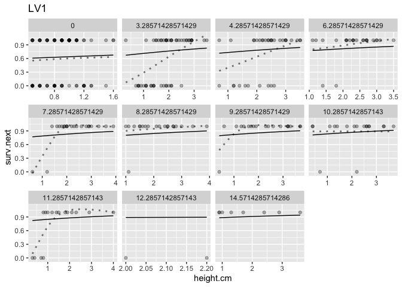<!-- -->

```
## `geom_smooth()` using formula = 'y ~ s(x, bs = "cs")'
```

```
## Warning: Failed to fit group -1.
## Failed to fit group -1.
## Failed to fit group -1.
## Failed to fit group -1.
## Failed to fit group -1.
## Failed to fit group -1.
## Failed to fit group -1.
## Failed to fit group -1.
## Caused by error in `smooth.construct.cr.smooth.spec()`:
## ! x has insufficient unique values to support 10 knots: reduce k.
```

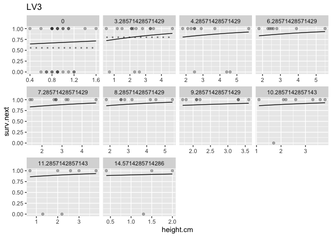<!-- -->

```
## `geom_smooth()` using formula = 'y ~ s(x, bs = "cs")'
```

```
## Warning: Failed to fit group -1.
## Caused by error in `smooth.construct.cr.smooth.spec()`:
## ! x has insufficient unique values to support 10 knots: reduce k.
```

```
## Warning: Failed to fit group -1.
## Caused by error in `gam.reparam()`:
## ! NA/NaN/Inf in foreign function call (arg 3)
```

```
## Warning: Failed to fit group -1.
## Failed to fit group -1.
## Caused by error in `smooth.construct.cr.smooth.spec()`:
## ! x has insufficient unique values to support 10 knots: reduce k.
```

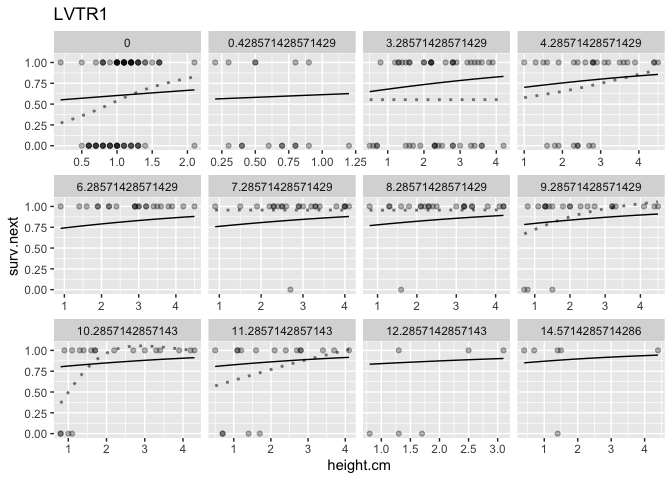<!-- -->

```
## `geom_smooth()` using formula = 'y ~ s(x, bs = "cs")'
```

```
## Warning: Failed to fit group -1.
## Caused by error in `gam.reparam()`:
## ! NA/NaN/Inf in foreign function call (arg 3)
```

```
## Warning: Failed to fit group -1.
## Failed to fit group -1.
## Failed to fit group -1.
## Failed to fit group -1.
## Failed to fit group -1.
## Failed to fit group -1.
## Caused by error in `gam.reparam()`:
## ! NA/NaN/Inf in foreign function call (arg 3)
```

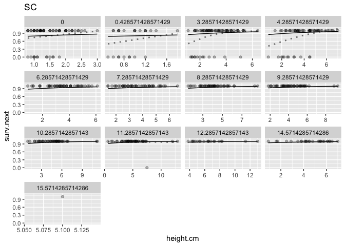<!-- -->

```
## `geom_smooth()` using formula = 'y ~ s(x, bs = "cs")'
```

```
## Warning: Failed to fit group -1.
## Failed to fit group -1.
## Failed to fit group -1.
## Failed to fit group -1.
## Failed to fit group -1.
## Caused by error in `gam.reparam()`:
## ! NA/NaN/Inf in foreign function call (arg 3)
```

```
## Warning: Failed to fit group -1.
## Failed to fit group -1.
## Failed to fit group -1.
## Caused by error in `smooth.construct.cr.smooth.spec()`:
## ! x has insufficient unique values to support 10 knots: reduce k.
```

<!-- -->

```
## `geom_smooth()` using formula = 'y ~ s(x, bs = "cs")'
```

```
## Warning: Failed to fit group -1.
## Caused by error in `smooth.construct.cr.smooth.spec()`:
## ! x has insufficient unique values to support 10 knots: reduce k.
```

```
## Warning: Failed to fit group -1.
## Failed to fit group -1.
## Failed to fit group -1.
## Failed to fit group -1.
## Caused by error in `gam.reparam()`:
## ! NA/NaN/Inf in foreign function call (arg 3)
```

```
## Warning: Failed to fit group -1.
## Caused by error in `smooth.construct.cr.smooth.spec()`:
## ! x has insufficient unique values to support 10 knots: reduce k.
```

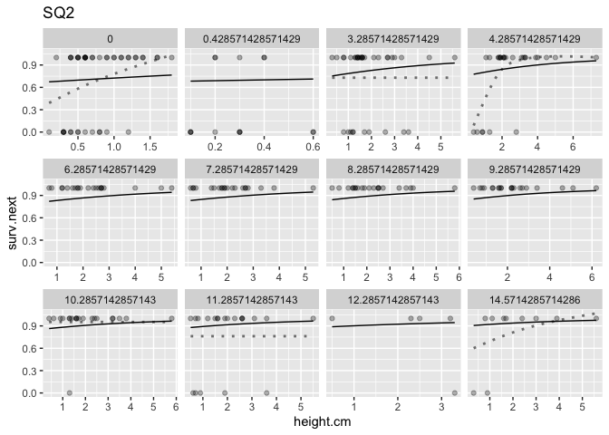<!-- -->

```
## `geom_smooth()` using formula = 'y ~ s(x, bs = "cs")'
```

```
## Warning: Failed to fit group -1.
## Failed to fit group -1.
## Failed to fit group -1.
## Caused by error in `smooth.construct.cr.smooth.spec()`:
## ! x has insufficient unique values to support 10 knots: reduce k.
```

```
## Warning: Failed to fit group -1.
## Failed to fit group -1.
## Caused by error in `gam.reparam()`:
## ! NA/NaN/Inf in foreign function call (arg 3)
```

```
## Warning: Failed to fit group -1.
## Failed to fit group -1.
## Failed to fit group -1.
## Failed to fit group -1.
## Caused by error in `smooth.construct.cr.smooth.spec()`:
## ! x has insufficient unique values to support 10 knots: reduce k.
```

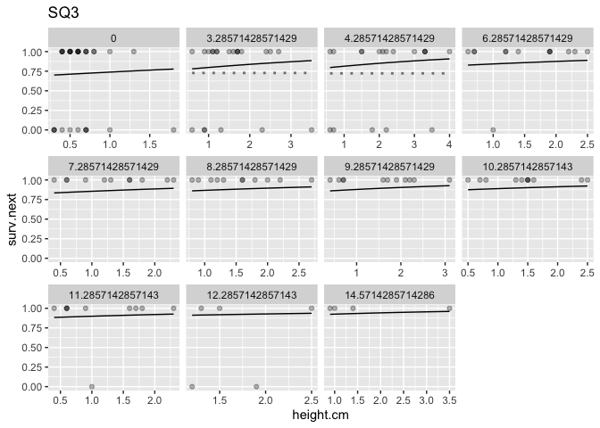<!-- -->

```
## `geom_smooth()` using formula = 'y ~ s(x, bs = "cs")'
```

```
## Warning: Failed to fit group -1.
## Caused by error in `gam.reparam()`:
## ! NA/NaN/Inf in foreign function call (arg 3)
```

```
## Warning: Failed to fit group -1.
## Failed to fit group -1.
## Failed to fit group -1.
## Failed to fit group -1.
## Failed to fit group -1.
## Caused by error in `gam.reparam()`:
## ! NA/NaN/Inf in foreign function call (arg 3)
```

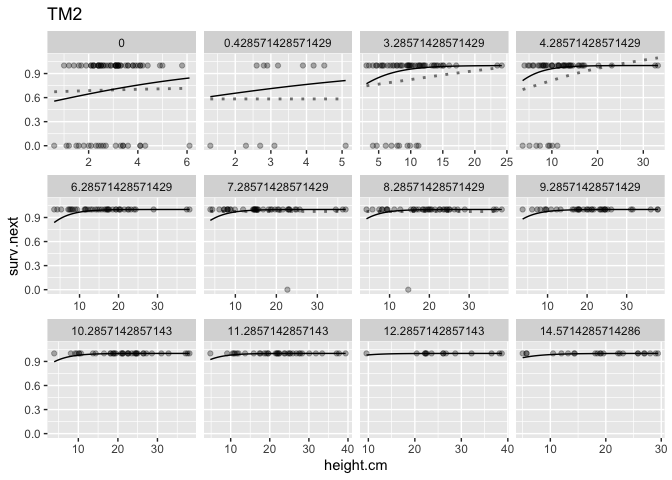<!-- -->

```
## `geom_smooth()` using formula = 'y ~ s(x, bs = "cs")'
```

```
## Warning: Failed to fit group -1.
## Failed to fit group -1.
## Failed to fit group -1.
## Caused by error in `smooth.construct.cr.smooth.spec()`:
## ! x has insufficient unique values to support 10 knots: reduce k.
```

```
## Warning: Failed to fit group -1.
## Caused by error in `smooth.construct.cr.smooth.spec()`:
## ! x has insufficient unique values to support 10 knots: reduce k.
```

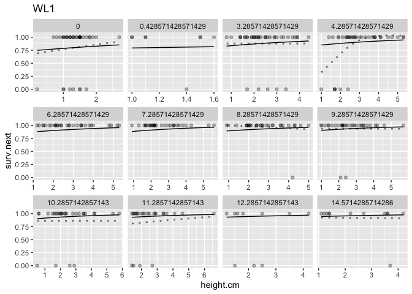<!-- -->

```
## `geom_smooth()` using formula = 'y ~ s(x, bs = "cs")'
```

```
## Warning: Failed to fit group -1.
## Caused by error in `gam.reparam()`:
## ! NA/NaN/Inf in foreign function call (arg 3)
```

```
## Warning: Failed to fit group -1.
## Caused by error in `gam.reparam()`:
## ! NA/NaN/Inf in foreign function call (arg 3)
```

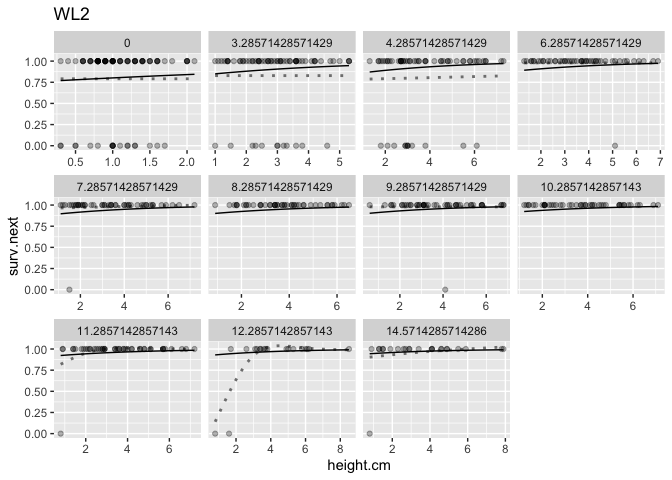<!-- -->

```
## `geom_smooth()` using formula = 'y ~ s(x, bs = "cs")'
```

```
## Warning: Failed to fit group -1.
## Caused by error in `smooth.construct.cr.smooth.spec()`:
## ! x has insufficient unique values to support 10 knots: reduce k.
```

```
## Warning: Failed to fit group -1.
## Failed to fit group -1.
## Failed to fit group -1.
## Failed to fit group -1.
## Failed to fit group -1.
## Failed to fit group -1.
## Failed to fit group -1.
## Failed to fit group -1.
## Caused by error in `smooth.construct.cr.smooth.spec()`:
## ! x has insufficient unique values to support 10 knots: reduce k.
```

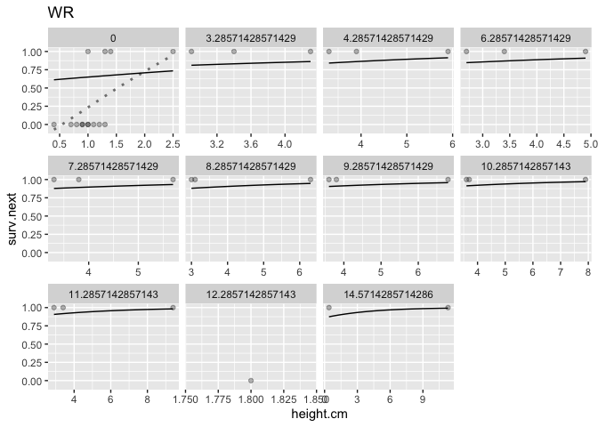<!-- -->

```
## `geom_smooth()` using formula = 'y ~ s(x, bs = "cs")'
```

```
## Warning: Failed to fit group -1.
## Caused by error in `smooth.construct.cr.smooth.spec()`:
## ! x has insufficient unique values to support 10 knots: reduce k.
```

```
## Warning: Failed to fit group -1.
## Failed to fit group -1.
## Caused by error in `gam.reparam()`:
## ! NA/NaN/Inf in foreign function call (arg 3)
```

```
## Warning: Failed to fit group -1.
## Failed to fit group -1.
## Caused by error in `smooth.construct.cr.smooth.spec()`:
## ! x has insufficient unique values to support 10 knots: reduce k.
```

<!-- -->

```
## `geom_smooth()` using formula = 'y ~ s(x, bs = "cs")'
```

```
## Warning: Failed to fit group -1.
## Caused by error in `gam.reparam()`:
## ! NA/NaN/Inf in foreign function call (arg 3)
```

```
## Warning: Failed to fit group -1.
## Failed to fit group -1.
## Caused by error in `gam.reparam()`:
## ! NA/NaN/Inf in foreign function call (arg 3)
```

```
## Warning: Failed to fit group -1.
## Failed to fit group -1.
## Caused by error in `smooth.construct.cr.smooth.spec()`:
## ! x has insufficient unique values to support 10 knots: reduce k.
```

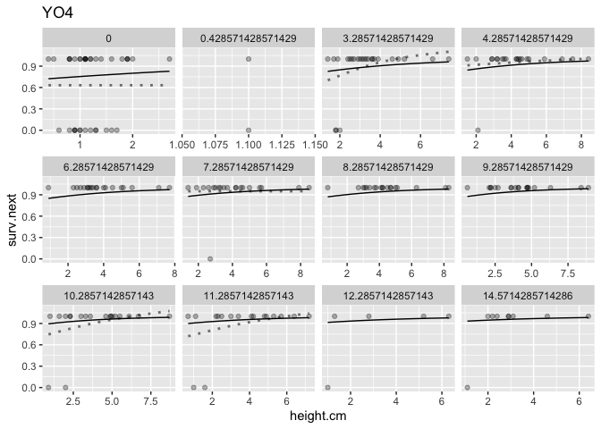<!-- -->

```
## `geom_smooth()` using formula = 'y ~ s(x, bs = "cs")'
```

```
## Warning: Failed to fit group -1.
## Caused by error in `gam.reparam()`:
## ! NA/NaN/Inf in foreign function call (arg 3)
```

```
## Warning: Failed to fit group -1.
## Failed to fit group -1.
## Failed to fit group -1.
## Failed to fit group -1.
## Failed to fit group -1.
## Failed to fit group -1.
## Failed to fit group -1.
## Caused by error in `gam.reparam()`:
## ! NA/NaN/Inf in foreign function call (arg 3)
```

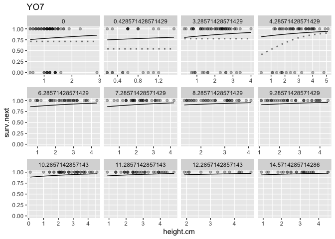<!-- -->

```
## `geom_smooth()` using formula = 'y ~ s(x, bs = "cs")'
```

```
## Warning: Failed to fit group -1.
## Failed to fit group -1.
## Caused by error in `smooth.construct.cr.smooth.spec()`:
## ! x has insufficient unique values to support 10 knots: reduce k.
```

```
## Warning: Failed to fit group -1.
## Caused by error in `smooth.construct.cr.smooth.spec()`:
## ! x has insufficient unique values to support 10 knots: reduce k.
```

<!-- -->


``` r
surv.model.final <- surv.model.final %>% extract_fit_engine()
growth.model.final <- growth.model.final %>% extract_fit_engine()
```


``` r
save.image(file="../output/WL2_2023_growth_survival_models.Rdata")
```

Save just the pertinent stuff

``` r
save(surv.model.final, growth.model.final, survival2, growth2, growth.rec.poly, surv.rec.poly, file = "../output/WL2_2023_growth_survival_models_FINAL.Rdata")
```


