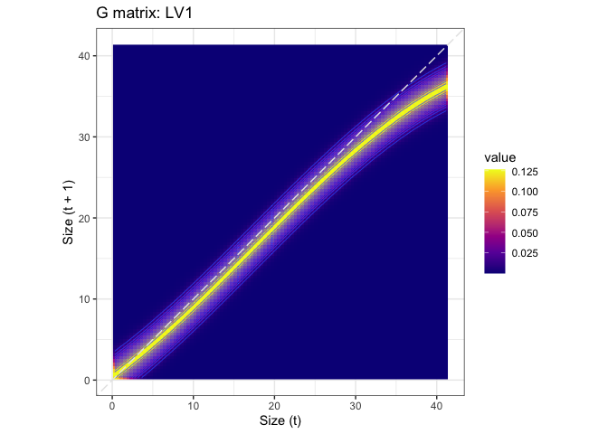
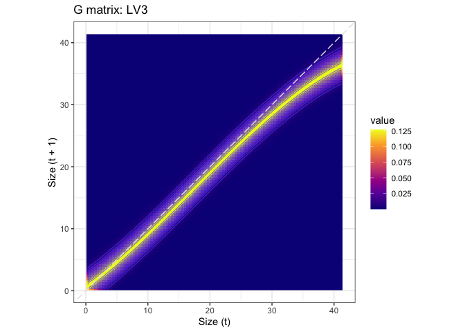
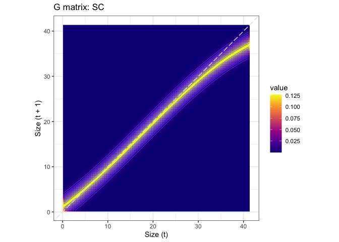
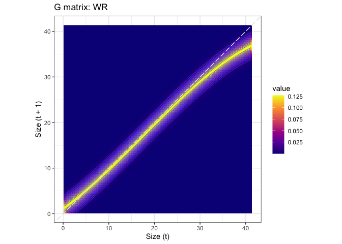
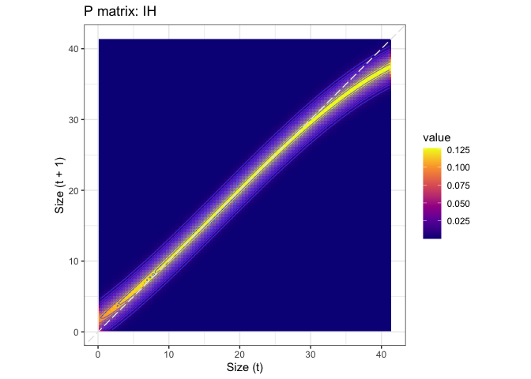
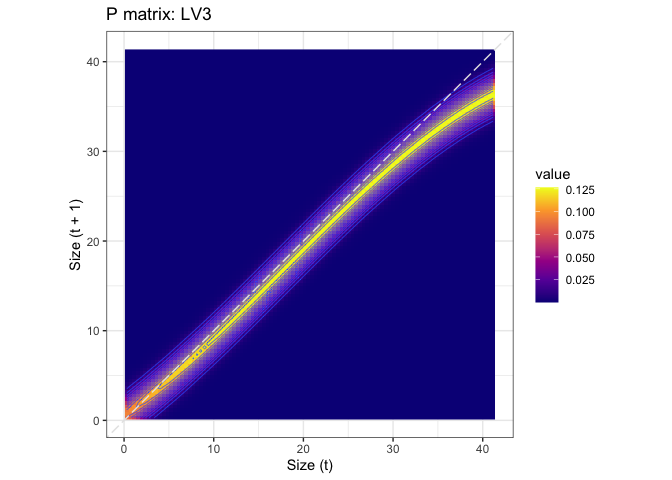
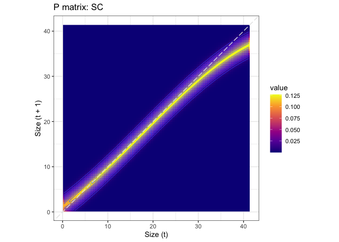
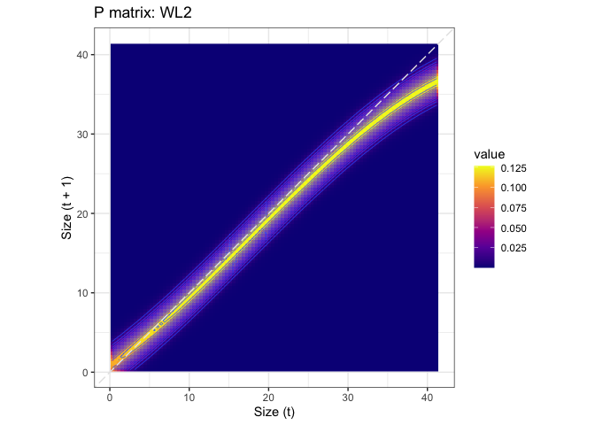

I am separating model selection from making the actual matrices into separate scripts.  This script is for th matrices.


``` r
library(tidyverse)
```

```
## ── Attaching core tidyverse packages ──────────────────────── tidyverse 2.0.0 ──
## ✔ dplyr     1.1.4     ✔ readr     2.1.5
## ✔ forcats   1.0.0     ✔ stringr   1.5.1
## ✔ ggplot2   3.5.1     ✔ tibble    3.2.1
## ✔ lubridate 1.9.3     ✔ tidyr     1.3.1
## ✔ purrr     1.0.2     
## ── Conflicts ────────────────────────────────────────── tidyverse_conflicts() ──
## ✖ dplyr::filter() masks stats::filter()
## ✖ dplyr::lag()    masks stats::lag()
## ℹ Use the conflicted package (<http://conflicted.r-lib.org/>) to force all conflicts to become errors
```

``` r
library(patchwork)
library(magrittr)
```

```
## 
## Attaching package: 'magrittr'
## 
## The following object is masked from 'package:purrr':
## 
##     set_names
## 
## The following object is masked from 'package:tidyr':
## 
##     extract
```

``` r
library(lmerTest)
```

```
## Loading required package: lme4
## Loading required package: Matrix
## 
## Attaching package: 'Matrix'
## 
## The following objects are masked from 'package:tidyr':
## 
##     expand, pack, unpack
## 
## 
## Attaching package: 'lmerTest'
## 
## The following object is masked from 'package:lme4':
## 
##     lmer
## 
## The following object is masked from 'package:stats':
## 
##     step
```

``` r
library(recipes)
```

```
## 
## Attaching package: 'recipes'
## 
## The following object is masked from 'package:lmerTest':
## 
##     step
## 
## The following object is masked from 'package:Matrix':
## 
##     update
## 
## The following object is masked from 'package:stringr':
## 
##     fixed
## 
## The following object is masked from 'package:stats':
## 
##     step
```

``` r
conflicted::conflict_prefer("select", "dplyr")
```

```
## [conflicted] Will prefer dplyr::select over any other package.
```

``` r
conflicted::conflict_prefer("filter", "dplyr")
```

```
## [conflicted] Will prefer dplyr::filter over any other package.
```

``` r
conflicted::conflict_prefer("lag", "dplyr")
```

```
## [conflicted] Will prefer dplyr::lag over any other package.
```

## load the growth and survival models.  This also will load the 2023 data

``` r
load("../output/WL2_2023_growth_survival_models_FINAL.Rdata")
```

update the recipes to remove unused variable.  Recipes are needed to get the polynomials into the newdata data frame

``` r
growth.rec.poly <- growth.rec.poly %>% 
  update_role(mf, block, elapsed_weeks, new_role = "unused") %>%
  update_role_requirements(role="unused", bake = FALSE) 

surv.rec.poly <- surv.rec.poly %>% 
  update_role(mf, block, ppmf, new_role = "unused") %>%
  update_role_requirements(role="unused", bake = FALSE) 
```

Set up the prediction functions
TODO: I SHOULD PROBABLY INCORPORATE STD.DEV FOR BLOCK AND MF IN THE GROWTH FUNCTION

``` r
# 1. survival probability function
##This is inverse logit.  Provides survival probability based on size.
s.x=function(x, model, parent.pop, week = 5, elapsed_weeks = 1, re.form= ~(1 | parent.pop)) {
  newdata=tibble(height.cm=x, parent.pop, week, elapsed_weeks) 
  newdata <- prep(surv.rec.poly) %>% bake(newdata) # creates the polynomial variables
  predict(model, newdata, re.form = re.form, type = "response")
}

# 2. growth function
## Return a probability distribution of new sizes at t+1 (xp) at a given size x.  
## Consider going back and modelling variance as a function of pop.  Might need to do this in BRMS.
g.yx=function(xp, x, model, parent.pop, re.form = ~ (1 | parent.pop)) {
  newdata <- tibble(height.cm=x, parent.pop)
  newdata <- prep(growth.rec.poly) %>% bake(newdata) # creates the polynomial variables
  pred.mean <- predict(model, newdata, re.form = re.form)
  dnorm(xp,mean=(pred.mean), sd=sigma(model))
}
```

Define the parameters for integration

TODO: Should I have a different min and max size for each pop? 

``` r
minSize <- min(growth2$height.cm, na.rm = TRUE)*.95
maxSize <- max(growth2$height.cm, na.rm = TRUE)*1.05

nBigMatrix <- 100 # matrix dimensions
  b <- minSize + c(0:nBigMatrix) * (maxSize - minSize)/nBigMatrix # boundary points
  y <- 0.5 * (b[1:nBigMatrix] + b[2:(nBigMatrix + 1)]) # mesh points
  h <- y[2] - y[1] # step size
```

Functions to create the matrices

``` r
makeG <- function(parent.pop, y, h, fn=g.yx, model=growth.model.final) {
  h*outer(y, y, fn, model=model, parent.pop=parent.pop)
}  # growth matrix
# OK for each value of y,y evaluate the growth function g.yx using params
# If I understand this correctly, the rows are x(t) and the columns are x(t+1)

makeP <- function(parent.pop, G, y, fn=s.x, model=surv.model.final) {
  S <- fn(y, model, parent.pop) 
  P=G # placeholder; redefine P on the next line
  for(i in 1:length(y)) P[,i]=G[,i]*S[i] # growth/survival matrix
  P
}
```

Function to plot matriices

``` r
plotMatrix <- function(m, title=NA, y) {
m %>% as_tibble() %>%
  set_colnames(y) %>% 
  mutate(size.t1=y) %>%
  pivot_longer(-size.t1, names_to = "size.t", names_transform = as.numeric) %>%
  ggplot(aes(x=size.t, y = size.t1)) +
  geom_raster(aes(fill = value)) +
  geom_contour(aes(z = value),lwd=.25) +
  geom_abline(intercept=0, slope = 1, color="gray90", lty=5) +
  scale_fill_viridis_c(option = "plasma") +
  labs(x = "Size (t)", y = "Size (t + 1)", title = title) +
  coord_equal() +
  theme_bw()
}
```

Create a tibble to hold the matrices from each pop and fill it

``` r
IPM.tibble <- tibble(parent.pop=unique(growth2$parent.pop)) %>%
  mutate(G = map(parent.pop, makeG, y, h),
         P = map2(parent.pop, G, makeP, y))

IPM.tibble
```

```
## # A tibble: 22 × 3
##    parent.pop G                 P                
##    <chr>      <list>            <list>           
##  1 BH         <dbl [100 × 100]> <dbl [100 × 100]>
##  2 CC         <dbl [100 × 100]> <dbl [100 × 100]>
##  3 CP2        <dbl [100 × 100]> <dbl [100 × 100]>
##  4 CP3        <dbl [100 × 100]> <dbl [100 × 100]>
##  5 DPR        <dbl [100 × 100]> <dbl [100 × 100]>
##  6 FR         <dbl [100 × 100]> <dbl [100 × 100]>
##  7 IH         <dbl [100 × 100]> <dbl [100 × 100]>
##  8 LV1        <dbl [100 × 100]> <dbl [100 × 100]>
##  9 LV3        <dbl [100 × 100]> <dbl [100 × 100]>
## 10 LVTR1      <dbl [100 × 100]> <dbl [100 × 100]>
## # ℹ 12 more rows
```

plot G matrices

``` r
IPM.tibble %>%
  mutate(Gplot = map2(G, parent.pop, \(G, parent.pop) {
    plotMatrix(G, str_c("G matrix: ", parent.pop), y)}
    )) %>%
  pull(Gplot) %>% walk(print)
```

```
## Warning: There was 1 warning in `mutate()`.
## ℹ In argument: `Gplot = map2(...)`.
## Caused by warning:
## ! The `x` argument of `as_tibble.matrix()` must have unique column names if
##   `.name_repair` is omitted as of tibble 2.0.0.
## ℹ Using compatibility `.name_repair`.
```

<!-- --><!-- --><!-- --><!-- --><!-- --><!-- --><!-- --><!-- --><!-- --><!-- --><!-- --><!-- --><!-- --><!-- --><!-- --><!-- --><!-- --><!-- --><!-- --><!-- --><!-- --><!-- -->

plot P matrices

``` r
IPM.tibble %>%
  mutate(Pplot = map2(P, parent.pop, \(P, parent.pop) {
    plotMatrix(P, str_c("P matrix: ", parent.pop), y)}
    )) %>%
  pull(Pplot) %>% walk(print)
```

<!-- --><!-- --><!-- --><!-- --><!-- --><!-- --><!-- --><!-- --><!-- --><!-- --><!-- --><!-- --><!-- --><!-- --><!-- --><!-- --><!-- --><!-- --><!-- --><!-- --><!-- --><!-- -->


I AM HERE

Correct the matrix using the Merow et al "constant" correction code


``` r
Pc <- P # a new, corrected matrix
nvals <- colSums(Pc, na.rm = TRUE)
loc0 <- which(nvals == 0, arr.ind = TRUE)

if (length(loc0) > 0) {
  print("warnings - columns that sum to 0 or that have NAs - assuming survival is along the diagonal; plot your Pmatrix to check it")
  Pc[, loc0] <- 0
  Pc[cbind(loc0, loc0)] <- s.x(y[loc0], params=params)
}
nvals <- colSums(Pc, na.rm = TRUE)
Pc <- t((t(Pc)/nvals) * s.x(y, params=params))
```


